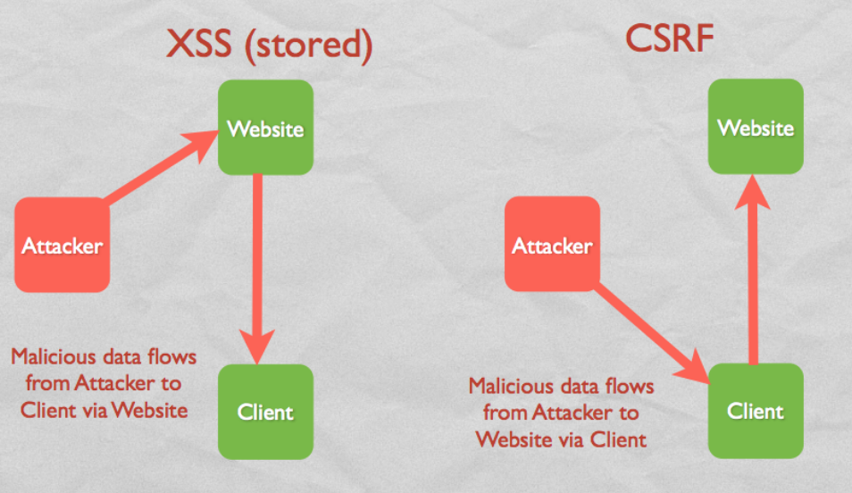

## Nettbank

- Kunne forklare hvordan innlogging i de første nettbankene fungerte tidlig på 2000-tallet
  - Ny kunde oppga fødselsnummer og navn
    - Sjekket mot folkeregisteret, sendt 4-sifter PIN i posten
    - Lastet ned sertifikat
    - Gjentatt på hver nye maskin
  - Max 10.000 forskjellige koder i bruk

- Kjenne til hvordan norske personnummer er bygget opp
  - DD.DD.DD.III.CC
  - D = dato, I = individnummer, C = kontrollsifre (I3 bestemmer kjønn)
  - Kontrollsifre regnes ut fra resten av sifrene mod 11. Deles ikke ut PN med C1 eller C2 = 10
  - Ca 150 barn pr dag

- Kunne forklare hvordan brute-force angrepet mot Skandiabanken fungerte
  - Genererte mengde ut fra statistikk om Skandiabankens kunder
  - 340,000 personnumre, forventet antall kunder 75,000 i mengden.

- Kunne forklare og sette opp utregningen som viser hvor effektivt angrepet ville vært
  - Prøv 2 forsøk pr personnr => 2 / 10,000 = 1 / 5,000 pr pers
  - P(minst én PIN) ~= 1
  - Forventet antall = 15

- Kunne beskrive hvilke endringer Skandiabanken gjorde i innloggingen i 2004
  - Fremdeles fødselsnummer og PIN, men også engangspassord på SMS/post
  - Engangspassord kun for nedlasting av sertifikatet, ellers bare fødselsnr og PIN
  - Noe upålitelig løsning, tilfelle kunde ikke har dekning osv, men OK

- Kunne forklare hvordan sikkerheten ble forbedret, men også hvorfor det opprinnelige angrepet fremdeles kunne gjennomføres
  - Det originale angrepet kunne fremdeles gjennomføres, for så å snappe opp SMSer etterpå.
  - Mindre sannsynlig at noen snapper opp SMS
  - Angriper kunne forsøke å endre telefonnummeret til kunden?
  - Kunne også snappe opp brevet fordi angriper bestemte når det skulle sendes
  - Etter tømming av konto kan angriper DoS'e kunden slik at det tar lengre tid før det oppdages
  - Kunne løst det med en lengre PIN-kode og rekommandert brev i posten
  - Gikk etter hvert over til statisk passord og engangspassord for alle pålogginger.

## Nettbank 2

- Kunne forklare hva som er spesielt med DoS-angrep på applikasjonslaget, og hvorfor dagens nettbanker er spesielt sårbare for dette.
  - De er ekstra sårbare på grunn av rutiner for innlogging (sperring av konto)
  - DoS-angrep på applikasjonslaget er vanskelig å oppdage fordi alt ser normalt ut i resten av lagene.

- Kunne forklare hvorfor det er svært vanskelig for en bank å beskytte seg mot et DDoS angrep, der angriper har tilgang til mange maskiner for å utføre angrepet
  - Banker brukte IDS (Intrusion Detection System)
    - Ser etter mønstre i loggfiler som ligner hackere (eks store mengder SYN-pakker)
  - Vanskelig for IDS å skille mellom legitime og falske pålogginger. Må ta ned hele siden = DoS funket
  - Når banken kommer opp igjen kan angrepet fortsette

- Kunne forklare hvorfor det er uheldig å bruke personnummer eller kontonummer som identifikator i innloggingen
  - Fødselsnumre er høystrukturerte og lette for en angriper å generere.
  - Kontonummer er også høystrukturerte og lette for en angriper å genere, derfor er de ikke bedre.

- Kunne forklare hvordan en PKI-løsning kan redusere risikoen for DoS-angrep mot nettbanker
  - Opprette sikker kobling mellom klient/tjener for å logge på ved hjelp av PKI
  - Fjerner behov for fødselsnumre og sperring av konto
  - Øker sikkerheten

- Kunne forklare problemene med klokkegenererte PIN-koder fra PINkalkulatorer og hvordan bankene løser dette problemet
  - Klokker må synkroniseres mellom PIN-kalkulator og nettbank
  - Vindu av PIN-koder nødvendig
  - Norsk bank med vindu på 19
  - RSA SecurID kunne få opp til 41, men spurte om en ekstra PIN hvis vinduet ble stort
  - Angrep på 6-sifret PIN, vindu på 3 = 3 \* (3/1,000,000) > Sannsynlighet for å knekke min én kode 0.97

## SQL injection

- Ha overfladisk kunnskap om hva en database er og hvordan man utfører spørringer mot en database

- Kunne forklare hvordan en web-server og en database server typisk kommuniserer, og hvordan et SQL injection angrep foregår

- Vite at SQL injection kan skje både i skjema og i URL

- Vite hva som er spesielt med blind SQL injection

- Kunne fortelle om potensiell skade av SQL injection

- Kunne forklare om forsvar mot SQL injection, og hvor effektive de ulike tiltakene er
  - Input validation
  - Limit database permissions
    - Scripts should have read-only permission
  - Configure error reporting
    - Limit the amount of information the attacker gets for each attempt
    - Internal error messages

## XSS

Cross Site Scripting (XSS)

- Kjenne til hvilke HTML-tags som typisk blir brukt i XSS.
  - `<script />`: Javascript kan lese cookies (og potensielt sende dem videre)
  - ``: har en 'onerror=' som skjer dersom bildet ikke lastes
  - `<iframe />`: For å ha nested webpages i HTML
  - `<a />`:

- Vite hva cookies er, og hvorfor de kan være kritisk for sikkerheten
  - En cookie er en token (egt. en liten fil) for å huske state mellom sessions (eks for å forbli innlogget).
  - Lagres og brukes av browseren, sendes sammen med requests
  - Unik for hver klient

• Kunne forklare hvordan et XSS angrep virker, og hva som er angriperens mål

- Målet er å kjøre et script på klientens maskin
  - Ofte for å skaffe seg cookies
  - Same origin policy gjør at scriptet kan aksessere privat data mellom server/klient
  - Sender privat data tilbake til angriper

- Kunne forklare forskjellene mellom reflected XSS og stored XSS
  - Reflected XSS (non-persistent)
    - "Hey, klikk på denne linken: `www.vg.no/legitScript.php?parameter=<iframe>src=evilPage<\iframe>`
    - Angriper lurer klient til å sende en request til server som inneholder et ondsinnet script
    - Scriptet reflekteres av serveren og sendes tilbake til klient, for så å kjøres clientside.
    - Vanlig med spoofed emails, men det er ikke phising siden klient sendes til den ekte websiden, men angriper får delvis kontroll over hva webserveren viser til klienten.
    - Kan også poste malicious link på legit sider (som kommentar feks).
  - Stored XSS (persistent)
    - Lagres på webserveren, sendes til alle klienter som går innpå websiden, kjøres på klienten.
    - Typisk kommentar/forumpost/review/etc..
    - Legit script på serveren må være vulnerable til XSS, dvs godta `<script>`-tags.
- Kunne gjøre rede for ulike forsvar mot XSS, og hvor effektive og realistiske de er
  - Server-side:
    - Passe på at alle scripts er safe mot XSS, dvs escaper alle potensielle script-injections
      - Hvis du ikke trenger HTML-tags i user input, ikke tillat noen tags. Hvis du trenger, ikke tillat `<script>`
    - Bruke cookie protection
      - HttpOnly - kun browser kan aksessere cookie, ikke scripts
      - Knytte IP-adresse til cookie (urealistisk)
    - Teste websiden mot XSS
      - Bruk OWASP cheat sheet
    - Få websiden til å fungere uten scripts (urealistisk)
  - Klient-side:
    - Skru av scripts i browser (urealistisk)
      - Eneste som beskytter fullstendig
    - Være påpasselig med linker
      - Funker ikke mot onMouseOver
      - Funker ikke mot stored XSS
- Vite at designet av www gjør det fundamentalt vanskelig å beskytte seg mot XSS
  - Vanskelig å beskytte seg 100% på grunn av delingskulturen i internett i dag.

### Summary

- XSS et av de vanligste angrepene
- Same origin policy: Et script kan kun aksessere data fra samme webside som det ble kjørt fra (fra browseren sin side)

## CSRF

Cross Site Request Forgery (CSRF)

- Synonymer: Cross-site reference attack, Sidejacking, One-click attack, Session riding.
- Kunne forklare hvordan et CSRF angrep virker
  - Ondsinnet webside får browser til å utføre en handling på en annen nettside
  - Mulig fordi nettsiden stoler på web-browseren, ikke brukeren. (se bilde Demo)

- Utnytter autentiseringen (evt manglende autentisering) på nettsider. Vanligvis sjekkes det kun at en request kommer fra brukerens browser, men ikke at brukeren nødvendigvis har utført handlingen som sendte requestet.
- Kan også utnytte lagrede passord

- Kunne gjøre rede for forskjellen mellom CSRF og XSS (se bilde Forskjell)

- CSRF utnytter trust nettsiden har til browseren. XSS utnytter trust bruker har til nettsiden.
- Beskyttelse mot XSS er ikke nødvendigvis beskyttelse mot CSRF

- Kunne forklare hva som skjer i et CSRF angrep gjennom GET requests
  - Når en bruker går til www.evilsite.com laster browseren inn eks ``
  - På denne måten vil browseren gjøre en GET-request til legitSite.com og utføre action.php med evt parametere.
  - Browseren legger automatisk til session-cookie i requesten, slik at brukeren er autentisert
- Kunne forklare rollen til innloggings-cookie i et CSRF angrep
  - Når brukeren (legit) logger seg på en nettside får den en session-cookie som lagres i browseren.
  - Når kode fra en ondsinnet nettside tvinger browseren til å gjøre en request til den ekte nettsiden, legges cookien automatisk til, slik at brukeren er autentisert.
- Kunne forutsetningene for at et CSRF angrep skal kunne lykkes
  - TLS beskytter IKKE mot CSRF fordi browseren er autentisert og sender gjennom TLSen, men da må brukeren ha en aktiv session mot legit server samtidig som angrepet skjer.
  - Hvis trusted site godtar GET-requests kan man bruke ``, hvis POST må man bruke JS
  - Må distribuere link til ondsinnet webside som kan gjøre requests
  - Applikasjoner/routere/switcher som ikke har aut/autentiserer på pre-set verdier/implisitt autentiserer er sårbare mot CSRF
- K-unne gjøre rede for forsvar mot CSRF, både på serverside og klient
  - Nr 8 på OWASPs Top 10 application security risks
  - Server side defense
    - Kun la GET-requests hente ned data, ikke gjøre endringer i state eller data
      - Da kan ikke angriper bruke eks ``
    - Tvinge alle POST-requests til å inneholde en CSRF-token (pseudo-random verdi)
      - En kryptografisk sterk verdi ligger i cookie OG i requesten. Disse må matche for at requesten godkjennes. Angriper har ikke tilgang til cookie!!
  - Client side defense
    - Alltid logge ut fra alle nettsider (urealistisk)
    - Ikke starte andre ting mens man er logget inn (urealistisk)
    - Aldri lagre passord/brukernavn i browser

## Pharming

- Vite hva pharming er, og hva som er målet og konsekvensene
  - Ordspill; Farming/Phising
  - Pharming betyr å redirigere en web-sides trafikk til en annen, ondsinnet webside
  - Har som mål å stjele data, typisk username/password
  - Minner om phising, men her må ikke bruker trykke på link etc.
  - Konsekvensene er at alle brukere som prøver å aksessere siden og tilfeldigvis får sin DNS-query sendt til den forgiftede serveren vil komme til bogus-siden. Cachepoisoning er også svært smittsomt!
- Vite hva DNS servere og hosts-fil er
  - DNS servere
    - Hierarisk system for å resolve domener til IP-adresser
    - En DNS-server sjekker først cache, deretter spør den videre i kjeden
    - DNS-attack: Få en falsk mapping inn i cachen på en DNS-server
  - Hosts-fil
    - En lokal fil med mapping fra domene &#x2013;> IP-adresse
    - Eks på lokal maskin eller router
    - Small scale pharming går ut på å endre disse (påvirker kun én maskin/ett nettverk)
- Kunne gjøre rede for hva som menes med cache poisoning og hvordan det kan forekomme
  - Cache poisoning er å få en falsk mapping inn i cachen til en DNS-server
  - Første angrep:
    - Før kunne det forekomme ved at ondsinnede DNS-servere inkluderte en falsk mapping i requests den mottok.
    - Dvs at DNS-serveren badGuys.com kan svare med mappingen 199.177.0.1 &#x2013;> www.paypal.com, selv om den egentlig ble spurt om domenet `badGuys.com/somesubsite/`
  - Andre angrep:
    - DNS-servere har ikke integritetsjekk eller autentisering av hverandre, men de bruker en query id for å koble sammen requests og svar.
    - En angriper kan da sende en request til en DNS-server, og deretter bombardere serveren med falske svar og forskjellige query ids. Hvis han treffer før serveren får det ekte svaret, vil serveren forgiftes.
    - IDer ble før opprettet sekvensielt, nå er de random. En ID var kun 16 bits (65 536) forskjellige values.
    - Liten sjanse for å gjette riktig, og lang tid mellom hvert forsøk pga cache på server.
- Vite hva Bailiwick checking er, og hvorfor det ble innført
  - For å mitigere mot at ondsinnede DNS-servere inkluderte andre mappings i sine svar ble det innført en sjekk som gjorde at DNS-servere kun godtok mappings som går fra domenet eller et sub-domene.
- Kunne forklare hvordan Kaminsky’s angrep virker
  - Unngikk Bailiwick checking ved å spørre etter falske sub-domener (eks aaa.paypal.com). Hvis det falske svaret når frem før det ekte, kan det også inneholde www.paypal.com og fremdeles passere bailiwick-checken.
  - Unngår ventetiden ved å spørre om falske sub-domener, da kan man bare spørre om et nytt subdomene.
- Vite hva som er dagens forsvar mot Kaminsky’s angrep
  - For å mitigere mot Kaminsky's angrep ble det i 2008 innført at man i tillegg til å bruke random query ID ble det også brukt en random ut-port (~ 65000 porter). Da må angriper gjette både port og ID.
  - DNSSec er et bedre tiltak.
- Kunne forklare hvordan innstilling for DNS server kan endres i et hjemmenettverk
  - Drive-by Pharming
  - Routere har en IP-addresse til DNS-serveren som skal brukes by default (Vanligvis ISP)
  - Fungerer så lenge browseren tillater kjøring av java applets og routeren ikke har passord/har default passord.
  - Java applet skaffer IP-adressen ved å opprette en socket connection tilbake til den ondsinnede serveren. Slik finner man rangen DHCPen i nettverket deler ut. Router er oftest laveste/høyeste IP i dette subnettet. 10.0.0.1 / 192.168.0.1
  - Javascript prøver å laste ned bilder fra router-configuration page (som finnes på router-IPen). Hvis den lykkes å laste ned et bilde, er routermodellen identifisert.
  - Javascript kan endre DNS-serveren på routeren og DHCP vil distribuere denne nye DNS-serveren til alle tilkoblede enheter.
  - Enkelt angrep, effektivt, liten sjanse for at brukeren oppdager angrepet.
  - Mitigering: Endre default-passord, Java-applets burde ikke kunne opprette socket connections uten videre.

## DOS

• Vite hva et DoS angrep er, og forskjellen mellom flooding og vulnerability
    Denial of Service - har som mål å hindre en applikasjon/tjener/nettverk i å tilby en tjeneste
    Flooding attack betyr å sende enorme mengder data som tar opp ressurser hos mottaker
        UDP-floods, TCP syn, ping
    Vulnerability sender en bestemt sekvens med pakker for å kræsje systemet.
        Ping of death
        Teardrop

• Kjenne til protokollene som er omtalt, vite hva de gjør og hvor de ligger i protokoll-stacken
    IP (i forbindelse med source spoofing)
        Ingen integritetsjekk gjør spoofing mulig
    UDP
        DNS, ntp, whois
        UDP-floods: Ta opp båndbredde
    TCP
        TCP-syn flood: Fylle opp serveren med halvåpne TCP-connections
        Teardrop: Windows TCP/IP stack kunne ikke takle TCP-pakker med lengde != offset
    ICMP  (Internet Control Message Protocol)
        Ping (ICMP Echo Request/Response messages)
        Ping-flood: Bruke store pakker fordi mottakeren må sende dem tilbake (ekko).
        Ping of death: Send a ping packet larger than 65,536 bytes (ping -l 65550 `<host />`)

• Vite hva «spoofing» er
    Imitere noe/noen
    Spoofe source adresse
    Mitigering
        Få router til å kaste utgående pakker med source IP som ikke er fra lokalt subnett.
        Få router til å kaste innkommende pakker med source IP som er fra det lokale subnettet.
        Kan assosiere MAC-adresse med IP for å oppdage spoofing.

• Kunne forklare sårbarhet i TCP handshake
    TCP handshake allokerer plass til en TCP-handshake etter første kontakt (TCP SYN-pakke).  Dette gjør at en angriper kan sende kun TCP SYN-pakker og ta opp plass på serveren. Sårbarhet i TCP.

• Vite hva som kjennetegner et «smurf» type angrep
    Smurf
        Sende ping til IP-broadcast og spoofe source til target-IP. Da vil alle på nettverket svare til source.
        En type amplified attack

• Vite hvordan botnets blir skapt, og hvordan de kan brukes i DDoS
    DDoS - Distributed Denial of Service
    Bruker flere maskiner, som regel bots, til å utføre DoS
    Spoofing er ikke nødvedig fordi serveren ikke klarer å filtrere ut alle bottene.
    Handlers/masters brukes til å kontrollere botnets for at angriperen skal skjule identiteten sin
    DDoS deles i 3 deler
        Lage botnettet (ta over maskiner, feks en orm)
        Armere (installere programvare)
        Execute
    Worm
        Self replicating, self contained. Sprer seg fort, brukes for å lage botnet
        Fase 1: Ormen scanner IP-adresser for sårbare maskiner
        Fase 2: Starter en backdoor, lytter på en port, skaffer seg root access
        Fase 3: DoS
    Kontrollere bots
        Starte/slutte/styre DDoS
        Kommandoer sendes via handlers. Handlers må ha alle botene sine IP-adresser

Sårbarhet
    Maskiner tilkoblet internett er sårbare mot DDoS.
    Kan angripe maskiner som ligger bak NAT eller firewall med å utgi trafikken for å være legit.
    Kan mitigere mot vulnerability attacks, men ikke mot flooding

Phatbot
    Kan brukes til flere typer DoS-attacks
    TCP Syn, UDP flood, ICMP flood, HTTP GET flood.
    Targaflood: Brukes for å lage random TCP-pakker som kan kræsje serveren
    Wonk flood: TCP-syn flood. Sender 1 TCP Syn-pakke og 1,023 TCP ACK-pakker.

Konklusjon
    Ingen fullstendig mitigering, men overvåking på applikasjonsnivå kan delvis mitigere.

## Electronic surveilance

Electronic Surveillance

- Vite hva datalagringsdirektivet inneholdt og historien rundt det
  - Lagre telefoni og internettrafikk
    - Metainformasjon om samtaler, emails, websider
    - Source/destination av samtaler
    - Tidspunkt, varighet
    - Devices
    - Type kommunikasjon
    - Lokasjon
    - Ingenting om innhold
  - Ble vedtatt i Norge i april 2011, men aldri iverksatt.
  - Skulle være tilgjengelig for kompetent personale i myndighetene, inkl politi i visse saker.
  - Avdekke og forhindre alvorlig kriminalitet
  - Dømt ulovlig av EU-domstolen i 2014.

- Vite hvordan NSA fikk utvidet sine tillatelser til elektronisk overvåkning i årene 2001 - 2008
  - Juni 2013: Snowden leaks
  - US Person = Noen som har langtids-oppholdstillatelse  i USA
  - Etter 11.09.2001 fikk NSA mye frihet til overvåkning.
  - President Surveillance Program (PSP) i kjølvannet av 11 sept. Skulle vært short-term, varte 6 år
  - Foreign Intelligence Surveillence Court (FISC) godkjente PSP-rutinene videre etter 2007.
  - Før PSP trengte NSA warrant for å overvåke når en av partene var US person. Etter 'første' PSP kunne de fritt overvåke all kommunikasjon (både metadata og innhold) mellom USA og Afghanistan/suspected terrorist fritt i 30 dager.
  - PSP ble fornyet ca hver 45. dag. Etter 2002 ble ikke afghanistan eksplisitt nevnt
  - Sluttet å samle metadata om internettkommunikasjon i 2004 etter at det ble funnet ulovlig av Dept of Justice.
  - 4th Amendment beskytter US-citizens mot overvåking
  - Søkte i 2007 om å få samle telefon-metadata pga call-chaining. Svar ikke kjent, men offentlig kjent at slik overvåkning er iverksatt.
  - Oppsummering:
    - Overvåker all metadata (telefon/internett), uavhengig av US-person eller ikke
    - Overvåker telefon/internett-innhold hvor minimum én part ikke er US-person.

- Kjenne til FISC sin rolle i utviklingen av NSA’s overvåkning, kjenne til teleselskapene sine roller
- FISC:
  - En FISC dommer ble kjent med PSP i 2002.
  - FISC gav NSA mulighet til å oppta innsamling av metadata om internettkomm, etter at Dept of Justice fant det ulovlig. PSP ble justert til å tillate overvåkning hvor minimum én av partene var non-US person. Under PSP ble nærmere 20,000 emailkontoer og telefoner avlyttet.
- Teleselskapene (A, B og C)
  - A og B kontaktet NSA og spurte om de kunne hjelpe etter 11 sept.
  - C fryktet PSP var ulovlig, fikk rettsgodkjennelse fra FISC
  - A, B og C tok seg av ca 85% av all telefonkommunikasjon i USA
  - Alle tre leverte data og telefon metadata til NSA under PSP

- Vite hva PRISM programmet inneholder
  - Program for å samle inn data direkte fra service providers
  - Nesten alle store selskaper i USA bidrar

- Vite hva XKeyScore er og hva det omfatter
  - XKeyScore samler inn all trafikk som passerer gjennom punkter i internett
    - Henter ut info fra events og lagrer informasjon kategorisk i database
  - Beholder innhold i 3-5 dager, metadata i opptil 30 dager
  - Gjør det mulig for NSA å stille generelle spørringer
  - Kan søke basert på trends etc.
  - Approx 150 sites, 700 servers
  - Strong (eks email) og soft (innhold) selection
  - Kan brukes for å finne targets, se bilde.
  - Language tracking: Filtering: My target is in Pakistan, but speaks German.
  - TAO: Gruppe av hackere i NSA
  - Show me all the VPN startups in country X and give me the data so I can decrypt it.
        ^ wtf!?

- Generelt:
  - Elektroniske spor (traces): Flyplasser, bankterminaler, etc. Samler informasjon om oss.
  - NSA prøver aktivt å korrumpere kryto-algoritmer for å kunne dekryptere trafikk.
  - Beskytte seg mot overvåkning:
    - Bruk VPN
    - Tor nettverk
    - Trustworthy encryption som TLS eller PGP

## Tor - Anonymity on the Internet

- Vite hvordan man kan identifiseres i vanlig nettbruk
  - Vanlig nettaktivitet er ikke anonymt. IP-adresser til sender/receiver sendes i klartekst
  - ISPer kan koble sammen IP og individ
  - Ved å overvåke nettverk kan man koble sammen IP til identifikatorer som email, username, etc.
  - Anonymitet er bra pga privacy, dårlig pga kriminalitet

- Kunne forklare prinsippet i onion routing
  - Sende trafikk gjennom en kjede av mellom-servere
  - Mellom-servere vet kun om forrige og neste server, kun sender kjenner destinasjon
  - Data er kryptert i flere lag, slik at hver onion router kan dekryptere ett lag for å vite neste destinasjon

- Kunne begrepene cell og circuit
  - Cell er en pakke med data (melding)
    - Control cells
      - Brukes til å opprette og kontrollere kjeden av routers (mottaker er ORen)
    - Relay cells
      - Skal dekrypteres og sendes videre til ny OR (meldinger gjennom nettverket
  - Circuit er en kjede med onion routers, hvor hver router deler et nøkkelpar med brukeren
    - Entry node: Første router, kommuniserer med brukeren
    - Exit node: Siste router, kommuniserer med webserveren

- Kunne forklare hvordan en circuit i Tor blir satt opp
  - Bruker velger en sekvens av ORs
- Utvid til OR1
  - Bruker sender kontrollcelle til OR1: Utvide kretsen og utveksle kryptonøkkel gjennom Diffie-Helmann. DH-parameter encryptet med OR1s public key.
  - OR1 lager K1, svarer til bruker med Hash(K1)
  - Bruker regner ut K1 og Hash(K1)

- Utvid til OR2
  - Bruker lager kontrollcelle til OR2 på samme måte som til OR1. Pakker den inn i en relay-celle og sender til OR1.
  - OR1 dekrypterer med K1 og ser at meldingen skal videre til OR2.
  - OR2 lager K2 og sender svar til OR1, som krypterer med K1 og sender til bruker. Kjeden er nå utvidet.
  - Circuits kan også endres (eller omdirigeres dersom en node faller ut)

- Kunne forklare hvordan nettrafikk går gjennom en circuit og hvorfor bruker blir anonym
  - Bruker lager en pakke med data som skal til webserveren. Denne krypteres med alle nøklene i circuiten, med siste OR først. På denne måten sendes det gjennom kjeden som relay-cells, hvor hver OR skreller av ett lag og sender videre. Siste node (exit node), skreller av siste lag og sender til web-serveren. Ingen av routerene vet om andre enn forrige og neste hopp, derfor blir brukeren anonym.
  - Svaret skjer på samme måte. Når exit-node får svaret fra webserveren, krypterer den svaret og sender til forrige router, som igjen krypterer. Slik legge skallene til igjen og sendes bakover i kjeden.

- Kunne forklare under hvilke omstendigheter en bruker kan bli identifisert selv om Tor brukes
  - Kan også bruke TLS i Tor. Da blir sessionen mellom user og server, ikke exit node og server.
  - Hvis man ikke bruker TLS vil exit node kunne se trafikken, og dersom pakken inneholder identifikatorer (eks source) vil OR3 kunne identifisere bruker.
  - Observatører kan kun se at noen bruker Tor, men ikke hvor de sender til
  - Nettverket må ha nok brukere for at ikke nettverksobservatører skal kunne identifisere brukere.
  - Leaky pipe - Bruker kan velge å sporadisk ikke bruke hele pipen ved å la være å kryptere med alle nøklene. Dette vil føre til når dataen er kommet (feks) halvveis i kjeden, sendes den direkte til serveren.

Dette gjør det vanskeligere for noen å monitorere exit nodes

- NSA supertrick
  - Observere request til terrorist.com som kommer fra en exit node.
  - Sende spoofed svar til exit node og redirecte til Hotmail og Yahoo.
  - Hvis bruker har korresponderende cookie til Hotmail og Yahoo, kan NSA se at begge disse blir aksessert av samme user kort tid etter det spoofede svaret. Da kan de identifisere personen som prøvde å aksessere terrorist.com

- Vite hva hidden services er, og hvordan de kontaktes
  - Lar webservere være anonyme
  - Hidden services er ikke listet i DNS og kan kun aksesseres gjennom Tor
  - Tor lar hidden servers velge noen introduction points, og serven bygger en circuit til hver av disse ORene.
  - For at en bruker skal kontakte en hidden service, må han sende request til et introduction point, som videresender til servicen. Da vil aldri bruker vite hvor denne servicen er, og introduction point blir bare en exit node mellom 2 circuits (en fra user til intro-point, en fra hidden service til into-point)
  - Liste over alle hidden services og deres introduction-points finnes i  og vedlikeholdes av Tor Directory Authorities (.onion)

- Vite hva Tor directory authorities er og hvordan de opererer
  - Tor Directory Authorities (TDA) er som DNS for Tor-nettverk
  - Har en liste over tilgjengelige ORs
  - Originalt ett directory, trust bottleneck

- Vite hvorfor det finnes flere Tor Directory Authorities
  - Hvis en angriper tar over et directory, kan han liste kun sin 'egne' ORs og dermed ha kontroll over all routing og se alt.
  - Alle TDAs broadcaster jevnlig listen sin, mottar alle andre broadcasts og lager en trusted liste i kombinasjon av disse. Deretter signerer de sin liste og distribuerer signaturen.
  - Når bruker laster ned lister over ORs, sjekker den mot alle signaturer. Hvis over halvparten stemmer, godtar den listen. Dvs at en ondsinnet kilde må kontrollere > 50% av alle TDAs for å kunne gjennomføre angrepet.

- I praksis
  - Ingen vil være exit node, derfor lite oppslutning med frivillge ORs
  - Tor gir ORs muligheten til å blokkere visse IPer. Mange velger å blokkere alle IPer som ikke er en annen OR.
  - 2016: 7200 ORs og 1.6 mill brukere!
  - TorBrowser
    - Lager circuit automatisk, sender data gjennom
    - Default: Lagrer ikke cookies, bruker bare HTTPS, NoScript,

## WEP

### WEP Failure (Wired Equivalent Privacy)**

- Kjenne til hvordan kryptering i WEP virker
  - Krypterer på MAC-laget. Kun MS (mobile enheter) med en nøkkel kan kommunisere med BS
  - Alle kan se trafikken, men uten nøkkelen er den jibberish
  - Krypteres med stream cipher, RC4.
    - RC4 er symmetrisk, dvs samme nøkkel krypterer og dekrypterer.
    - Stream cipher kjører bra på minimal hardware, men det er ikke nødvendig i dag.
    - Fungerer med XOR
  - SSID (nettverksid) og kontrollmeldinger er ikke kryptert
  - Replay attack er problem: Angriper kan re-transmitte innsamlet data

- Kunne hvordan meldingsintegritet er implementert i WEP
  - Lager en ICV (Integrity Check Value) som legges til dataen før kryptering. Når mottaker dekrypterer utfører han CRC (Cyclic redundancy check) for å se at dataen ikke er modifisert i kryptert tilstand.
  - (Plaintext + ICV) XOR (RC4(Init vector, secret key)) = ciphertext    // RC4(vector, key) = keystream
  - Initial vector sendes i klartekst sammen med ciphertekst, fordi den er useless uten secret key

- Vite hvordan autentisering er løst i WEP
  - To muligheter for auth i Wi-Fi
    - Open system auth (BS aksepterer alle MS)
    - Shared-key auth (WEP)
      - Krever at begge parter (MS/BS) implementerer WEP
      - Enkelt: BS sender en melding til MS (challenge). MS krypterer, sender tilbake. Hvis krypteringen er gjort med pre-shared key, autentiseres MS.
- Kunne forklare hvorfor mekanismen for meldingsintegritet ikke virker i WEP
  - CRC gir i dette tilfellet kun beskyttelse mot random errors, ikke tampering. Siden CRC er en lineær funksjon og kryptoen bare er en XOR kan man gjøre kontrollerte endringer i melding/ICV.
  - FCS (Frame Check Sum) er bare for transmission errors (sendes i klartekst, kan endres)

- Kunne redegjøre for problemene med krypteringsalgoritmen brukt i WEP
  - Det finnes kun 224 forskjellige initial vectors (IVs). Dvs at etter 17. million pakker gjenbrukes IV. Pakker som bruker samme IV bruker sannsynligvis samme RC4 keystream (hvis ikke nettverkspassord er endret)
  - Det finnes en stor delmengde av IVs som gir en svak RC4-keystream. Mulig å finne disse, og samle opp, deretter finne en og en byte fra pre-shared key (kompleksitet vokser lineært)
  - Kan unngå å bruke IVs som gir weak keys.
- Kunne forklare problemene med autentisering og nøkkelhåndtering i WEP
  - Nøkkelhåndtering
    - Må legges inn manuelt (i form av wifi-passord)
    - Deles mellom alle brukere (de kan dekryptere hverandres informasjon!)
  - Problem med auth i WEP (Shared Key Auth)
    - BS kan verifisere MS, men ikke motsatt. Fare for ondsinnede BS.
    - En angriper kan lese challenge i klartekst og ciphertekst i svaret.
  - Klartekst XOR cipher = keystream
    - Gir ingen verifisering på at resten av kommunikasjonen faktisk kommer fra autentisert MS.
    - Hva trengs: Mutual auth, secret frame token for kontinuerlig verifisering, auth key != crypto key

- Kunne forklare hvordan DoS angrep kan forekomme i WiFi nettverk
  - Application layer: Flood en network-aware applikasjon, eks en webserver (ingen forskjell på wifi/wired)
  - Transport layer: TCP Syn DoS (Ingen forskjell på wifi/wired)
  - Physical layer: Befinne seg i nærheten og floode luften med signaler av samme frekvens => lav signal to noise ratio.
  - Data-Link layer: Kan lage et fake BS med samme SSID. Hvis fake BS har større signalstyrke vil MS prøve å koble til den i stedet.
  - Network-layer: DoS BS med feks ping flood

- Kunne gi alternative måter for å oppnå sikkerhet i trådløs nett enn å bruke WEP
  - Hindre mistenkelige tilkoblinger til MS
  - Bruke upper layer tunnels (TLS og SSH)
  - BS access control (Ikke del av standard 802.11)
    - Closed network, SSID distribueres ikke i beacon frames, MS må spesifisere SSID
      - Dette er retarded fordi MS må sende SSID i klartekst når han vil connecte. Kan sniffes.
    - MAC filtering: Table i BS med godkjente MS mac adresser
      - Dette er retarded fordi MAC adresser sendes i klartekst i alle frames, og kan sniffes + spoofes
    - Portaler kan brukes til å autentisere MS gjennom en login-page
    - VPN kan brukes

## WPA - WiFi Protected Access

- Specification av forbedringer til WiFi mtp autentisering, meldingsintegritet, replay prevention, privacy og nøkkeldistribusjon.
- Fremoverkompatibelt med WPA2 (802.11i)

- Kunne forklare rollen til EAP protokollen
  - Extensible Authentication Protocol
  - Ikke en autentiseringsprotokoll, men en transportprotokoll for Upper Layer Authentication (ULA)
    - Fungerer som en plug-in for ULAs
  - Brukes for å bedre autentiseringen i 802.11
  - EAP bruker en sentral autentiseringsserver, som feks RADIUS, for å autentisere brukere (MS)
  - Mutual authentication mitigerer mot rouge nettverk
  - Letter jobben til WPA ved å sentralisere autentisering og autorisering, minimerer kostnad for BS

- Hva mangler WPA i forhold til 802.11i (WPA2)?
  - Secure IBSS (Independent BSS)
  - Secure fast handoff
  - Secure de-authentication and disassociation
  - Enhanced encryption protocols

- Vite hva som menes med ULA, og hvilken ULA protokoll som er default i WPA
  - Upper Layer Architecture
  - Bruker by default TLS (også omtalt EAP-TLS)
  - Brukes i dag, mest i enterprise hvor nettverk infrastrukturen allerede er på plass.

Hovedoppgaver

- Gir mutual autentisering mellom MS og en auth-server på nettverket.
- Generer og distribuerer kryptografiske nøkler som brukes mellom MS og BS over nettverket
- Ikke spesifisert i WPA/WPA 2

- Kunne forklare rollen til en RADIUS server
  - Remote Authentication Dial-In User Service
  - RADIUS definerer&#x2026;
    - vanlig funksjonalitet til en autentiseringsserver
    - en protokoll som gjør det mulig for enheter å aksessere funksjonaliteten
  - Spesifisert av IEFT
  - Bruker UDP/IP
  - WPA bruker RADIUS for å kommunisere mellom BS og auth-server (BS er da Network Access Server (NAS))
  - RADIUS bruker encryption og integritetssjekk
  - RADIUS-serveren har user credentials og autentiserer bruker før de aksesserer nettverket
    - RADIUS gir MSK til BS (NAS)

- Vite at WPA bruker TLS
  - WPA bruker bare initial authentication/key generating phase av TLS
    - TLS bruker public key cryptography (sertifikater)
  - Brukes mellom MS og auth-server
  - TLS bruker TCP/IP
  - En Upper Layer Authentication (ULA) procol innkapslet i EAP og RADIUS

- Vite forskjellen på Enterprise mode og SOHO mode i WPA
  - Forsterker enterprise-modellen ved følgende forbedringer ift WEP
    - Sentralisert sikkerhetsmanagement
    - Kryptografiske nøkler er forskjellige hos alle MS på nettverket
    - Støtte for sterk autentisering (strong authentication) i ULA
    - Authenticationserveren genererer krypto- og MIC-nøkler automatisk.
  - Home/SOHO-mode
    - Hjem/mindre kontor har ikke egen autentiseringserver.
    - Kjører i en spesiell home-mode (Pre-shared key mode)
      - Kun MSer med wifi-passordet (pre shared key) kan bli med i nettverket.
      - Session keys blir distribuert og TKIP encryption starter
    - ULA er ikke søttet!

- Vite hva som inngår i TKIP og hvilke av WEP’s problemer TKIP løser
  - Bedre meldingsbeskyttelse ved bruk av TKIP (Temporal Key Integrity Protocol).
  - Designet for å holde å være bakoverkompatibel med gammel WEP hardware (bare software upgrade)
  - TKIP uses RC4!!
  - Gir 4 algoritmer ekstra til WEP
    - Utvidet 48-bit IV (Init vektor).
      - Kalles TKIP sequence counter
      - Sekvensiering hindrer replay-attacks
      - Består av 1 og 2 byte fra original WEP IV + 4 ekstra bytes (248 mulige IVs)
    - MIC (Message Integrity code) erstatter ICV som integritetsjekk
      - Enveis kryptografisk integritetsjekk av source/destination MAC + meldingsinnhold
      - Må implementeres på begge sider (MS og BS)
    - Per-packet key mixing for å dekorrelere IVer fra weak keys
    - Re-keying for å unngå nøkkelgjenbruk
  - Kan sees på som en wrapper rundt WEP

- Kunne nøkkelhierarkiet i WPA (MSK, PMK, GTK, transient keys) og vite hvilke som er felles for alle brukere av en BS og hvilke    som er unike for hver bruker.
  - Kryptografiske nøkler er random generert og endres frekvent.
  - Master Session Key (MSK):
    - Generert av EAP/ULA
    - Varer en hel brukersession
    - 256-bits
    - Gis til BS av RADIUS-server
  - Pairwise Master Key (PMK):
    - Symmetrisk nøkkel deles mellom MS og BS i autentiseringsfasen.
    - Genereres fra MSK i enterprise mode, fra SSID og passord i SOHO-mode.
    - MS må lagre én PMK
    - BS må lagre en PMK pr user i Enterprise, men bare én felles PMK i SOHO
    - 256-bits lange
  - Group Temporal Key (GTK):
    - En enkelt nøkkel felles for alle som er tilkoblet BS
    - Genereres av BS, sendt til alle MSer som er tilkoblet BS
    - 256 bits i TKIP, 128 bits i WPA2
    - Brukes til broadcast og multicast messaging
  - Pairwise Transient Keys:
    - Pairwise Transient Keys er unik for hver assosiasjon mellom en individuell MS og BS
    - MIC-nøkkel genereres av PMK og noen random tall sendt mellom MS og BS
    - Temporal Key (TK): Data encryption key
    - EAP encryption/integrity key (Enterprise mode)

- Kunne forklare hovedtrekkene i ARP spoofing angrepet, og hva som blir konsekvensen hvis det lykkes
  - MITM: Angriper kan route all trafikk mellom MS-BS gjennom seg selv
  - ARP spoofing er et MitM attack
  - ARP - Address Resolution Protocol
    - Identifiserer MAC adressen til en gitt IP-adresse
    - Broadcaster en ARP-request for å få MAC-adressen til en IP
      - Disse ARP-requestene har ingen integritetssjekk, derfor er det mulig å spoofe og forgifte ARP-cachen
    - Resulterer i at all trafikk til BS går til angriperen i stedet &#x2013;> Angriper kan få sensitiv data
    - Forutsetninger
      - Angriperen må ha tilgang til link-laget
      - MS må bruke TKIP
      - TKIP må bruke et stort re-keying intervall, feks 3600 sek.
      - Rangen av IPv4-adresser i subnettet må være liten (eks 192.168.0.X)
    - Selve angrepet
      - Angriper dekrypterer en ARP request eller response fra BS til MS på ca 12-15 min
      - Dekrypterer en og en byte uten å trigge MIC counter measurements
        - "Chopchop"-tool
        - Sniffer til ARP-pakke blir sniffet
        - Gjetter ved å endre en byte av key-stream om gangen, sender til BS på en annen QoS channel for å sjekke
        - Hvis det var riktig, vet angriperen én byte av key streamen, men trigger mest sannsynlig også MIC-failure
          - MIC-failure gjør at BS går inn i alarm mode (ny failure innen 60 sek => re-keying)
          - Vent 60 sek, gjett på neste byte.
      - Skaffer seg key stream til ARP pakken
    - For å beskytte seg mot angrepet
      - Bruk kortere re-keying interval (5 min feks)
      - Bytt til WPA2

Mulige angrep i WPA (Fra slide om WPA2)

- Kunne forklare hvordan en angriper som kjenner PMK i et trådløst nett som bruker WPA kan finne sesjonsnøkler til en annen bruker i nettverket.
  - Short story: Lytt på en annen enhets 4-way handshake og generer nøklene selv
  - WPA i SOHO bruker én felles PSK (Pre shared key).
  - Enten 256-bit tall eller passord 8-63 bytes langt.
  - 256-bit tall key brukes direkte som PMK (Pairwise Master Key)
  - Passord gir PMK ved PBKDF2(passord, ssid, ssid-length, 4096, 256)
  - PMK brukes til å generere Pairwise Transient Key (PTK), som er samlingen av nøklene under:
    - Encryption key (Temporal Key)
    - Integrity key (MIC key)
    - Brukes også til å generere EAPOL-nøkler, som brukes under 4-way handshake.
  - En angriper (som har Pre-shared key) kan lytte på 4-way handshaket
    - Få tak i klartekst MAC-adresser og nonces fra de første 2 pakkene
    - Med dette faller hele Pairwise Transient Key (som er samlingen av alle nøkler) sammen.

- Kunne forklare hvordan en angriper kan finne passordet til et WPA nettverk gjennom offline passordgjetting.
  - Krypteringsnøkelene genereres av PMK + NONCES + MACs
    - Nonces og macs kan leses i klartekst under 4-way handshake
    - PMK kan bruteforces ved å bruke dictionary og sende PSK gjennom PBKDF2
    - Når PMK + sniffed nonce og mac gir riktig encryption keys har angriperen funnet PSK (passordet).
  - Kan være svært enkelt med dårlige passord

- Vite at man lett kan beskytte mot offline passordgjetting ved å la passordet være mer som en vanlig krypteringsnøkkel, og hvorfor det ikke går for mye ut over brukervennlighet.
  - PSK bør være randomiserte strings av passelig lengde (96-128 bits, 12-16 characters langt)
  - Når det er random funker ikke dictionary-attacks
  - Passordet må bare legges inn 1 gang og huskes så av enheten, derfor er det akseptabelt med et komplisert passord. Det går ikke ut over brukervennligheten.

- Vite hvilket mottiltak som er innført i WPA pga. svak MIC-algoritme, og hvordan det muliggjør DoS angrep.
  - WPA bruker algoritmen Michael for å generere MIC (ved bruk av MIC-key på den ukrypterte dataen)
  - Random MIC-verdi har ca 1/1,000,000 sjanse på å bli akseptert
  - Ved MIC-failure på unicast-message (single message)
  - PÅ MS
    - Droppe alle frames utenom kontroll-frames (802.1X-frames)
    - Request ny pairwise key ved å sende EAPOL-melding til autentiseringsserveren
    - Logge eventen
  - PÅ BS
    - Dropp og block alle frames utenom kontroll-frames
    - Ved 2 MIC-failures på under 60 sek, blackout 60 sek
    - Start ny 4-way handshake
  - MIC-failure på multicast-message
  - PÅ MS
    - Slette GTK (Group temporal key)
    - Request ny GTK fra autentiseringsserver ved å sende EAPOL-melding
    - Logge eventen
  - PÅ BS (Etter at MS har bedt om ny GTK)
    - Slette eksisterende GTK
    - Ved 2 MIC-failures på under 60 sek, blackout i 60 sek
    - Lag ny GTK og distribuer til alle MS
  - Ut i fra de røde punktene over ser det ut som man bare må sende 2 MIC-failures pr 60 sek for å DoS'e BS, men
    - Angriper må endre MIC value uten at TSC (TKIP seq. counter) blir ugyldig
    - TSC er også IV og IV er en del av per-packet encryption key. Dvs at dersom man endrer TSC, så vil ikke CRC på ICV (fra WEP) bestå, og pakken droppes (Uten MIC-sjekk)

- Kunne forutsetningene for at DoS angrepet skal fungere.
  - For å lykkes må angriper omgå begge punktene over
    - Snappe opp en gyldig frame og passe på at den ikke blir levert til BS
    - Modifisere MIC slik at den blir invalid
    - Generere ny ICV sånn at framen blir godkjent
    - Levere modifisert korrupt pakke til BS før den mottar en melding med høyere TSC (Sekvens)
  - Kan gjøres enklere i en kombinasjon med et MitM for å gjøre stegene over lettere

## WPA2

- Vite hva AES er
  - Krypteringsstandard satt av NIST i 2002
  - Splitter opp meldinger til blocks av 16 bytes = 128 bits.
    - Padding kreves på blokker < 128 bits
  - Krypterer/dekrypterer blokkene med nøkler av størrelse 128/192/256 bits (16/24/32 bytes)
    - Større nøkler er sterkere, men krever mer computational power
  - Block cipher

- Vite hvordan counter mode fungerer og hvordan CBC mode fungerer og hvordan de er brukt til kryptering og meldingsintegritet i WPA2
  - Countermode bruker ikke AES block cipher direkte for å kryptere
    - Bruker en 128-bit IV (en counter) som først krypteres og deretter XORes med datablokken.
    - IV endres for hver nye 128-bit block. Initialiseres av en nonce og inkrementeres (counter).
      - To identiske blokker med klartekst gir ikke samme krypterte blokk fordi blokkene XORes med forskjellig IV
  - Counter mode bruker AES som en stream cipher
  - Dekryptering blir samme som kryptering fordi XORing to ganger gir samme resultat. (Se figur)
  - Kan kryptere flere blocks fordi IV-value er kjent fra start
  - Countermode with CBC MAC &#x2013;> CCM mode er regler som bruker AES block cipher til å gi
    - Meldingsintegritet
    - Cipher Block Chaining for å gi MIC (også kalt MAC)
      - Ta første block i meldingen, XOR med IV, encrypt med AES
      - XOR første resultat med den neste klartekst og krypter resultatet. Gjenta for alle blocks
      - Resultatet er en enkelt 128-bit block som kombinerer integriteten av alle blokkene
      - CBC krever at alle blokker er 128-bits, men CCM fikser dette med padding
    - Meldingskryptering
  - CCM linker kryptering og integritet under en enkelt nøkkel
  - CCM bruker AES forskjellig for kryptering og MIC-generering
  - Header i en frame er ikke kryptert, men integriteten sikres gjennom CBC-MAC

- Vite hva som ikke er endret fra WPA til WPA2.

Recap

- Alle MS må fremdeles lagre en PMK, og BS må lagre én PMK pr tilkoblet MS. (PMK = 256 bits long)
- Encryption keys (temporal keys) genereres ved nonces, mac og PMK
- EAPOL-keys (encryption og integrity) er alle 128-bits lange i motsetning til PMKen
- WPA2 Personal bør kun brukes til low-risk hjemmenettverk
  - Bruk EAP-TLS hvis PKI er tilgjengelig
- Offline dictionary attack er et problem for WPA SOHO
- Enheter i WPA/WPA2 kan finne hverandres temporal keys i SOHO-mode
- ARP spoofing i WPA er en grunn til å bruke WPA2 med AES

## Autentisering

- Kunne forklare autentiseringsbegrepet og rollene til de tre partene som alltid er med i et autentiseringssystem
  - Autentisering er prosessen for å opprette troverdighet rundt en påstand
  - Kan bare gi en viss grad av troverdighet (ikke bevis)
- 3 roller
  - Utsteder (Issuer) &#x2013;> Genererer credentials (feks førerkort)
  - Presentør (Presenter) &#x2013;> Presenterer credentials
  - Validør (Verifier) &#x2013;> Verifiserer credentials
  - Issuer og verifier er ofte samme enhet
  - En utsteder må ofte stole på andre autentiseringer for å generere credentials

- Kunne forklare hva som menes med sterke og svake identifikatorer
  - Identifikator: Noe som peker på et individ (individ = person, firma, etc)
  - Sterk hvis det gir en unik mapping fra identifikator -> Individ
  - Svak gir en mapping til flere individer i en populasjon
  - Kombinasjon av svake identifikatorer kan gi en sterk identifkator

- Kunne forklare individautentisering
  - Betyr å etablere en viss grad av troverdighet om at en sterk identifikator referer til et spesifikt individ
  - Brukes når
    - Et individ skal holdes ansvarlig for sine handlinger
    - Et individ har visse autoriseringer

- Kunne forklare begrepet identitet, og hva som er forskjellen på identitet og individ
  - En identitet er et sett med informasjon som er assosiert med et spesifikt individ.
  - Identitetsautentisering (se bilde)
    - Etablere en viss grad av troverdighet om at en identifikator referer til en spesifikk identitet
    - Eksempel er verifisering av passord assosiert med en email (del av identiteten)
      - Her er det ikke nødvendigvis mulig å linke email til et individ, men passord kan linkes til identiteten

- Kunne gjøre rede for begrepet attributt
  - En atributt er en egenskap som assosieres med et individ, og er del av et individs identitet
  - Eks høyde, medlem av en organisasjon, bussbillett er gyldig, etc.
  - Atributtautentisering er å etablere en viss grad om at en atributt referer til et spesifikt individ.

- Kunne gjøre rede for forskjellene mellom autentisering, autorisering og identifisering
  - Autentisering: Hva et individ er
  - Autorisering: Hva et individ har lov til å gjøre (autorisering avhenger av autentisering)
  - Identifisering: Bruke observerte atributter til å bestemme hvem et individ er
  - Autentisering vs identifisering
    - Autentisering forventer aktiv deltakelse fra individet
  - Tovveis autentisering
    - Når en klient presenterer seg for verifisering til en server, bør den forvente at serveren gjør det samme sånn at de har verifisert hverandre. Da bytter de roller underveis.
  - Autentisering for å autorisere vs autentisering for å holde ansvarlig

- Kjenne til de tre klassene av autentiseringsteknikker, og deres styrker og svakheter
  - 3 teknikker
    - Noe du vet
      - One-way auth med statiske passord
    - (+)  Enkelt å implementere
    - (+)  Ingen treningskostnad
    - (-)   Dårlige passord
    - (-)   Gjenbruk av passord
      - Bruteforce, dictionary, social engeneering, interception, MitM
    - Noe du har
      - Fysisk token som førerkort, kodebrikke (OTPs), smartcard, usb
    - (+)  Ikke menneskelige passord
    - (+)  Større sikkerhet
    - (-)  Vanskeligere implementasjon
    - (-)  Krever litt mer trening
      - Stjele OTP generator, replisere liste over OTPs, keylogging og stjele OTP
    - Noe du er
      - Biometrics som fingerprint, voice, iris, facial, handwriting
    - (+)  Veldig sikkert
    - (+)  Depender ikke på secrets
    - (-)  Tung implementasjon
    - (-)  Kun enveis autentisering
    - (-)  Både false positives, og false negatives er problem
  - Mer enn 1 av disse gir multi-faktor autentisering
  - Kodebrikke med PIN er 2-factor: Du har brikken, du vet PIN-koden.
  - Sentralisert vs desentralisert
    - Noen autentiseringer krever infrastruktur
      - Eks PKI

- Vite hvordan personvernet kan bli rammet ved bruk av autentisering
  - Personvern: Rettighet til å bestemme selv når og på hvilke vilkår vår identitet avsløres
  - Autentisering ved (bruker)navn genererer en logg og gjør det mulig å straffe individer

  - Mobilnettverk autentiserer telefoner, ikke brukere, men databasen kan mappe fra telefon -> Bruker
  - Kredittkorttransaksjoner lagrer informasjon om kjøper/selger og identiteten deres

- Farer
  - Noen system gjør det mulig å identifisere et individ uten at de vet det
  - Overdrevet bruk av autentisering gjør det mulig for noen systemer å samle inn personlig informasjon om et individ
  - Systemer kan samle inn informasjon fra flere systemer hvis de har sterke identifikatorer
  - Individautentisering introduserer muligheter for sosialkontroll i samfunnet

## Password management

- Kunne gi grunner til hvorfor man ikke skal lagre passord i klartekst
  - Database admins og sysadmins kan se passordet til alle
  - Passord kan lekkes til hackere, og da kan passordet brukes på andre tjenester også

- Vite hva en hash-funksjon er, og hva som menes med pre-image resistance og collision resistance
  - En hashfunksjon er et kryptografisk primitiv
  - Any length input => fixed length output
  - Ingen hemmelig nøkkel eller randomisering. Public og deterministisk
  - Må være pre-image resistant
    - Gitt y skal det være praktisk umulig å finne en x slik at H(x) = y
  - Må være collision resistant
    - Skal være praktisk umulig å finne en x' slik at H(x) = H(x') = y
    - Hvis passordet er x, kan bruker skrive inn x' og får tilgang dersom H(x) = H(x')
  - Eksisterende hash-funksjoner
    - MD5 (BROKEN!!)
    - SHA-1 (160 bit output, do not use)
      - SHA-256
    - SHA-3 (224-512 bit)

- Kunne forklare hvordan hash-funksjoner brukes i system for passord autentisering
  - Systemet lagres username og H(passord)
  - Når en bruker logger på, sjekker systemet om H(oppgitt passord) = database-entry
  - Må hashes på server, ellers kan angriper bare sende hashen uten å vite passordet

- Vite hva et dictionary eller brute force angrep er hvor godt de virker i praksis
  - Hvis en angriper har en database med usernames og H(passord)
    - Kan bruke en dictionary med vanlige passord p til å sjekke om h(p) finnes i databasen
    - Stor suksessrate hvis databasen er stor, pga dårlige og lite kreative passord
    - Dictionaries kan finnes på nettet
    - Verktøy som gjør det mulig å prøve variasjoner av ord i dict (capital/number etc)

- Kunne forklare hvordan en rainbow table er konstruert, og hvordan den forenkler brute force angrep på

passord

- Pre-computed tabeller med hashes
- Brukes på korte passord, ellers vil tabellen bli alt for stor
- Time/memory trade off
- Bruker en hash-chain
  - Hashe masse stuff i en chain, lagre kun start-endepunkt, .. magic .. , god stemning

- Vite hva som menes med salt i forbindelse med passord-autentisering, hvordan det brukes og hvilken beskyttelse det gir
  - Hashe passord med med bare hash er ikke nok fordi mennesker er dårlige på å lage passord
  - Salt er random data (minst 16 bytes) som legges til passordet før det hashes
  - Salt er annerledes for hver bruker, og lagres i passordfilen på server i klartekst
  - Dette gjør at dictionary-attack ikke kan targete alle passord samtidig, men må ta en og en bruker.
  - Salt gjør at man ikke kan bruke eksisterende rainbow-tables
  - Må bygge et nytt rainbowtable pr user man vil cracke

- Kunne gjøre rede for hva bcrypt er, og hvilke spesielle egenskaper den har
  - bcypt er en hash-funksjon for passordhashing med egenskapene:
    - Kost-parameter: Bestemmer hvor lang tid hashingen tar
      - Kost lagres i passordfilen, sier noe om hvor mange ganger (ncost) det skal hashes
    - Salt: Innebygget salting
  - bcrypt(cost, salt, password)
  - Litt kost pr login er greit for serveren og kan endres etter bruksmønstre og serverkapasitet.
    - Endres ved å re-compute neste gang bruker logger inn (man må ha passordet i klartekst)

- Kunne forklare SRP protokollen på et overordnet nivå
  - SRP er best practice innen passordautentisering
  - Brukes for at serveren aldri skal se passordet brukeren velger, kun en verifiseringsverdi
  - Fungerer ved at
    - Client velger salt s og passord p, regner ut v = F(s,p) hvor F er en hashfunksjon
    - Sender username, s og v til server for lagring
    - Ved innlogging, masse kompliserte hashegreier, se bilde
- (+)  Insidere på serversiden kan ikke se passordet
- (+)  Kan brukes over usikker channel
- (-)  Høy kompleksitet på både server/client side
- (-)  Fire meldinger for auth
- (-)  Single user bruteforce fremdeles mulig hvis passordfilen lekker

## PKI (Public key certificates)

- Vite hvilke nøkler som brukes til kryptering/dekryptering og signering/ verifisering i et offentlig nøkkel system
  - Private keys: Holdes hemmelig!
  - Public keys: Publiseres
  - Nøklene er asymmetriske. Krypter med den ene => dekryptering med den andre
  - Brukes både til signering og kryptering!

- Vite hva et offentlig nøkkel sertifikat er, og hvor tillit kommer inn. Vite hva et tillitsanker (trust anchor) er.
  - Public-key certificate inneholder en entitets offentlige nøkkel
  - Genereres av en CA (Certification Authority) og signeres med CAs private nøkkel
  - Sertifikatet verifiserer at eieren har private key til den oppgitte offentlige nøkkelen
  - Signaturen godkjennes ved å se på CAs public key
  - CAer utsteder sertifikater til hverandre, sånn at en sluttbruker som ikke stoler på en CA kan sjekke CAens sertifkater og lete etter en CA han stoler på.
  - En CA er et trust point/trust anchor for en sluttbruker dersom sluttbrukeren stoler på CAen.
  - En sertifikatsti er en kjede med sertifikater hvor
    - Den første utstederen er et trust point
    - Siste sertifikat er en sluttbruker
  - Lager en sertifikatsti for å verifisere sluttbrukers sertifikat

- Kunne skille sluttbruker sertifikat fra CA sertifikat, og vite hva som er spesielt med rot-CA sertifikater.
  - CA sertifikater utstedes til CAer og er del av sertifikatstier
  - Brukersertifikater utstedes til sluttbrukere og brukes i kommunikasjon
  - Rot-sertifikater er selvsignerte sertifikater for Rot-CAer.
    - Brukes til å utstede public keys og etablere trust-points

- Kunne forklare hvordan en sertifikat-kjede blir validert
  - Two step
    - Samle inn alle sertifikatene opp til en trusted CA
    - Validere stien ved å sjekke alle signaturene, utløpsdatoer, revocation status, etc.

- Kjenne til de obligatoriske feltene i X.509 v3 sertifikater, og hva de skal inneholde
  - En entitet kan identifiseres ved email, navn, URL, IP, etc
- Felter:
  - Versjon (1,2,3)
  - Serienummer (unik identifikator)
  - CA signatur algoritme
    - Algoritme brukt for signering av dette sertifikatet
  - Ustedernavn
  - Gyldighetsperiode (start/slutt)
  - Subject navn
    - Hvem som sitter med denne private nøkkelen
  - Subject public key
    - Verdien til den offentlige nøkkelen
  - Issuer unique ID (opt)
  - Subject ID unique (opt)
  - Extensions (opt)
  - Signatur
    - Signaturen fra utsteder CA
    - Hvem som helst kan verifisere ved å se på CAs public key

- Kunne de fem standardutvidelsene i X.509 og si noe om hva hver enkelt brukes til
  - Alle utvidelser har et kritisk-flagg (y/n), en extension id og en extension value
  - Gir CA mulighet for å legge til ekstra info som ikke er standard
  - Subject
    - Er vedkommende en CA eller end entity?
  - Alternative name
  - Key Usage
    - Kan denne nøkkelen brukes til key transport/digital signatur/etc?
  - Policy information
    - Level of trust. Feks kan denne brukes til store transaksjoner?
    - Sier noe om hvilke policies sertifikatet er utgitt under

  - Additional info
    - Where can I find&#x2026; ?
      - CRL - Certificate Revocation List
      - Authorative CA information?

- Vite forskjellen mellom kritiske og ikke-kritiske utvidelser
  - Hvis utvidelsen er flagget som kritisk må den evalueres og forstås, hvis ikke kan ikke sertifkatet brukes

## Components and architecture of PKI

- Består av 1 eller flere CAs og RAs, et repo og et archive.

- Vite hva RAs rolle i en PKI er
  - Verifiserer og registrerer nye medlemmer i PKI (men utsteder ikke sertifikater!)
  - Registrering
    - Bruker presenterer seg til server
    - Genererer private/public nøkkelpar
    - Gir offentlig nøkkel til RA
    - RA tar kontakt med CA på brukerens vegne

- Vite hva CAs rolle i en PKI er, og hvordan en CA bør lagre sin private nøkkel
  - Hovedoppgave: Hold private key hemmelig, ellers er alle som stoler på CA fucked **Skamme seg! Sånt språk ekkje greit**
    - Lagres ofte i hardware security module (HSM), alle operasjoner med private key skjer her inne
    - Private key kan ikke dras ut av HSM
  - To funksjoner
    - Utstede korrekte sertifikater
      - Garanterer at en entity har privat nøkkel korresponderende til oppgitt offentlig nøkkel
      - Garanterer at resten av informasjon på sertifikatet er korrekt
    - Vedlikeholde CRLs (Revocation lists)
      - Lagrer dato, grunn og hvilke sertifikater som er revoked.
  - CA har liste med RAer den stoler på
  - Når CA utsteder CA-sertifikat, garanterer at alle sertifikat fra denne CA er trustworthy. CA har en sertifikat-profil som sier noe om hvilke sertifikattyper de utsteder (eks email)

- Kjenne til oppgavene til repository og archive i en PKI
  - Repository
    - Distribuere sertifikater og CRLs (har ikke noe med sikkerheten å gjøre, bare tilgjengelighet)
  - Archive
    - Vedlikeholde nok informasjon til å kunne validere et sertifikat etter at det er utgått

- FYI:

  - CA bør outsources, RA trenger ikke fordi en organisasjon kjenner sine medlemmer best.

  - Single CA
    - En enkelt CA gir CRLs og sertifikater til et community av brukere
    - Alle sertifikater er brukersertifikater, untatt et selvsignert rot-CA sertifikat.
    - Problem: Lite skalerbart og single point of failure

  - CA trust list
    - Brukere har en liste over trusted CAs, men ingen trust mellom CAs
    - Brukere godtar kun certs og CRLs fra CAs de kjenner
    - Problem: Naive brukere legger til CAs uten å sjekke opp

- Vite hvordan en hierarkisk PKI er bygget opp, og kunne forklare dens fordeler/ulemper
  - Enterprise PKI (CAs kan stole på hverandre)
  - Alle brukere stoler på root CA, alle CA har en parent CA utenom root. Brukere i endepunktene.
  - Alle brukere må ha root CA public key lagret (må gjøres sikkert)
  - Trustpoint er alltid root CA
  - (+) Hvis en CA (ikke rot) blir kompromittert, er det bare for CAen direkte over å revoke cert til kompromittert CA får rettet opp og utstedt nye certs under seg.
  - (-) Hvis rot CA blir kompromittert er shit fucked **KRISTIAN! NEI**

- Vite hvordan en mesh PKI er bygget opp, og forklare dens fordeler/ulemper
  - Også kalt network PKI
  - Ingen rot
  - Multiple CAs har peer-to-peer relations
  - Alle brukere stoler på en enkelt CA, men denne er ikke den samme for alle brukere
  - (+) Enkelt å registrere nye CAs
  - (+) Ingen måte å dra ned hele PKIen pga multiple trust points
  - Hvis en CA kompromiteres, revokeres alle sertifikater til denne CA
  - (-) Vanskeligere å lage en sertifikatsti pga flere mulige veier

- Kunne forklare hvordan PGP’s web of trust skiller seg fra den vanlige PKI modellen
  - Web of trust:
    - Brukes til email
    - Brukere lager sine egne public/private key pairs (alle er sin egen CA)
    - Signerer hverandre sertifikater (kan signeres av mange brukere)
  - Pretty Good Privacy
  - Kryptering og signering stoler på sertifikater
  - Brukere må velge hvem de stoler på selv
  - Velger selv hvilke identifikatorer de vil ha på sertifikatet
  - Trust level (hvor mye du stoler på vedkommende) og validity (om nøklene tilhører personen)
    - Implisitt trust (kun eget), complete trust, marginal, untrusted
  - PGP bestemmer validity ut fra trust level fra andre brukere
  - Ingen CRLs. Brukere kan revoke sin signatur på et sertifikat

## Key and certificate management

- Kunne gjøre rede for hva som er god praksis i registreringsprosessen i en PKI
  - Initialiseringsfasen
    - New end-entity (user) registrering
      - User ber RA om registreringsskjema og får et tilsendt
      - User fyller ut, sender til RA som åpner en request til CA
      - CA setter opp, sender til RA som sender til user
      - User ber CA om sertifikat (ved å oppgi en shared secret), CA svarer med sertifikat
      - For å få registrering til high value transactions må man møte opp fysisk osv.
    - Nøkkelpar-generering
      - Kan lages hos user, i RA, CA eller ekstern 3. part
      - Noen anbefaler å lage keys hos user, noen hos CA
      - Two-key pair model
    - Sertifikatopprettelse
      - CA oppretter alltid sertifikater!
      - Genereres ut fra public key fra user og info fra RA
    - Sertifikatformidling
      - Kan sendes fysisk, over nett etc.
    - Key backup
      - Kan lagres hos third party som backup for å ikke risikere å miste all data
      - Private keys til signering bør ikke lagres hos third party vendors, for hvis de mistes kan det bare bestilles nye

  - Utstedtfasen (Issued phase)
    - Sertifikatgjenfinning
      - For å hente end-entity sertifikat når det trengs (kryptere/dekryptere/validere signatur)
      - Sertifikat sendes ofte med den krypterte dataen
    - Sertifikatvalidering
      - Sjekk hvert sertifikat fra trust point.
        - Navn, signatur, expiration, revoked status, policy
    - Private key recovery
      - Backup hos Key recovery center, CA eller USB feks
    - Key-pair update
      - Update bør skje når sertifikatet når 70/80% av lifetime

  - Kanselleringsfasen
    - Expiration
      - Enten no action, renewal med samme key eller update med ny key
    - Revocation
      - Feks mistet private key
    - Key history
      - Må lagre utgåtte keys for å dekryptere gammel data
      - Alternativ: Dekrypter all data med gammel private key, krypter med ny private key
    - Key archive
      - Lagring av utgåtte keys

- Kunne forklare hvorfor private nøkler brukt til signering og dekryptering trenger ulik håndtering, og hva forskjellene består i
  - Signeringsnøkler bør lagres kun hos bruker, mens dekrypteringsnøkler bør ligge i backup hos 3. part
  - Dekrypteringsnøkler bør heller ikke slettes etter lifetime.
  - Kan ha flere enn to par: Til bruk for store ordre, små ordre, email, etc.

- Vite hvordan private nøkler bør lagres i praksis
  - Kan lagres i
    - Tamper resistent smart card (anbefalt)
    - Kryptert fil på en harddrive
    - På en server
  - Tilgang må beskyttes med passord/PIN

- Kunne gjøre rede for fordeler/ulemper ved å ta backup av private nøkler
  - (+) Hvis man mister krypteringsnøkkelen slipper man å miste data
  - (-) Tredjepart kan lese kryptert data
  - (-) Hvis man lagrer private signeringsnøkler kan tredjepart utgi seg for å være oss

- Kunne forklare hva som må kontrolleres når en sertifikat-sti skal valideres
  - Sjekk hvert sertifikat fra trust point.
    - Navn, signatur, expiration, revoked status, policy

- Vite hva som typisk skjer i en PKI når et sertifikat nærmer seg utløpsdato, og kunne gi eksempler på grunner til at sertifikater blir tilbaketrukket
  - Update bør skje når sertifikatet når 70/80% av lifetime
  - Enten no action, renewal med samme key eller update med ny key
  - Typisk grunner for tilbaketrekking
    - Mistet private key
    - Komprommitert private key
    - Bytte av identifier eller endring i jobbstatus

- Vite hva en CRL er, og gjengi hvilke obligatoriske felter den har
  - Signert datastruktur med liste over alle revoked sertifikater
  - Signert av CA
  - Kan caches for å enhance perfomance (kan da også verifisere off-line)
  - Versjon 1 er flawed og skal ikke brukes
  - Felter
    - Versjon
    - Algoritme
    - Utsteder
    - Tid for denne oppdateringen, tid for neste oppdatering
    - Liste med revoked certificates
    - Extensions
    - Signatur fra CA
  - Complete (full) CRL: Liste med alle sertifikater til en CA
    - Kan bli for store til å manage

- Vite hva delta CRL og base CRL er
  - Delta CRL har kun endringer fra en gitt base CRL
  - Kan distribuere flere delta CRLs
  - Bruker trenger kun å hente siste Delta (krever mindre båndbredde)
  - Må lage ny Base CRL når Delta CRL blir for stor
  - Enterprise PKI
    - Ny base CRL hver uke
    - Ny delta CRL hver 8 time
  - Problem: Mer komplekst, base CRL kan bli for stor for eksempelvis telefoner
  - Det finnes også Certification Recovation Trees (CRTs)

- Kunne forklare hva OCSP er
  - Online Certificate Status Protocol
  - Request-response protokoll
  - En OCSP responder svarer med revocationstatus på requests
    - Good/revoked/unknown
  - OCSP må signeres med OCSP server sitt sertifikat, så bruker må få tak i OCSP public key og kunne ha kontroll på dens revocation status.

## TLS - Transport Layer Security

- Kunne gjengi hovedtrekk i utviklingen av SSL/TLS og hvilke typer sikkerhet som gis av TLS

Utvikling

- SSL 1, 2 og 3 i henholdvis 94', 95' og 96'
- SSL renamed til TLS av IEFT
- TLS 0, 1, 2, 3 i henholdsvis 1999, 2006, 2008, 2016 (1.3 er i beta-testing)

Funksjonalitet

- Brukes i client/server-applikasjoner
- TLS gir two-way autentisering med public-key certificates
  - Utveksler sertifikater og verifiserer at den andre parten har riktig private key
- Konfidensialitet
- Integritet
  - MIC ved HMAC (SHA-256)
  - MIC legges til melding og krypteres
- Fungerer som et sepear lag mellom applikasjons- og  transportlaget.

Limitations

- Må implementeres med en reliable transportprotokoll som TCP
- Trenger PKI infrastruktur

- Kunne forklare hvilke meldinger som går i TLS 1.2 handshake protokoll, og hva hensikt og innhold er for hver av dem
  - Klient starter kommunikasjon med server og foreslår sikkerhetsparametere
  - Server velger fra klientens forslag
  - ClientHello:
    - Foreslår TLS-options
    - Versjon, crypto random tall (nonce), id, liste over krypteringsalgoritmer, liste over compression algoritmer
  - ServerHello: Velger TLS-options og sender en nonce
  - Certificate: Server sender en sertifikatsti fra sitt cert til root CA.
  - CertificateRequest: Server ber om klientens sertifikat. Spesifiserer lovlige CAer og cert typer
  - ServerHelloDone
  - Certificate: Klient sender sin sertifikatsti
  - ClientKeyExchange:
    - Klient sender (symmetrisk) session key kryptert med server public key som skal brukes under kommunikasjonen.
    - Sender Premaster-secret (randomgenerert 48 byte)
    - Slik kan klienten verifisere at server har den private-keyen han påstår
  - CertificateVerify:
    - Viktig info om oppkobligen, kryptert med sin egen private key.
    - Server dekrypterer med klientens public key og ser på den måten at klienten har den private nøkkel sin.
  - ChangeCipherSpec: Klient gir beskjed om å begynne å bruke avtalt kryptering
  - Finished: Klient sender til server slik at server kan teste options
  - ChangeCipherSpec: Server gir beskjed om å begynne å bruke avtalt kryptering
  - Finished: Server sender til klient slik at klient kan teste options

  - ClosureAlert når de skal avslutte kommunikasjon
    - Viktig for å hindre avkuttingsangrep (truncation attacks)
  - Alert: Possible security breach
  - ApplicationData: Faktisk data som sendes mellom dem kryptert og autentisert
  - Master secret genereres av Premaster-secret og nonce fra ClientHello og ServerHello. MasterSecret er kilden til alt hemmelig i TLS

- Kunne gi en overfladisk beskrivelse av POODLE angrep
  - Virker mot SSL 3.0, men ikke TLS
  - Utnytter padding i CBC
  - SSL 3.0 sier ikke noe om byte values i padding, kun lengden
  - Guess-and-determine angrep som lar angriper gjette 1 byte om gangen
  - Kan brukes til å stjele session-cookie
  - Trenger at cookien er lagret en spesiell plass i plaintext
  - Kan bruke JS
  - Downgrade attack:
    - Angriper kan endre på two-way handshaket og late som klienten aksepterer max opptil SSL 3.0
    - Problem at servere og klienter fremdeles aksepterer SSL 3.0

- Kunne gjøre rede for endringene mellom TLS 1.2 og den kommende TLS 1.3
  - 1-round trip handshake (1-RTT)
  - 0-RTT for å gjenoppta session
  - Fjerne støtte for alle gammelt/unødvendige komponenter
  - 1.3 har ikke støtte for compression
    - Komprimering skjer en annen plass
    - Beskytter mot CRIME og TIME attacks
  - Ciphersuite med kun sterke krypteringer
    - AES for block cipher
    - Chacha20 for stream cipher
    - SHA256 /  SHA 384 for  hash
    - RC4 er ikke lov
  - Diffie-Hellmann (DH) nøkkelutveksling
    - Kun sterke parametere
  - Beskyttelse mot downgrade. Server må sette DH til spesiell value hvis klient sier han kun godtar TLS 1.2 og lavere

## PKI in the real world

- Kunne gi en kort forklaring på prosessen for å få rotsertifikat inkludert i de største operativsystemer og nettlesere
  - Microsoft lar noen CAs bli inkludet i Windows OS (Microsoft trusted root program)
    - CA må sende forespørsel med fysisk adresse og 2 kontaktpersoner + godkjenning fra approved auditor
    - Commercial/governmental CAs
    - Kjører audits jevnlig
  - Apple root certificate program
    - Root CAs i OS X og iOS
    - Må sende mail med kontaktpersoner, info om selskapet, motivasjon
    - Bli audited av approved auditor
  - Mozilla har lignende
  - Android har lignende

- Kunne gi to eksempler på vellykede angrep mot rot-CAer, og forklare praktiske problemer med å fjerne sertifikat fra en stor CA fra nettleser/OS
  - Angrep på DigiNotar (VASCO)
    - Root-sertifikatet med i alle browsers
    - Falske \*.google.com sertifikater signert av DigiNotar (hacket)
    - Brukte fake sertifikat for MitM angrep mot iranske gmail-brukere
    - Ble fjernet fra browsers og gikk konkurs
  - Angrep på Comodo
    - Største CAen på internett
    - Brukerkonto på en RA ble hacket, fikk signert 9 falske sertifikater
    - Raskt oppdaget, sertifikater tilbaketrukket
    - RAen ble sagt opp, men Comodo ikke fjernet fra browsers pga nødvendig for alt for mange brukere
  - Too big too fail
    - Hvis en stor CA (som Comodo) blir komprimitert er det vanskelig å inndra alle sertifikatene, fordi browseren vil gi feil/warnings når bruker prøver å sette opp TLS connections mot mange nettsider.
  - Government interference
    - Spekuleres i om Root CAs kan ha blitt bedt om å gi fra seg private keys (etter Snowden leaks)

- Kunne gjøre rede for hvordan CloudFlare’s Flexible SSL løsning virker
  - Cloudflare selger services i web-hosting, blant annet Fexible SSL. Dette gjør at selv uten sertifikat fra en CA eller SSL/TLS, uten private key, vil browsere vise at connectionen er en gyldig TLS
  - Bruker har en TLS-connection til Cloudflare, men fra CloudFlare til webserveren er det ingen beskyttelse (gir falsk trygghet)
  - CloudFlare har sertifikat utstedt til dem, men har www.example.com som 'alternative name' i Subject Alt Name Extension. Dette gjør at hengelåsen i browserbaren vises.
  - Comodo har signert 'Flexible SSL', men burde aldri gjort det. Alt name skal være alternative navn på bedriften i subject-feltet.
  - Googles root certificate policy har sagt at dette ikke er lov, men godkjenner likevel. Er Comodo too big to fail?

- Kunne forklare hvordan WoSign omgikk forbudet mot SHA-1
  - Wo-Sign er en kinesisk CA som kjøpte opp StartCom i 2015, men vil ikke innrømme det.
  - Når en CA kjøper en annen må det oppgis på browser/CA forum for oppdatering.
  - SHA-1 ble faset ut i 2016 av de fleste browsere, dvs sertifikater etter 2016 ikke fikk inkludere SHA-1.
  - WoSign lagde sertifikater i 2016 med SHA-1 og back-dated de til 2015 for å unngå forbudet. Bevis for manuell tampering.
  - Team fra Mozilla ledet etterforskningen. Foreslår å boikotte alt fra WoSign og StartCom.

- Kunne forklare hvordan TLS-forbindelse fra maskin med Superfish sertifikat foregår, og hva som er sikkerhetsproblemet med løsningen
  - Lenovo solgte PCer med pre-installert root CA Superfish.
  - PCene hadde også en proxy som kunne fungere som en mitm i TLS-connections (Proxyen blir som en lokal CA)
  - Når en browser koblet til en webserver
    - Vanlig TLS mellom proxy og web-siden
    - Proxy lager cert til websiden, signert av Superfish.
    - Proxy oppretter TLS-forbindelse med seg selv og browseren med det nye sertifikatet
  - Problemet
    - Alle som har SuperFish root CA private key kan lytte på alle Superfish-infected laptops TLS connections.
    - Private-key ligger på alle superfish-maskiner, beskyttet av passordet "komodia".
  - Hvorfor?
    - For å legge til adds gjennom proxyen
    - Kunne ikke legge til når tilkoblingen var TLS
    - Løsning: Lagde en proxy og egen CA og satte opp i midten
    - Lenovo gjorde det for å tjene penger ($250,000)

- Kunne forklare begrepene «extended validation» og «certificate pinning»
  - PKI modellen antar at brukere stoler på noen CAs
  - For å gjenoppbygge tillit til PKI
    - Extended validation (EV)
      - Comodo 2005
      - Problemer:
        - CAer skal sjekke identitet til subjects, men med tiden har ID-sjekken blitt dårligere
        - CAer gir for generelle subjects (eks bare et domene, URL)
      - Løsning:
        - EV krever fysisk adresse, organisasjonsnummer, kontaktperson, verifisering fra uavhengige kilder, telefonsamtaler
        - Kun CAer som har blitt audited av WebTrust kan gi ut EV-sertifikater
      - Kritikk:
        - Løser kun problemer som ikke burde vært der
        - Dyrere enn vanlige sertifikater
        - Gjør ikke stor forskjell i praksis pga lite forståelse
    - Sertifikat pinning
      - Problem:
        - Folk stoler bare på innebygde root CAs
        - Hvis en CA blir kompromittert, er alle vulnerable til mitm
      - Løsning:
        - Pinning gir mulighet til å pinne et spesifikt sertifikat til browser/applikasjon
        - Enten ved hardkoding av sertifikat eller lagre sertifikat på klienten første gang brukeren gjør en oppkobling til en server.
        - Selv om CA kompromitert kan ikke angriper bruke fake certs, med mindre det er første oppkobling
      - Chrome har hardcoded et pinned \*.google.com sertifikat
        - Denne mekanismen merket DigiNotar-angrepet

## Cloud Computing introduction

- Kunne forklare hvilke trekk som kjennetegner cloud computing
  - Cloud gir infrastruktur og/eller software services
    - Bruker virtualisering til å kjøre flere servere.
    - Software som gir et abstrakt lag mellom OS og hardware
  - On-demand resizable computing, båndbredde, lagring
  - Abstrahering
  - Multi-tenancy
    - Flere brukere av samme ressurs/applikasjon (fra samme eller forskjellig kundefirma)
  - Cloud storage
    - Erstatter lokal lagring
    - Lagres sannsynligvis på flere systemer
    - Du vet ikke hvor eller hvordan data lagres
  - Cloud service
    - Bygget oppå cloud infrastruktur
    - Tilgang via browser eller web API
  - Tilgjengelighet

- Kunne forklare de tre lagene i SPI-modellen, og hvordan ansvar for sikkerhet er ulikt fordelt på hvert lag
  - IaaS - Infrastructure as a Service (Eks. Amazon Web Services)
    - Ren virtualisering av hardware
    - Kunde kan konfigurere servere, lagring, nettverking
    - Cloud leverandør ansvarlig for fysisk sikkerhet
    - Kunde er ansvarlig for sikkerhet i nettverking, apps og data.
  - PaaS - Platform as a Service (Eks Google App Engine)
    - Virtuell infrastruktur
    - Development environment
    - Fast application deployment
    - Cloud leverandør ansvarlig for å isolere data/apps mellom kunder og fysisk sikkerhet
    - Kunde er ansvarlig for sikkerhet rundt den utviklede appen
    - Downside: Vendor lock-in. Kan tvinges til å utvikle under vendors API, tools og språk
  - Saas - Software as a Service (Eks gmail)
    - Software tilgjengelig i browseren
    - On-demand tilgjengelighet (tilgang når som helst, fra hvor som helst)
    - Cloud leverandør er ansvarlig for sikkerhet rundt software, app, data og fysisk.
  - Problem
    - Selv om sikkerheten for det meste ligger på leverandøren, er det kunden som tar risken
  - Public cloud
    - Åpen for alle som vil betale for service (typisk Amazon, Microsoft og Google public cloud)
  - Private cloud
    - On-demand virtualiserte environments
    - Organisasjon kjøper sine egne servere og får kontroll via hardware virtualization
  - Hybrid cloud
    - Basically en hybrid mellom de to overnevnte. Noen servere i skyen, noen lokalt.

- Vite hva Amazons S3 og EC2 er
  - AWS (Amazon Web Services) hoster veldig mange tjenester utviklet av kunder
- Tilbyr
  - Simple Storage Service (S3)
    - Skybasert lagring
    - Accessible gjennom AWS API
    - Lagres i 5TB buckets
    - Kan lagres public/private
    - Du bestemmer lagringssted
    - Gir høyere latency, så det burde ikke brukes som operational storage, men heller back up
    - Du kan finne, slette, lage, uploade og hente metadata om buckets.
  - Elastic Cloud Compute (EC2)
    - Gir et API for oppretting og vedlikehold av servere i Amazon Cloud.
    - Datasentre rundt i verden
    - AMI (Amazon Machine Image): Pre-definert image for nye servere. Innebygd OS og software
      - Kan velge mellom flere eller lage egne AMIs
    - AMIs lagres i S3, derfor er EC2 avhengig av S3
    - Kan lagre data temporary med VM-server eller fast med block storage
    - Statiske IP-adresser (5 stk pr Amazon account)

- Kunne fortelle om insentiver for å ta i bruk cloud computing, og om grunner til å være tilbakeholden med å overføre IT-drift til skyen
- (+)  Lav kostnad
  - Mindre kostnad fordi hele infrastrukturen ligger i skyen.
  - Betaler ikke for det man ikke bruker
  - Mindre investering up-front
- (+)  Big data analyse
  - Mulig for eksperter å samarbeide med å analysere big data
  - Analytics as a Service
- (+)  Høy fleksibilitet og skalerbarhet
- (+)  Høy oppetid
- (-)   Folk er redde for endring
  - Folk i IT-avdelinger er redde for å miste kontroll
- (-)   Sikkerhetsutfordringer
  - Leverandører av skytjenester vil ikke diskutere sikkerheten rundt det
  - Primary concern

## Cloud security

- Kunne forskjell på availablity og durability av data i skyen, og kunne forklare hvorfor det er vesensforskjell mellom 99% og 99.99% oppetid
  - Det finnes en mulighet for å miste data eller ha nedetid dersom
    - Clouden har dependencies som går ned
    - Clouden går konkurs
  - Availability zones (durability, slitesterk)
    - Litt som et fysisk datasenter
    - En feil i en sone skal ikke påvirke andre soner
  - Region
    - Samling med availability zones med lav latency innbyrdes
    - EC2 har ca 99.95% oppetid på sine regions
    - 99% oppetid på et år gir nesten 88 timer nedetid, mens 99.99% gir 52 min nedetid.
  - Av og til skjer uplanlagt nedtid, derfor bør kritiske apps fordeles over flere regions
  - Data kan gå tapt i skyen. Hvis du har kritisk data, fordel over flere cloud services og bruk vanlig backup
  - Velg en cloudleverandør som er trygg i markedet
  - Advice: Bruk TLS for kommunikasjon med skytjenesten (upload og download med HTTPS)

- Kunne fortelle om krav til autentiseringsløsninger i skyen
  - Enterprises vil ha en IAM (Identity Access Management)
    - Single sign-on mellom skytjenester
  - Krav til en IAM
    - Bør kunne beskytte konfidensialitet, integritet og identitetsinformasjon
    - Bør kunne autentisere cloud personell
    - Må skalere bra
    - Sterk autentisering ved nye brukere
    - Loggføre transaksjoner
    - Nye brukere får ikke tilgang til eldre brukeres data
  - Access management requirements
    - Cloud personell burde ikke få tilgang til customer data
    - Multi-faktor autentisering for privilegerte operasjoner
    - Ikke tillat brukerdeling
    - Gi minst mulig tilganger
    - Rollebaserte tilganger (satte roller)

- Kunne gjøre rede for problemer knyttet til tillitt til skyleverandør
  - Noen cloudleverandører er ikke open source, noe som gjør at omverden ikke får funnet potensielle bugs
  - I praksis må kunder stole på at leverandøren har kontroll
  - Overnevnte er spesielt et issue med SaaS siden leverandøren har full kontroll på softwaren
  - Advice: Signer en Non-disclosure agreement, men insister på å gjøre grundige sikkerhetstester selv

- Kunne fortelle om sikkerhetsaspekter som er sentrale når man har flere virtuelle servere i en sky
  - Pass på at leverandøren har hypervisor sikkerhetsmekanismer
    - Prosessisolering
    - Sikker kommunikasjon
  - Pass på at autentiseringsmetoden til hypervisoren er sterk
  - Ikke lagre sensitiv informasjon (eks private key) i AMI (Amazon Machine Image). Lagres i S3, kan dekrypteres av Amazon
  - Pass på at AMI er riktig konfigurert med brukere, tilganger, tools etc.
  - Security groups
    - Virtuelle firewalls
  - Bruk Host Intrusion Detection (HID)
    - Monitorerer en server for uvanlig aktivitet
    - HID-servers kan holde kontroll på dette for deg
  - Gjør deg minst mulig sårbar for DDoS, da dette vil gi en dramatisk økning på regningen fra leverandør
  - Client-side security software (Eks oppdaterte browsers siden de er accesspoint)

- Kunne fortelle om hvordan man bør lagre data i skyen med tanke på å sikre personvern
  - Ha et strengt skille mellom sensitive og ikke-sensitive data
    - Eks forskjellige servere
    - Ingen burde ha access til begge typer servere
    - Pass på at en angriper må bryte seg inn på begge servere for å kompromitere personvernet
    - Ha serverne i forskjellige zones
  - Sensitiv data krypteres før lagring
    - Enten klient-side eller S3-side hvis du har lagret nøklene dine her
    - Full disk/mappe nivå/fil nivå/app nivå - encryption
  - Clear minnet når en ny server lastes
  - Data collecting: Leverandøren samler inn data for å analysere brukere, bruksmønstre, autentisering etc.
  - Key management
    - Vanskelig å lagre nøkler i HSM (Hardware Security Module) i skyen. Aldri lagre PKI keys i skyen.

- Kunne fortelle litt om hvilke typer risiko som øker i en skyløsning, og hvilke som blir lavere
  - Cloudleverandører burde kunne gi tilstrekkelig sikkerhet
  - Kan ofte øke sikkerhet ved å gå over fra gamle legacy systemer til cloud, men tilliten blir et problem
  - Hvis du ikke har backup eller lagring hos en annen leverandør, kan konkurs føre til at du mister data.
