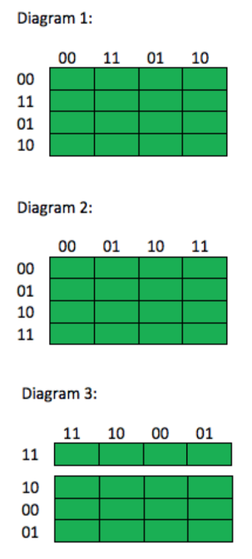
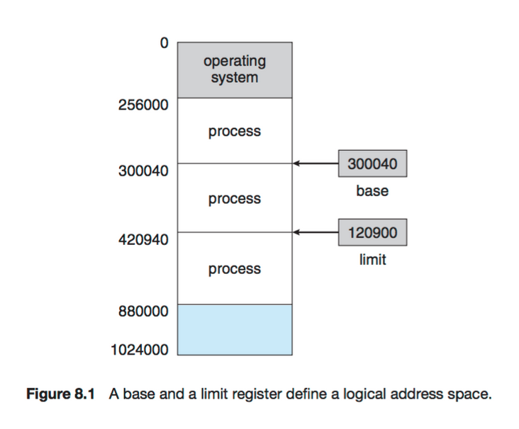
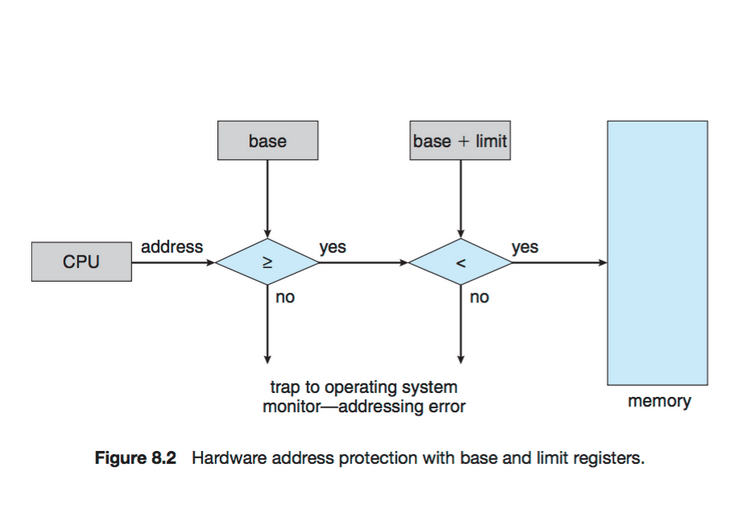
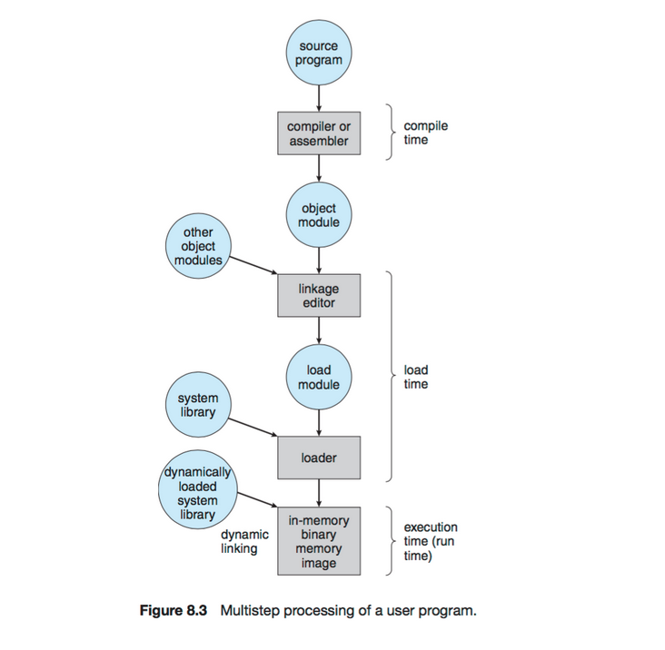
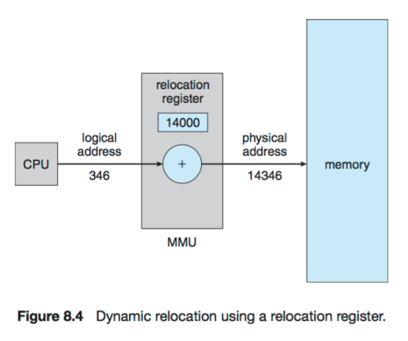
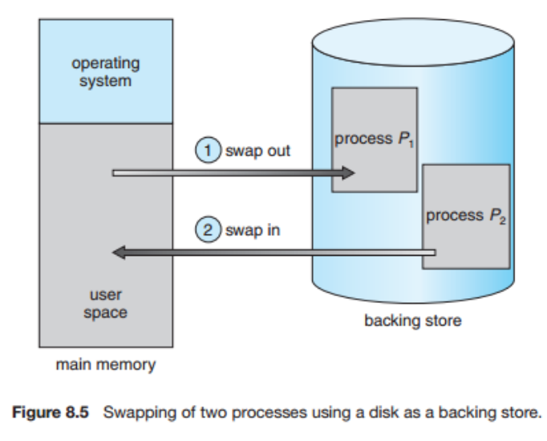
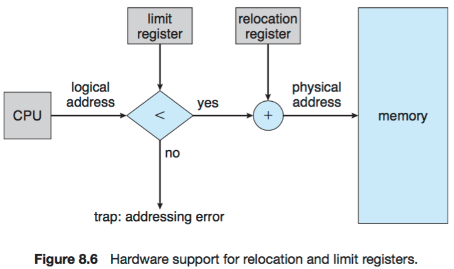
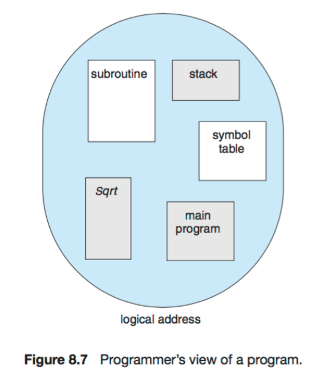
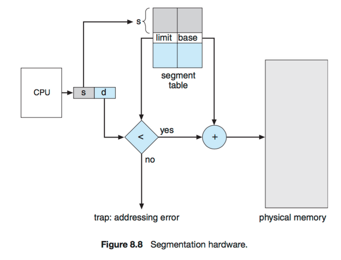
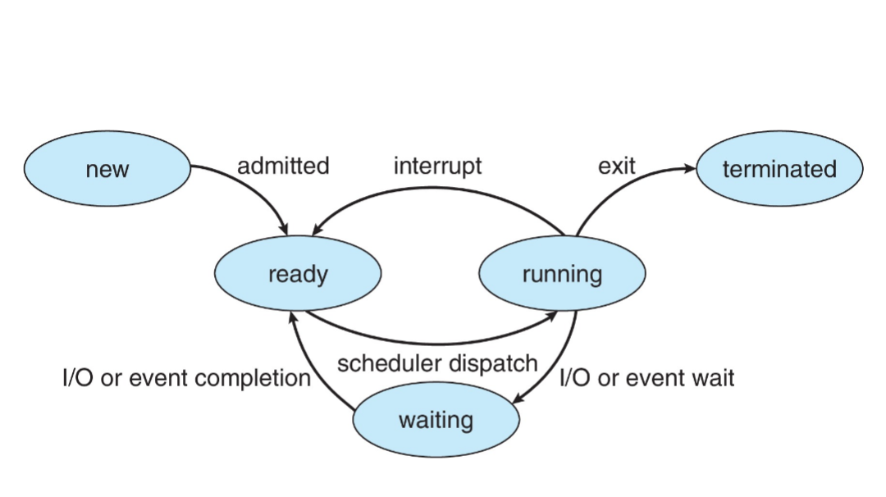

Info om notat. Når du ser tekst i source blokker

    Dette er en source blokk

Så betyr tall med understrek etter seg at tallet er nedfelt i det neste tallet
Samme gjelder for ^, det betyr at tallet er opphøyd i neste tall.

    10^10
    10_10

Er det samme som:
10<sup>10</sup>
10<sub>10</sub>

Med andre ord, om du noen gang ser at notatene har en kodebit som blir rar, eksempelvis SYS<sub>WRITE</sub>, gi beskjed så jeg kan endre det til `SYS_WRITE`

**Ny info:** Eg har oppdatert sida dette rendrast på, dei fleste kodeblokker har ikkje syntax-highlighting. Når dokke leser notata så konverter gjerne kodeblokkene om til markdown format for å få syntax highlighting. I dag ser dei slik ut:

```markdown
    public void(thisIsNotWorking) {
        pleaseFixMe();
    };
```

Men dei skal sjå slik ut:

````markdown
    ```java
    public void(thisIsNotWorking) {
        pleaseFixMe();
    };
    ```
````

For å få dette resultatet:

```java
public void(thisIsNotWorking) {
    pleaseFixMe();
};
```

<a id="orgd2e480c"></a>

## Informasjon om eksamen (2015)

- Vi får utdelt IntelCodeTable.pdf
- Vi får også utdelt tabell med interrupt-koder (int80ish)
- **Skrive/forklare skallprogram**
  - forklare kommandoer
- Skrive/forklare assembly program
- Regne med binære tall
- Digitale/logiske? kretser (forklare hva det gjør, skrive forenklet uttrykk)
  - Flipflops maybe?
- Noen teorispørsmål
  - Ikke typisk detaljer (minst en hel side om emnet)
  - HVA ER ET OPERATIVSYSTEM?
- Se tidl. eksamen skrevet av Atle (for to år siden i 2015) for vektlegging.
- Ikke flervalgsspørsmål
- Algoritmer i operativsystemdel.
- **Vi får sannhetstabeller! (samme type som terningsoppgaven)**
- **Assembly: "samme" spm som 2013**

<a id="org79c66dd"></a>

### Pensum Atle nevnte som viktig

- CPU
- Adressering
- Håndtering av hukommelse
- Håndtering av prosesser (bla synkronisering)
- Planleggingsalgoritmer (KOMMER!!)
  - Feks forklar round robin

<a id="orgfc8dca9"></a>

## Hva er et operativsystem

Et operativsystem er mellomleddet mellom bruker, prosesser og hardware. Det er operativsystemet som gir adgang til hardwaren. Det har hjelperutiner som skal gjøre systemet enklere å bruke (eks. GUI, CLI). En viktig funksjon operativsystemet gir oss er muligheten til å kjøre andre programmer. Det fordeler også ressurser (minne, CPU-time..) jevnt og rettferdig, håndterer minne/lagringsplass, planlegger prosesser og kontrollerer adganger. (I Windows og OSX er det pakke, mens i Linux, kan du bygge opp operativsystemet på din egen måte (I følge Atle)).

<a id="org12200c7"></a>

### Hovedoppgaver

- Process management
- Memory management
- Storage management
- Device management

<a id="org71a0d8c"></a>

### Provides

- UI (GUI/CLI)
- Fordeling av ressurser
- Kjøring av programmer
- I/O operations
- Kommunikasjon mellom prosesser
- Error detection
- Accounting (statistikk)
- Beskyttelse (kontrollere tilganger etc.)

<a id="orga68795b"></a>

### Oppbygging

- Har en kjerne (kernel)
- Layered vs microkernel (mix)
- Ligger vanligvis på disk og kjøres fra BIOS som er kodet inn i ROM.

<a id="org7b4e9c1"></a>

### Debugging

- Error detection
- Performance tuning

<a id="org79729df"></a>

### Fra forelesning

**Hva er et operativsystem**

- Et program som fungerer som et bindeledd mellom brukeren av en datamaskin og maskinvaren.
- Mål for operativsystemet
  - Utføre brukerprogram og løse brukerens problemer enkelt
  - Gjøre datamaskinen tilgjengelig for brukeren
  - Utnytte maskinvaren mest mulig effektivt

<a id="org83e7489"></a>

### Fra powerpoint

**Hva er et operativsystem?**

- Et program som fungerer som et bindeledd mellom brukeren av en datamaskin og maskinvaren
- Mål for operativsystemet:
  - Utføre brukerprogram og løse brukerens problemer enkelt
  - Gjøre datamaskinen tilgjengelig for brukeren
  - Utnytte maskinvaren mest mulig effektivt

**Hva gjør operativsystemet?**

- Kommer an på øynene som ser
- Bruker ønsker enkelhet og bryr seg ikke om ressursutnyttelse
- Men alle delte maskiner må sørge for at alle brukerne er tilfreds, dedikerte maskiner har dedikerte ressurser, men bruker delte ressurser fra tjenere, mobile enheter må tenke på brukbarhet og batteri, og noen maskiner har spesialisert brukergrensesnitt (bil, .. etc.)

**Definisjon av et operativsystem**

- Operativsystemet allokerer ressursene
- Håndterer alle ressursene
- Fordeler ressursene effektivt og rettferdig
- Operativsystemet er et styringsprogram
- Styrer utføringen av program for å unngå feil og uriktig bruk av datamaskinen
- Mange ulike definisjoner
- "Alt leverandøren gir deg når du kjøper operativsystemet"
- "Det eneste programmet som kjører hele tiden er kjernen", alt anne er enten systemprogram eller applikasjoner.

<a id="org3be2f06"></a>

## Untitled important stuff

- CPU
- Adressering
- Håndtering av hukommelse
- Planleggingsalgoritmer (KOMMER!!!)
  - F.eks. forklar round robin

<a id="org246ac4a"></a>

### Threads

**Critical section:**
Der en prosess endrer på felles-variabler

- Cooperation process: prosesser som kan påvirke hverandre.
- **Race condition**: At flere prosesser kan gå inn i en kritisk seksjon samtidig. Ikke gøy!

<a id="orgfafe282"></a>

#### Mutex lock

True/false. Brukes for å beskytte en kritisk seksjon. (for å entre kritisk seksjon må prosessen først motta en lock, som blir sluppet når prosessen er ferdig med det den skal gjøre inne i kritisk seksjon).

<a id="orgeb1a66b"></a>

#### Semaphores

Semaphores er en en integer som aksesseres gjennom wait() og signal().

- En **counting semaphore** brukes når vi har flere units av ressursen. (teller ressurser, og gir tilgang til prosesser om mulig).
- **Binary semaphore** same som mutex lock.

<a id="org171623c"></a>

#### Monitor

Et sett av funksjoner som omkapsler dataen og gir mutual exclusion.

- Har en lock, og 0 eller flere condition varibles (gjør at tråden kan sleepe inne i en kritisk seksjon).
- Krever at data er private og synchronized.

<a id="orgd6eb306"></a>

#### Deadlock

Ende opp med en ventesyklus.

- 4 kriterier for deadlock:
  - En prosess kan kun benytte seg av én ressurs om gangen.
  - En prosess som holder på en ressurs venter på andre ressurser.
  - Prosessen er ikke avbrytbar
  - Det er sirkulær venting mellom prosessene.

<a id="orgd8e5f0a"></a>

#### Livelock

Tråder kjører i CPU, men vi får ingen progress.

**Adressering**:

- Minne er delt opp i bytes hvor hver byte har sin egen adresse, som regel sekvensielt og begynner på 0.
- Maskinvare bruker absolutt adressering, dvs enheten leser en bestemt byte i minnet (eks. bytenr. 1234)
  - Kan dette for eksempel være ting OSet legger på samme plass hver gang?? Who knows omegalol.
- Når prosesser legges i minnet, gis de en relativ adresse. Da kan vi finne ting i minnet ved å bruke basisadressen og regne ut relativ adresse + basis adresse = absolutt adresse.
- CPU bruker logisk adresse, minneenheter bruker fysisk adresse.

<a id="org7a04cf3"></a>

### Instruksjoner

- Dataprosessering (aritmetikk/logikk (ALU))
- Datalagring
  - Flytting til og fra hukommelse (registre og primærhukommelse)
- Dataflytting
  - Til og fra I/O.
- Styring (flyt)
  - Testinstruksjoner (hopp)

<a id="orgd301c06"></a>

#### Instruksjonssyklus

- Hent instruksjon
  1. Kalkuler adressen til neste instruksjon. Pekes på av program counter.
  2. Hent instruksjon fra minne.
- Hent operander
  1. Dekod instruksjoner. Hent ut opcode.
  2. Dekod lokasjon til operandene.
  3. Hent fra minne eller register om nødvendig.
- Utfør instruksjoner
  1. Data operasjon: kall ALU om nødvendig.
  2. Hvis data skal lagres, kalkuler lokasjon.
  3. Lagre/skriv data til minne el register.
- Sjekk for avbrudd

  1. Sjekk om avbrudd har blitt angitt.
  2. Hvis avbrudd, oppdater programmtelleren.

- **Langtidsplanlegger:** Laster inn jobb som skal kjøres til hovedminne.

- **Kortidsplanlegger:** angir hvilken prosess som skal kjøres på CPU.

<a id="orgea19300"></a>

### Prosesser (kap 3)

- Består av: program counter/stack/datasection med variabler/heap.
- Et program er i seg selv ikke en proses, men det blir det når det kjøres.
- **States**: New/running/waiting/ready/terminated.
- PCB (Program Control Block): Datastruktur brukt av OS for å holde styr på informasjonen som trengs for å styre en prosess. Består av state/program counter/CPU registre/prioritet/accounting/IO
- Process scheduler: Velger neste prosess til CPUen (fra ready-queuen av prosesser).
- Forskjellige queues med prosesser (eks I/O-queue for prosesser som venter på tilgang til input/output).
- Context switch: Bytte mellom prosesser, krever at man lagrer staten til nåværende prosess og loader den nye staten. Tar "fuckloads" med tid.
- PID (process identifier): Typisk en integer for å identifisere prosesser.
- Prosesser kan kjøres asynkronisert/synkronisert på samme måte som tråder. (Parent må vente/ikke vente på child)
- Prosess avsluttes med exit()-systemkallet. OS deallokerer ALLE ressursene som er gitt prosessen. (Kan også bruke terminateProcess() på child-prosesser).
- Prosesser kan dele ressurser (ved å feks. oprette shared memory).

<a id="orge269f1b"></a>

### Threading (kap 4)

- _"A flow of control within a process"_
- Fordeler: Respons/ressursdeling/økonomisk/slalerbarhet
- Samtidighet(concurrency) vs parallelizing
- Dataparallellisering vs oppgaveparalellisering
- User threads vs kernel threads (many>one, one>one,many>many)
- Synkronisert (begge kjører videre) vs asynkronisert (parent venter på child).
- Implisitt threading (thread pools/OpenMP/GCD)
  - Compiling/run-time libraries som hjelper oss å threade implisitt.
- Issues: fork() og exec(), signal handling, thread cancellation, scheduler activations.

<a id="orgd1ec7d3"></a>

### Synkronisering (kap 5)

- Cooperating process: Kan påvirke og påvirkes av andre prosesser.
- Må ha synkronisering for å forhindre race condition.
- Kritisk seksjon:
  - Inneholder ressurser som bare kan aksesseres av en prosess om gangen.
  - 3 krav:
    - Mutual exclusion
    - Progress
    - Bounded waiting
  - Preemtive kernel (OS kan context switche) vs. non-preemtive (ingen race conditions).
  - Mutex-lock (true/false lock, aquire() og release()).
  - Spinlock, tråd looper mens den venter (en form for busy waiting).
    - Stjeler mange CPU-cycles på å sjekke hele tiden om den kan aquire.
    - Pro: Mindre context switching om ventetiden er kort.
  - Semaforer (counting eller binary, wait() og signal()).
  - Block (unngå busy waiting). Legger prosesser til i en queue.
  - Monitors: en ADT med en lock og null eller flere condition variables.
    - Skal forsikre oss mot timing errors, krever at all data er private.
    - Alle tråder må holde locken når de er i en kritisk seksjon.

<a id="org95079f5"></a>

### CPU-scheduling (kap 6)

- Helt nødvendig, gjøres av OS.
- Mål: CPU skal være i bruk så mye som mulig, men også rettferdig.
- OS kan interrupte en tråd for å gi CPU-tid til en annen tråd, derfor trenger den en queue. CPU scheduling handler om måten å behandle denne køen.
- To typer multitasking: Cooperative vs Preemptive.
  - Cooperative: En proses kjører så lenge den vil.
  - Preemptive: OS kan interrupte tråder (Complicated shit, tidkrevende).
- **Algoritmer**:
  - FIFO (First in first out)
  - SJF (Shortest job first): Gi prioritet til de som bruker lite tid, eks. GUI-stuff.
  - Priority scheduling, forskjellige prioriteter.
  - Round-robin: Bytter prosess hvert x antall millisekund.
- Kernel threads: "Ekte tråder", kan kjøres paralellt. Lang tid pr- context switch.
- User-lebel threads: Implementert i software, kjører concurrent.
- Interrupt er når kernel avbryter kjøring av en tråd for å gi tilgang til CPU til en annen tråd.

<a id="org282affe"></a>

### Deadlock (kap 7)

- Deadlock oppstår når en prosess er i en evig wait fordi en annen proses holder på ressursene den trenger.
- Ressurser kan være CPU cycles, filer, I/O devices.
- Request, use, release.
- Deadlock 4 krav:
  - Mutual exclusion.
  - Hold and wait (prosess holder mens den venter).
  - Bare prosessen selv kan slippe ressursen.
  - Curcular wait (A venter på B, B venter på C, C venter på A).
- Kan bruke graf (proses = sirkel, ressurs = firkant, prikker er antall ressurser pe klasse).
- Safe state: hvis vi har nok ressurser til å kjøre alle prosessene (i en eller annen rekkefølge). Unsafe state kan føre til dealock.
- Bankers algoritme: [Bankers algoritme video](https://www.youtube.com/watch?v=w0LwGqffUkg)
- For å løse deadlock kan vi stjele ressurser fra en annen proses, gjøre rollback på prosesen eller xxxxx&#x2014;Missing stuff&#x2014;xxxxx <&#x2013; kom med forslag.

<a id="orgc120786"></a>

### Memory allocation

- Letteste metode: Multiple-partition, fordele i flere fixed-size partitions.
  - Når vi legger en prosess fra queuen inn i minnet (allokerer) kan vi bruke tre forskjellige metoder: first fit, best fit, worst fit.
- **Fragmentation**:
  - Ekstern: Ledig plass i det totale minnet er delt opp i mange små biter.
    - 50% rule ved first-fit (N allokert minne gir 0.5N tapte blocks).
  - Intern: Inni hver blokk er det ikke sikkert at prosessen bruker hele minnet, etterlater seg holes.
- Ekstern fragmentering kan begrenses ved å tillate at prosessene deles opp i segmenter eller pages.
  - Segmentering og paging.
- **Segmentering:**
  - Man kan dele opp en prosess i <span class="underline">logisk</span> deler, og legge den inn der det er plass i minnet. Ulempe er at den gir lere hull i minnet, men fordelen er at den ikke bryter opp ting som burde være samlet (typisk en løkke).
  - Med segmentering får man varierte størrelser på delene.
- **Swapping:** Swapper prosesser ut og inn av minnet.
  - Det man swapper ut blir lagt i backing store, det man swapper inn blir lagt i minnet.
  - Swap har en fuckload av transfer time.
  - Mobile enheter driver generelt sett ikke med swapping, hvertfall ikke standar swapping.

<a id="org672ee34"></a>

### Virtual Memory (kap 9)

- Paging algoritmer
  - Velger hvilke pages som skal erstattes i RAM.
- Frame allocation.
  - Bestemmer antall frames som gis til hver prosess.
- Paging
  - Flytter pages (del av proses) fram og tilbake fra disk til RAM.
- Thrashing
  - Bruker mer tid på paging enn å kjøre prosessen.

<table border="2" cellspacing="0" cellpadding="6" rules="groups" frame="hsides">

<colgroup>
<col  class="org-left" />

<col  class="org-left" />
</colgroup>
<tbody>
<tr>
<td class="org-left">Page fault</td>
<td class="org-left">Finner ikke pagen i minnet (RAM)</td>
</tr>

<tr>
<td class="org-left">Demand paging</td>
<td class="org-left">Henter kunn inn RAM de pagene som trengs</td>
</tr>

<tr>
<td class="org-left">Prepaging</td>
<td class="org-left">Alle trengte "initial" pages tas inn i RAM før oppstart av prosessen</td>
</tr>

<tr>
<td class="org-left">Page locking</td>
<td class="org-left">Låser pages i RAM som OSet må ha hele tiden</td>
</tr>
</tbody>
</table>

<a id="org4124271"></a>

## Binære tall

<a id="org0ba5745"></a>

### Toerkomplement

Om noken har lyst til å skrive litt om dette hadde eg blitt glad&#x2026;

<a id="orgb61212a"></a>

### Tallsystem

      1     0    1    1   0   0   1   1
      x     x    x    x   x   x   x   x
    [128] [64] [32] [16] [8] [4] [2] [1]
     128 +  0 + 32 + 16 + 0 + 0 + 2 + 1 = 179

- Posisjonssystem
- Titallsystem
  - Mest signifikant siffer til venstre, minst til høyre.
- Totalls-system
  - Der er bare 10 forskjellige typer siffer (hehe).
- Grunntallet (radix) angis slik 597<sub>10</sub> eller slik 1011<sub>2</sub>
- Omskriving fra binær til oktal:

  - Oktal har sifrene: 0, 1, 2, 3, 4, 5, 6, 7
  - Del opp tre og tre fra venstre og regn ut totall-verdien.

  - 010 101 011_2 = 253_8
    1 5 3

- Heksadesimale tallsystem

  - 0, 1, 2, 3, 4, 5, 6, 7, 8, 9, A, B, C, D, E, F
  - Posisjonens betydning er 16<sup>posisjon</sup>.
  - Omregning fra binær til heksadesimal
  - Del opp 4 og 4 fra venstre og regn ut totall-verdien

  - 1010 1011 = AB_16
    A B

- Fra titalls-system til binært
  - Titall %2, rest blir helt til høyre. Fortsett med titall / 2.

Tallsystem er ikkje skikkelig notert, så om folk har notat på dette er det berre å dele.

<a id="org4533abc"></a>

## Logiske kretser og tallsystem

There is nothing here yet.

<a id="org85de808"></a>

## Karnaughdiagram


Fra eksamensoppgave:

- **Spørsmål:** Hvorfor kan grupperinger i Kernaughdiagrammer simplifiseres til enklere uttrykk?
- **Svar:** Prinsippet er slik at naboceller er forskjellig i bare en variabel. Hvis to naboceller er relatert til uttrykket, vil produktene bare være forskjellig med en variabel, som f.eks. AB + AB i oppgave C. Vi kan bruke identiteten A \* B + A = A (neste oppgave) for å simplifisere uttrykket. I praksis, betyr det at variabler som endres i en gruppe kan elimineres.
- **Spørsmål:** Diagrammene over viser potensielle oppsett for Kernaugh-basert simplifisering. Minst et av diagrammene er ugyldig og minst et er gyldig. Angi hvilke av diagrammene som er gyldige og hvlike som er ugyldige Kernaughdiagrammer. Begrunn.
- **Svar:** Et gyldig Kernaughdiagram vil være slik at naboceller bare er forskjellig i en variabel. Diagrammene 1 og 2 er ugyldige siden 00 og 11, og 10 og 01, er forskjellige i to variabler. Diagram 3 er gyldig.

<a id="org5453544"></a>

## Assembly

Om vi skriver siffer, refererer (Fyttinnina hon refererer e et heilt forbanna jævli ord å lese/skrive. De e jo berre masse r'a og e'a annakvar gong med en f i midten&#x2026;) vi til plassen i 'minne-tabellen'. Om vi skriver [siffer] refererer vi til verdien som plassen siffer i minnet inneholder.

Hele E\*X-registeret er 32 bytes.

           8B     8B
     16B  |----AX---| = 32 B
    |     | AH | AL |
    |------EAX------|

IP - Instruksjonsteller (instruction pointer)

- Hvor CPUen finner neste instruksjon som skal utføres.

SP - Stabelpeker (stack pointer)

- Hvor neste plass i stabelen
- Push/pop
- Brukes til mellomlagring

.bss

- Deklarere variabler
- resb, reserve byte. siffer resb 1 betyr at vi reserverer 1 byte til variabelen siffer.

.data

- Definere strenger, lengder, crlf.

.text

- \_start forteller assembleren hvor programmet skal starte (pga. `global_start`).

**Registre:**

<table border="2" cellspacing="0" cellpadding="6" rules="groups" frame="hsides">

<colgroup>
<col  class="org-left" />

<col  class="org-right" />

<col  class="org-left" />

<col  class="org-left" />

<col  class="org-left" />
</colgroup>
<thead>
<tr>
<th scope="col" class="org-left">&#xa0;</th>
<th scope="col" class="org-right">Eax</th>
<th scope="col" class="org-left">Ebx</th>
<th scope="col" class="org-left">Ecx</th>
<th scope="col" class="org-left">Edx</th>
</tr>
</thead>

<tbody>
<tr>
<td class="org-left">`SYS_WRITE`</td>
<td class="org-right">4</td>
<td class="org-left">1 (stdout)</td>
<td class="org-left">content</td>
<td class="org-left">Length in bytes</td>
</tr>

<tr>
<td class="org-left">`SYS_READ`</td>
<td class="org-right">3</td>
<td class="org-left">0 (read from std input)</td>
<td class="org-left">content</td>
<td class="org-left">Length</td>
</tr>

<tr>
<td class="org-left">`SYS_EXIT`</td>
<td class="org-right">1</td>
<td class="org-left">\* Not important</td>
<td class="org-left">-</td>
<td class="org-left">-</td>
</tr>
</tbody>
</table>

<table border="2" cellspacing="0" cellpadding="6" rules="groups" frame="hsides">

<colgroup>
<col  class="org-right" />

<col  class="org-left" />

<col  class="org-left" />

<col  class="org-left" />

<col  class="org-left" />

<col  class="org-left" />

<col  class="org-left" />
</colgroup>
<thead>
<tr>
<th scope="col" class="org-right">%eax</th>
<th scope="col" class="org-left">Name</th>
<th scope="col" class="org-left">%ebx</th>
<th scope="col" class="org-left">%ecx</th>
<th scope="col" class="org-left">%edx</th>
<th scope="col" class="org-left">%esx</th>
<th scope="col" class="org-left">%edi</th>
</tr>
</thead>

<tbody>
<tr>
<td class="org-right">1</td>
<td class="org-left">`sys_exit`</td>
<td class="org-left">int</td>
<td class="org-left">-</td>
<td class="org-left">-</td>
<td class="org-left">-</td>
<td class="org-left">-</td>
</tr>

<tr>
<td class="org-right">2</td>
<td class="org-left">`sys_fork`</td>
<td class="org-left">struct pt<sub>regs</sub></td>
<td class="org-left">-</td>
<td class="org-left">-</td>
<td class="org-left">-</td>
<td class="org-left">-</td>
</tr>

<tr>
<td class="org-right">3</td>
<td class="org-left">`sys_read`</td>
<td class="org-left">unsigned int</td>
<td class="org-left">char \*</td>
<td class="org-left">`size_t`</td>
<td class="org-left">-</td>
<td class="org-left">-</td>
</tr>

<tr>
<td class="org-right">4</td>
<td class="org-left">`sys_write`</td>
<td class="org-left">unsigned int</td>
<td class="org-left">const char \*</td>
<td class="org-left">`size_t`</td>
<td class="org-left">-</td>
<td class="org-left">-</td>
</tr>

<tr>
<td class="org-right">5</td>
<td class="org-left">`sys_open`</td>
<td class="org-left">const char \*</td>
<td class="org-left">int</td>
<td class="org-left">`int`</td>
<td class="org-left">-</td>
<td class="org-left">-</td>
</tr>

<tr>
<td class="org-right">6</td>
<td class="org-left">`sys_close`</td>
<td class="org-left">unsigned int</td>
<td class="org-left">-</td>
<td class="org-left">-</td>
<td class="org-left">-</td>
<td class="org-left">-</td>
</tr>
</tbody>
</table>

<a id="org775217f"></a>

## Shellscript

Arrays var ikke pensum i 2015 (mest sannsynlig ikke i 2018 heller), men her er litt [useful arraystuff](https://www.cyberciti.biz/faq/finding-bash-shell-array-length-elements/).

    #!/bin/bash - shebang

<a id="orgd20d4bc"></a>

### Kommandoer

Arrays var ikke pensum i 2015 (mest sannsynlig ikke i 2018 heller), men her er litt [useful arraystuff](https://www.cyberciti.biz/faq/finding-bash-shell-array-length-elements/).

<table border="2" cellspacing="0" cellpadding="6" rules="groups" frame="hsides">

<colgroup>
<col  class="org-left" />

<col  class="org-left" />
</colgroup>
<thead>
<tr>
<th scope="col" class="org-left">Kommando/operatorer</th>
<th scope="col" class="org-left">Forklaring</th>
</tr>
</thead>

<tbody>
<tr>
<td class="org-left">wait</td>
<td class="org-left">wait</td>
</tr>

<tr>
<td class="org-left">&</td>
<td class="org-left">Kjør en prosess</td>
</tr>

<tr>
<td class="org-left">echo</td>
<td class="org-left">Skriv ut</td>
</tr>

<tr>
<td class="org-left">read</td>
<td class="org-left">'read myString'lagrer input i $myString.</td>
</tr>

<tr>
<td class="org-left">-p "some message"</td>
<td class="org-left">Bruk '-p "message" for å gi en beskjed med innlesingen</td>
</tr>

<tr>
<td class="org-left">date</td>
<td class="org-left">Gir dagens dato, format "Tue Dec 8 13:30:05 CET 2018"</td>
</tr>

<tr>
<td class="org-left">-r $filnavn</td>
<td class="org-left">Gir siste endringspunkt (i samme format som over)</td>
</tr>

<tr>
<td class="org-left">+%s</td>
<td class="org-left">Operator som regner om til sekunder</td>
</tr>

<tr>
<td class="org-left">grep [PATTERN][FILENAME]</td>
<td class="org-left">Henter ut linjer fra en fil som inneholder det gitte mønsteret</td>
</tr>

<tr>
<td class="org-left">-c (count)</td>
<td class="org-left">count: gir antall linjer som matcher pattern i filen.</td>
</tr>

<tr>
<td class="org-left">cut [OPTIONS][FILE]</td>
<td class="org-left">Kutter bort deler av linjer i en fil som vi ikke vil beholde</td>
</tr>

<tr>
<td class="org-left">-d (delimiter)</td>
<td class="org-left">Hvordan man ønsker å dele opp linjene</td>
</tr>

<tr>
<td class="org-left">-f (fields)</td>
<td class="org-left">Hvilket felt man ønsker (Eksempel: $(cut -d ":" -f2 fil.txt) gir alle linjer i fil som&#x2026;)</td>
</tr>

<tr>
<td class="org-left">& eller bg</td>
<td class="org-left">Kjører prosessen i bakgrunnen (Eksempel: ls -l & eller bg ls -l)</td>
</tr>

<tr>
<td class="org-left">Dc</td>
<td class="org-left">Kalkulator, gitt på eksamen h13, fikk manualen for dc.</td>
</tr>

<tr>
<td class="org-left">Head</td>
<td class="org-left">&#xa0;</td>
</tr>

<tr>
<td class="org-left">Tail</td>
<td class="org-left">&#xa0;</td>
</tr>

<tr>
<td class="org-left">Let eller (( &#x2026; ))</td>
<td class="org-left">Gjør utregning (Eksempel: let a=12; let b=a\*3  eller ((a=12));((++a)))</td>
</tr>

<tr>
<td class="org-left">-ne</td>
<td class="org-left">Ikke lik</td>
</tr>

<tr>
<td class="org-left">-eq</td>
<td class="org-left">Lik</td>
</tr>

<tr>
<td class="org-left">-gt</td>
<td class="org-left">Greater than</td>
</tr>

<tr>
<td class="org-left">-lt</td>
<td class="org-left">Less than</td>
</tr>
</tbody>
</table>

<table border="2" cellspacing="0" cellpadding="6" rules="groups" frame="hsides">

<colgroup>
<col  class="org-left" />

<col  class="org-left" />

<col  class="org-left" />
</colgroup>
<thead>
<tr>
<th scope="col" class="org-left">Boolske operatorer</th>
<th scope="col" class="org-left">Forklaring</th>
<th scope="col" class="org-left">Eksempel</th>
</tr>
</thead>

<tbody>
<tr>
<td class="org-left">-e</td>
<td class="org-left">exists</td>
<td class="org-left">eks. [-e "test.txt"] gir [TRUE] hvis test.txt eksisterer</td>
</tr>

<tr>
<td class="org-left">-ne</td>
<td class="org-left">not equal to</td>
<td class="org-left">eks. [$#-ne 0]           gir [TRUE] hvis antall argumenter ikke er 0</td>
</tr>

<tr>
<td class="org-left">-eq</td>
<td class="org-left">equals</td>
<td class="org-left">^^</td>
</tr>

<tr>
<td class="org-left">-z</td>
<td class="org-left">TRUE om strengen er tom</td>
<td class="org-left">if [-z $1]                 sjekker om første argument er tom</td>
</tr>

<tr>
<td class="org-left">-n</td>
<td class="org-left">String is NOT null, has content</td>
<td class="org-left">if [-n $1] sjekker om første argument ikke er tom</td>
</tr>
</tbody>
</table>

<a id="orgf4ec801"></a>

### Variabler

Arrays var ikke pensum i 2015 (mest sannsynlig ikke i 2018 heller), men her er litt [useful arraystuff](https://www.cyberciti.biz/faq/finding-bash-shell-array-length-elements/).
**Variabler**
declare -i tall (deklarerer en int)
declare streng

For å bruke verdien i en variabel har vi $ foran, om vi skal sette den bruker vi ikke $ (eks. total+=\$tall)
**Bruke verdien i argumenter:**

- For å hente verdien i argumenter bruker vi $1, $2 osv.
- \$# gir antall argumenter
- shift fjerner argument nr 1 og flytter alle argumenter et hakk til venstre

  while [$# -ne 0]
  do
  do stuff to \$1
  shift
  done

<a id="orgd24adf6"></a>

### Kontrollstrukturer

    If-statements
        Vanlig
        if [ boolean expression ]
        then
     do stuff...
        else
     do something else..
        fi

    Multiple conditions:
        if [ boolean expression ] && [ boolean expression ]
        Kan også bruke ! foran expression slik [ ! boolean expression ]

    for-loopyloops
        Vanlig
        for ((i=0; i < $someNumber; i++))    # husk to parenteser!!
        do
     do stuff...
        done

        Loope gjennom en string
        for users in ${allUsers[@]}
        do
     do stuff...
        done

    while-loop
        while [ boolean expression ]
        do
     do stuff...
        done

        Innlesing som varer helt til bruker trykker ctrl + d
        while read tall
        do
     sum+=$tall
        done

<a id="orga66c05e"></a>

## Dinosaurboka

<a id="org225216c"></a>

### Kapittel 1 - Introduction

<a id="org450753c"></a>

#### What Operating Systems Do

- **Operativsystem:** Et program som styrer maskinvare. Det gir også grunnlag for program og fungerer som et mellomledd mellom datamaskinen bruker og maskinvare.
  - Komplekst, må lages bit for bit. 

En datamaskin kan deles inn i fire komponenter:

- Hardware (CPU, Minne og input/output)
  - Gir de grunnleggende dataressursene for systemet.
- Operativsystem.
  - Program som styrer datamaskinens maskinvare.
  - Kontrollerer hardware og koordinerer bruken mellom ulike program for ulike brukere.
- Applikasjoner
  - Word, kompilatorer, internettlesere osv. (Brukerens databehandling)
- Brukere

(Kan også se på det slik at et datasystem er hardware, software og data)

Operativsystemet er det eneste programmet på datamaskinen som kjøres hele tiden.

- The kernel
  - To andre typer programmer:
    - Systemprogrammer (Assosiert med operativsystemet)
    - Applikasjoner (Andre programmer)

**Storage definition:**
Bit - basic unit of computer storage. Two values: 0 and 1.

- All lagring i en datamaskin er basert på collections av bits.

  - Kan representere nummer, bokstaver, bilder, filmer, lyd, program osv.

    1 Byte = 8 bits
    1 KB = 1024 bits
    1 MB = 1024^2 bits
    1 GB = 1024^3 bits.

<a id="orgbced344"></a>

#### Computer-System Organization

Memory: CPU, Disk Controller, USB Controller, Monitor.

For å starte en datamaskin må man ha et "boot-strap" system.

- Starter operativsystemet.

Interrupts:
Alle datamaskinsystemer har egne rutiner for å håndtere interrupts.

- Interruptet må overføre kontrollen til den aktuelle avbryt-tjenestens rutine. Den enkleste metoden for håndtering av slik overføring vil være å starte en generisk rutine for å undersøke avbruddets informasjon og i sin tur kalle avbruddets spesifikke behandler.
  - Må behandles fort.

Memory:
ROM - Bare static programmer er lagret der.
RAM - Alle programmer som kjøres lagres her.
Nesten alle programmer er lagret på en disk før de loades inn til RAM.

Registre - Cache - Main Memory - Elektronisk Disk - Magnetisk Disk - Optical Disk (optisk) - Magnetic Tapes.

<a id="orgd3c370a"></a>

#### Computer-System Architecture

- Fleste system bruker single-prosessor.
  - En main CPU.
  - Andre spesifikke prosessorer som har en oppgave.
- Multiprocessor System, blitt mer vanlig.
  - To eller flere prosessorer.
    - "Mer gjort på kortere tid", billigere, mindre feilhåndtering.
  - Clustered System - der flere systemer lager felles flere CPU'er.
    - Ofte koblet sammen via LAN.

<a id="org3475eee"></a>

#### Operating-System Structure

- Multiprogramming: Operativsystemet har flere jobber i minnet samtidig. Switcher mellom jobbene.
  - Ved programmer som krever "svar" fra brukeren ved bruk av I/O, skifter operativsystemet til en ny jobb i mellomtiden.

<a id="orgc27a6d1"></a>

#### Operating-System Operations

- Interrupt basert.
  - Ingen prosesser å avslutte eller ingen I/O til å håndtere. Operativsystemet vil være i "vente-modus".
- Trap (Exception) - Software generert interrupt som følge av en error.

Finnes to ulike "modes" for operasjoner. Kernel mode (0) og User mode (1)
En bit (0 og 1), mode bit, finnes i hardwaren for å indikere nåværende mode.

- Kan vite om en oppgave kjøres for operativsystemet eller for brukeren.
  - Om en user-oppgave trenger hjelp fra operativsystemet skiftes mode.
- Starter alltid i Kernel mode.
- Ved interrupts skifter systemet fra user mode til kernel mode.
  - Alltid når systemet har kontroll over datamaskinen er det Kernel mode.

Timer:

- Unngå evige loops i feilsøking osv.
- Settes til en viss tid slik at en interrupt skjer om feilsøkingen ikke er ferdig.

<a id="orge760851"></a>

#### Process Management

En prosess trenger ulike ressurser: CPU time, minne, filer og I/O for å fullføre oppgaven. Operativsystemet er ansvarlig for følgende aktiviteter i forbindelse med prosess-styring:

- Skjemalegge prosesser og tråder på CPU'en.
- Lage og slette både bruker- og system-prosesser.
- Suspendere og fortsette prosesser.
- Gi mekanismer for prosessens synkronisering.
- Gi mekanismer for prosessens kommunikasjon.

<a id="orga71e900"></a>

#### Memory Management

"Main memory" (primærhukommelse/RAM) er en stor array med ord eller bytes. I størrelser fra 100 til 100 000 billioner.

- Hver byte eller ord har sin egen "adresse".

"Main memory" er ett oppbevaringssted med hurtig-tilgjengelige data delt av CPU og I/O.

Operativsystemet er ansvarlig for følgende aktiviteter i forbindelse med minne-styring:

- Holde oversikt over hvilke deler av minnet som er brukt for tilfellet og av hvem.
- Avgjøre hvilke prosesser eller data som skal flyttes inn og ut av memory.
- Tildeling av minne.

<a id="orgce1b275"></a>

#### Storage Management

Operativsystemet er ansvarlig for følgende aktiviteter i forbindelse med lagrings-styring:

- Lage og slette filer.
- Lage og slette kataloger til å organisere filene.
- Hjelpe primitiver for å manipulere filer og kataloger.
- Mappe filer til secondary lagring.
- Backup.

**Mass-Storage-styring:**
Operativsystemet er ansvarlig for følgende aktiviteter i forbindelse med disk-styringen:

- Ledig plass
- Lagringskataloger
- Disk styring (Skjemalegge/Rydde)

**Caching:**
Informasjon er normalt lagret i lagringssystemet. Når det blir brukt blir det kopiert til et raskere lagringssystem "The cache".

- Sjekker alltid om informasjonen vi trenger er i cachen.

Magnetisk disk &rarr; Main Memory (RAM) - Cache - Hardware registrer.

I/O Systems:

- Ett minne-styringskomponent som inkluderer buffering, caching og spooling.
- En generell enhet-driver interface.
- Drivere for spesifikke hardware enheter.

<a id="orga8b6ae7"></a>

#### Protection and Security

Om en datamaskin har flere brukere må det kontrolleres hvem som har tilgang på de ulike delene og se til at kun de med rettigheter for tilgang til filer, minne segmenter, CPU og andre ressurser.

- Ubeskyttede ressurser kan ikke forsvare seg mot bruk/missbruk fra uautoriserte eller inkompetente brukere.

<a id="orgbdad3ad"></a>

#### Distributed Systems

En samling av fysisk separate datasystemer som er koblet sammen for å la brukere ha tilgang til ulike ressurser systemet innehar.

- LAN: Kobler datamaskiner i samme rom, etasje eller bygning.
- WAN: Kobler bygninger, byer eller på tvers av land.

<a id="orge016bb6"></a>

#### Special-Purpose Systems

**Embedded computers:**
Finnes overalt, i alt fra biler, roboter, mikroovner og toastere.

- Spesifikke oppgaver. Nesten ingen user-interface.
- Real-time operativsystem. Sensorer og analyse.

<a id="orgc40add1"></a>

#### Computing Environments

- Utvikling
- En server: flere klienter.
- Peer to peer computing: oppgaver/arbeid fordeles mellom peers.

<a id="org16cdd23"></a>

#### Open-Source Operating Systems

Enklere å studere hvordan ting fungerer, bla operativsystem, da mye kode (source format) ligger åpent offentlig.

<a id="org6008fd6"></a>

### Kapittel 2 - System Structures

**Intro:** An OS provides the environment within which programs are executed.
[Relevant video](https://www.youtube.com/watch?v=dQw4w9WgXcQ)

**Oppsummering:**
Operativsystemer tilbyr en rekke forskjellige tjenester. Dypest inne vil systemanrop tillate et kjørende program å lage forespørsler direkte fra operativsystemet. Beveger man seg oppover vil skall ta imot kommandoer uten å måtte skrive programmer fra bunnen av. Kommandoer kan komme fra filer, direkte fra terminalen, eller gjennom et brukergrensesnitt som en bruker interaktivt kan navigere seg gjennom. Systemprogrammer sørger for å tilfredstille vanlige brukerforespørsler.

Typen forespørsel varierer i henhold til nivået man befinner seg i. Systemanropsnivået må tilby grunnleggende funksjoner som prosesskontroll, og fil- og enhetsmanipulasjon. Forespørsler på høyere nivå, som må tilfredsstilles av kommandotolkeren eller systemprogrammer, blir oversatt til en sekvens av systemanrop. Systemtjenester kan kategoriseres i flere kategorier som programkontroll, statusforespørsler og innputt- og utputtforespørsler. Programfeil kan betraktes som implisitte tjenesteforespørsler.

Dersom man skal lage et helt nytt operativsystem, er det flere viktige punkter man må tenke på underveis. Et viktig punkt i denne prosessen er å få en plan over hvordan designet av operativsystemet skal være, i god tid før arbeidet med dette iverksettes. Den ønskede typen system er grunnlaget for valg mellom ulike algoritmer og strategier som vil være nødvendige. Gjennom hele designprosessen må man skille politiske beslutninger fra implementasjonsdetaljer. Denne separeringen tillater maksimum fleksibilitet hvis de politiske beslutningene skal endres senere.

Når et operativsystem er ferdig designet, begynner implementasjonsprosessen. Dagens operativsystemer er så-og-si alltid skrevet i system-implementeringsspråk eller i et høynivåspråk. Dette fører til forbedringer rundt implementasjon, vedlikehold og portabilitet. Et system så stort og komplekst som et moderne operativsystem utvikles nøye. At systemet er modulbasert er viktig. Derfor anses det som god teknikk om man deler operativsystemet opp i flere lag, eller om det benyttes mikrokjerner. Flere operativsystemer støtter nå dynamisk ladede moduler, som tillater å legge til funksjonalitet mens det kjøres. Generelt sett bruker operativsystemene en hybrid tilnærming som kombinerer flere forskjellige typer strukturer.

Feilsøkingsprosess og kjernefeil kan oppnås ved bruk av debuggere, og andre verktøy som analyserer kjernefelt. Verktøy som DTrace analyserer produksjonssystemer for å finne flaskehalser og forstå annen systemadferd.

For å opprette et operativsystem for en bestemt maskinkonfigurasjon må vi utføre systemgenerering. For at datamaskinssystemet skal kjøre, må CPU-en initialiseres og kjøre bootstrapprogrammet, det første programmet som skal kjøres når et slik system startes. Bootstrap-en kan kjøre operativsystemet direkte dersom dette også er i fastvaren, eller kan det fullføre en sekvens som laster gradvis smartere programmer fra fastvaren og disken, helt til operativsystemet selv er lastet inn i minnet og kan kjøres.

<a id="org1609459"></a>

#### PR a new heading here

The services provided by the OS differs, but we can identify common classes:

1. User interface (UI)

   - Command-line interface(CLI)
     - Uses text commands and a method for entering them
   - Batch interface
     - Commands and directives to control those commands are enetered into files, and those files are executed.
   - Graphical user interface (GUI)
     - The interface is a window system with a pointing device to direct I/O, chose from menus, and make selections and a keyboard to enter text.
   - Some systems provide two or all of these variations.

2. Program executions

   Must be able to load a program into memory and running it. Must be able to end its execution, normally or abnormally(indicating error).

3. I/O operations

   A program might require I/O, which may involve a file or an I/O device. For efficiency and protection, users usually cannot control I/O devices directly. Therefore, the OS must provide a means to do I/O.

4. File-system manipulation

   Programs need to read and write files and directories. They need to create and delete by name, search by name, and list file information. Permission management to allow or deny access based on file ownership. Many OS provides a variety of file systems, for personal choice, and to provide specific features or performance characteristics.

5. Communications

   Processes needing to exchange info with other processes, either locally on the same computer, or on another via network. Can use either:

   - **Shared memory:** In which two or more processes read and write to a shared section of memory.
   - **Message parsing:** In which packets of information in predefined formats are moved between processes by the operating system.

6. Error detection

   The OS needs to be detecting and correcting errors constantly. Errors may occur in:

   - CPU and memory hardware (such as memory error or a power failure)
   - I/O devices (parity error on disk, connection failure network, lack of paper in printer etc.)
   - User program (arithmetic overflow, attemt to access illegal memory location, too-great use of CPU-time)

   For each type the OS should take appropriate action. Sometimes it has to halt the system. Other times it might terminate an error-causing process, or return an error code to the process for the process to detect and possibly correct.

7. Multiple users

   There is another set of operating system functions that exists to ensure the efficient operation of the system itself. Systems with multiple users can gain efficiency by sharing the computer resources among the users.

   1. Resource allocation

      Allocating resources to the process or user needing it. Some are complicated, such as CPU and memory, while I/O tasks is not that complicated.

   2. Accounting

      Keep track of which users use how much and what kinds of resources. Can be used for billing, researchers or statistics.

   3. Protection and security

      Protection involves ensuring that all access to system resources is controlled. Processes can only access what it needs to access. Security of system from outsiders is also important (user authentication). Also security against I/O devices, network adapters and such. A chain is only as strong as the weakest Zelda(link for you uncultured nerds).

<a id="org2d8f9c3"></a>

#### - PR a new heading here

1. Command interpreters

   On systems with multiple command interpreters to choose from, the interpreters are known as **SHELLS**. UNIX and Linux offers Bourne shell, C shell, Bourne-Again shell, Korn shell and others. Similar functionality - users choice.

   - **Main function - get and execute the next user-specified command:** The interpreter contains the code to execute the command. For deleting something, it jumps to a section of its code and sets up the parameters and makes the appropriate system call.

   UNIX uses system programs. The command interpreter does not understand the command, it merely uses the command to identify a file to be loaded into memory and executed. The UNIX command to delete a file: `rm file.txt` would search for `rm`, load the file into memory, and execute it with the parameter `file.txt`. The function in the program is defined in the code in the file.

2. Graphical User interfaces

   - Mouse-based window-and-meny system
   - Desktop, icons (for files, folders, programs and what not), folders (directories).
   - Appeared early in 1970s at Xerox PARC research facility.
   - More widespread by Apple Macintosh in the 80s.

3. Choice of Interface

   - Up to prefrence
   - Sys admins and power users frequently use CLI
   - Can do repetetive tasks easier, with shell scripts.

<a id="orgc7f1f63"></a>

#### System Calls

System calls provide an interface to the services made available by an operating system. Available as routines written in **C** and **C++**. Certain low-level tasks may have to be written using **assembly**-language instructions.

Many systens calls even though the task is small, for copying a file:

- Checking if files exists, create output file.
- Error handling if not exists, exists from before, reading problems, out of memory etc.
- Loop with copying content.

All of these tasks have a lot of system calls each. Simple programs may have use of the OS. Systems **execute thousands** of system calls per second.

Programmers rarely see or use this level of detail. We use an API, that invoke the actual system calls on behalf of application programmer.

Three of the most common API's:

- Windows api for Windows system.
- POSIX API for POSIX-based systems (which include virtually all versions of UNIX, Linux, and Mac OSX)
- Java API for programs that run on the Java Virtual Machine.

<a id="org7eb9753"></a>

### Kapittel 3 - Process Management

A process can be thoguht of as a program in execution. Processes are the unit of work in a modern time-sharing system.

A system consists of a collection of processes:

- Operating system processes executing system code.
- User processes executing user code.

In operating systems, many processes will run at the same time. A specific algorithm, **scheduling**, will allocate processor time for the different processes.

<a id="org7575bc0"></a>

#### Process concept

1. The process

   A process is more than the program code (text section), it also includes:

   - The current activity, as represented by the value of the program
   - The contents of the processors registers
   - The process stack, which contains temporary data (function parameters, return adress, and local variables)
   - A data section, which contains global variables
   - A process may also include a heap, which is memory that is dynamically allocated during process run time.

   A program in itself is not a process. A program is a passive entity, such as a file containing a list of instructions stored on disk (executable file), and a process is an active entity. A program becomes a process when an executable file is loaded into memory.

   Although two processes may be associated with the same program, they are considered two separate execution sequences. Several users may be running different copies of the mail program. Each of these is a separate process. Although the text sections are equivalent, the data, the heap, and stack sections may vary. A process itself can be an execution environment for other code.

2. Process state

   As a process executes, it changes state. A process may be in one of the following states:

   - **New:** The process is being created.
   - **Running:** Instructions are being executed
   - **Waiting:** The process is waiting for some event to occur
   - **Ready:** The process is waiting to be assigned to a processor
   - **Terminated:** The process has finished execution

   Only one process can be running on any processor in the same instance.

3. Process control block

   Each process is represented in the OS by a process control block (PCB), also called control block. PCB is a data structure in the operating system kernel containing the information needed to manage a particular process in the operating systems.

   - **Process state:** The state may be new, ready, running, waiting, halted, etc..
   - **Program counter:** The counter indicates the adress of the next instruction to be executed
   - **CPU registers:** May vary in number and type, depending on the computer architecture. Include accumulator, index registers, stack pointers, and general-purpose registers, plus any condition-code information.
   - **Accounting information:** Includes the amount of CPU and real time used, time limits, account numbers, job or process numbers, and so on.
   - **I/O status information:** Includes the list of I/O devices allocated to the process.

4. Threads

   Most modern operating systems have extended the process concept to allow a process to have multiple threads of execution and perform more than one task at a time.

<a id="org874df43"></a>

#### Process scheduling

The process scheduler selects an available process for program execution on the CPU. For a single-processor system, there will never be more than one running process. If there are more, the rest will have to wait until the CPU is free and can be rescheduled.

1. Scheduling queues

   A process is put into a job queue when it enters the system. A job queue consists of all processes in the system. The ready queue contains the processes that are ready and waiting to execute. When a process is allocated the CPU, it executes for a while and eventually quits, is interrupted, or waits for the occurence of a particular event.

   Suppose the process makes an I/O request to shared device. If the disk is busy with the I/O request from some other process, the process have to wait in a device queue. A device queue is a list of precesses waiting for a particular I/O device.

   When too many processes are submitted than what can be executed immediately, some are spooled to a mass-storage device for later execution.

   - **Long-term scheduler:** selects process from the mass-storage device and loads them into memory for execution.
   - **Short-term scheduler:** selects a process among the ones that are ready to execute and allocates the CPU to one of them. It must select a new process for the CPU frequently.

   An I/O-bound process is one that spends more of its time doing I/O than it spends doing computations.
   A CPU-bound process generates I/O requests infrequently, using more of its time doing computations.

2. Context switch

   Context switch : Switching CPU to another process requres a state save of the current process and a state restore of a different process.

<a id="orge2bde92"></a>

#### Operations on processes

1. Process creation

   During the course of execution, a process (parent process) may create several new processes (children). The children may in turn create new processes, forming a tree.

   Most operating systems identify processes according to a unique process identifier (pid) which is typically an integer. The pid provides a unique value for each process in the system, and it can be used as an index to access various attributes of a process within the kernel.

   When a process creates a child process, that child process will need certain resources to accomplish its task. A child process may be able to obtain its resources directly from the operating system, or it may be constrained to a subset of the resources of the parent process.

   When a process creates a new process, two possibilities for exection exist:

   1. The parent continues to execute concurrently with its children
   2. The parent waits until some or all of its children have terminated.

   There are two adress-space possibilities for the new process:

   1. The child process is a duplicate of the parent process
   2. The child process has a new program loaded into it

   In the UNIX operating system each process is identified by its process identifier, which is a unique integer. The fork() system call creates a new process. The new process consists of a copy of the address space of the original process. This allows the parent process to easily communicate with its child process.

   Processes are created in the Windows API using the CreateProcess() function, which is similar to fork() in that a parent creates a new child process. The difference between the two is that fork() has the child process inheriting the address space of its parent, while CreateProcess() requires loading a specified program into the address space of the child process at process creation.
   Fork() is passed no parameters, while CreateProcess() expects no fewer than ten parameters.

2. Process termination

   A process terminates when it finishes executing its final statement and asks the operating system to delete it by using the exit() system call. All the resources of the process - including physical and virtual memory, open files, and I/O buffers - are deallocated by the OS.
   The TerminateProcess() system call can cause termination of another process (can usually only by the parent of the process that is terminated).

   A parent may terminate the execution of one of its children for a variety of reasons:

   - The child has executed its usage of some of the resources that it has been allocated
   - The task assigned to the child is no longer required
   - The parent is exiting, and the operating system does not allow a child to continue if its parent terminates

   Some systems do not allow a child to exist if the parent has terminated.
   In such systems, if a process terminates, then all its children must also be terminated.

<a id="orgaf2362b"></a>

#### Interprocess communication

An independent process cannot be affected by other processes. Processes that does not share data with any other process is independent.
A cooperating process can affect or be affected by other processes executing in the system. Cooperating processes share data with other processes.

Reasons for providing an environment that allows process cooperation:

- Information sharing
- Computation speedup: Breaking a particular task into subtasks, each of which will be executing in parallel with the others.
- Modularity: Dividing the system functions into separate processes or threads.
- Convenience: An individual user may work on many tasks on many tasks at the same time.

Cooperating processes require an interprocess communication (IPC) mechanism that will allow them to exchange data and information. There are two fundamental models of interprocess communication: shared memory and message passing.

In the shared-memory model, a region of memory that is shared by cooperating processes is established. Processes can exchange information by reading and writing data to the shared region.
In the message-passing model, communication takes place by means of messages exchanged between the cooperating processes.
Many systems implement both models.
Message passing is useful for exchanging smaller amounts of data, because no conflicts need to be avoided. It is also easier to implement in a distributed system than shared memory.
Shared memory can be faster than message passing, since message passing systems are typically implemented using system calls and thus require the more time-consuming task of kernel intervention. In shared memory systems, system calls are required only to establish shared-memory regions. Once shared memory is established, all accesses are treated as routine memory accesses, and no assistance from the kernel is required.

1. Shared-memory systems

   Interprocess communication using shared memory requires communicating processes to establish a region of shared memory.

   Normally the operating system tries to prevent one process from accesing another's memory. Shared memory requires that two or more processes agree to remove this restriction. They can exchange information by reading and writing data in the shared areas. The form of the data and the location are determined by these processes and are not under the operating system's control. The processes are also responsible for ensuring that they are not writing to the same location simultaneously.

2. Message-passing systems

   Message passing provides a mechanism to allow processes to communicate and to synchronize their actions without sharing the same address space. It provides at least two operations:

   - Send (message)
   - Recieve (message)

   Communication link must exist between processes P and Q for them to be able to communicate.

   Methods for logically implementing a link and the send()/recieve() operations:

   - Direct or indirect communication
   - Synchronous or asynchronous communication
   - Automatic or explicit buffering

3. Naming

   Communicating processes must have a way to refer to each other:

   - **Direct:** The process that wants to communicate must name the recipient or sender of the communication
     - send (P, message) - sends to P
     - recieve (Q, message) receives from Q

   A communication link in this scheme has the following properties:

   - A link is established automatically between every pair of process that want to communicate. The process needs to know only each others identity to communicate
   - A link i associated with exactly two processes
   - Between each pair of processes, there exists exactly one link

   - **Symmetry:** Both sender process and receiver process must name the other to communicate.

   - **Asymmetry:** Only the sender names the recipient

   Limited modularity of the resulting process definitions is a disadvantage in both of these schemes.

   - **Indirect:** Messages are sent to and received from mailboxes, or ports. Two processes can communicate only if they have a shared mailbox. The send() and receive() primitives are defined as follows:
     - send (A, message) - sends to mailbox A
     - receive (A, message) - receives from mailbox A

   In this scheme, a communication link has the following properties:

   - A link is established between a pair of processes only if both members of the pair have a shared mailbox.
   - A link may be associated with more than two processes
   - Between each pair of communication processes, a number of different links may exist, with each link corresponding to one mailbox.

   A mailbox owned by the operation systems not attached to any particular process and must have a mechanism that allows a process to do the following:

   - Create a new mailbox
   - Send and receive messages throgh the mailbox
   - Delete a mailbox

4. Synchronization

   Message passing may be blocking or unblocking/synchronous or asynchronous

   - Blocking send. Process blocked until the message is received by the mailbox or by the receiving process
   - Nonblocking send. The sending process sends the message and resumes operation
   - Blocking receive. The receiver blocks until a message is available
   - Nonblocking receive. The receiver retrieves either a valid message or a null

5. Buffering

   Whether communication is direct or indirect, messages exchanged by communication processes reside in a temporary queue. Such queues can be implemented in three ways:

   - **Zero capacity:** Max length zero. The link cannot have any messages waiting in it.
   - **Bounded capacity:** The queue has finite length.
   - **Unbounded capacity:** The queue length is potentially infinite.

<a id="org3e0a1d8"></a>

#### Examples of IPC (inter-process communication) systems

Ikkje pensum, om noken ve skrive notat her så køyr på!

1. POSIX shared memory

2. Windows

<a id="orgdb9d222"></a>

#### Communication in Client-Server systems

In addition to shred memory and message passing, we have three other strategies for communication in a client-server system:

- Sockets
- Remote procedure calls (RPCs)
- Pipes

<a id="org6dd91fb"></a>

#### Sockets

A socket is an endpoint for communication. A pair of processes communicating over a network employs a pair of sockets - one for each process.
Sockets:

- Identified by an IP adress enated with a port number
- Use clinet-server architecture.

The server waits for incoming client requests by listening to a specified port. Once a request is recieved, the server accepts a connection from the clicent socket to complete the connection.
Communication using sockets - although common and efficient - is considered a low-level form of communication between distribudet processes. One reason is that sockets allow only an unstrucktures stream of bytes to be exchanged between the communicating threads. It is the responsibility og the client or server application to impose a structure on the data.

<a id="orgdd38a92"></a>

#### Remote procedure calls (RPC)

The RPC was designed as a way to abstract the procedure-call mechanism for use between systems with network connections. Here, because we are dealing with an environment in which the processes are executing on separate systems, we must use a message-based communication scheme to provide remote service.

RPC communication are well structured.

A port is a number included at the start of a message packet. A system normally has one network adress, but it can have many ports within that adress to differentiate the many network services it supports. If a remote process needs a service, it adresses a message to the proper port.

<a id="orgbe81fdd"></a>

#### Pipes

A pipe acts as a conduit allowing two processes to communicate.
One of the simpler ways for processes to communicate, but they have limitations.
Issues to be considered when implementing a pipe:

- Does the pipe allow bidirectional communication?
- If two-way communication is allowed, is it half duplex (data can travel only one way at a time) or full duplex (can travel in both direction at the same time)?
- Must a relationship exist between the communicating processes?
- Can the pipes communicate over a network, or must the communicating processes reside on the same machine?

Two types of pipes:

- Ordinary pipes
- Named pipes

1. Ordinary pipes

   Allow two processes to communicate in standard producer-consumer fashion: the producer writes to one end of the pipe (the write-end) and the consumer reads from te other end (the read-end).

   Ordinary pipes are unidirectional, allowing only one-way communication. Two pipes must be used for two-way communication, with each pipe sending data in a differnet direction.

   Ordinary pipes in UNIX:
   created with pipe(int fd[])
   Creates a pipe that is accessed through the in fd[] file descriptors: fd[0] is the read-end of the pipe, and [1] is the write-end.
   Treated as a special type of file, but they can be accessed using ordinary read() and write() system calls.
   Cannot be accesed from outside the process that created it. Typically, aparent process creates a pipe and uses it to communicate with a child process that it creates via fork(). Since a pipe is a special type of file, the child inherits the pipe from its parent process.

   Ordinary pipes in Windows:
   Termed anonymous pipes, and they behave similarly to their UNIX counterparts:

   - They are unidirectional
   - They employ parent-child relationships between the communicating processes

   Reading and writing to the pipe can be accomplished with the ReadFile() and WriteFile() functions.
   A pipe is created using the function CreatePipe(), which is passed four parametres. The parametres proveide separate handles for:

   - Reading
   - Writing
   - An instance of the STARTUPINFO struckture, which is used to specify that the child process is to inherit the handles of the pipe
   - The size of the pipe (in bytes) may be specified

   The programmer need to specify which attributes the child process will inherit.
   Ordinary pipes require a parent-child realtionchip between the communicating processes on both UNIX and Windows systems. Pipes therefore can only be used for communication between processes on the same machine.

2. Named pipes

   Ordinary pipes exist only while the processes are communicating. Once the processes have terminated, the ordinary pipe ceases to exist.
   Named pipes provide a much more powerful communication tool:

   - Communication can be bidiretional
   - No parent-child relationship is required
   - Several processes can use it for communication once a named pipe is established
   - Can have several writers
   - They continue to exist after the processes have finished

   Named pipes in UNIX:
   Named pipes are referred to at FIFOs in UNIX systems. Once created, they appear as typical files in the file system. A FIFO is created with the mkfifo() system call and manipulated with open(), read(), write(), and close() system calls. It exists until it is explicitly deleted from the file system.
   FIFOs allow bidirectional, but only half-duplex transmission is permitted. If data must travel in both directions, two FIFOs are typically used.
   Communicating processed must reside on the same machine. If intermachine cimmunication is required, sockest must be used.
   Only byte-oriented data may be transmitted across a UNIX FIFO.

   Named pipes in Windows:
   Full-duplex communication is allowed, and the communicating processes may reside on either the same or different machines.
   Windows systems allow either byte- or message-oriented data.
   Created with the CreateNamedPipe() function, and a client can connect to a named pipe using ConnectNamedPipe().
   Communication over the named pipes can be accomplished using the ReadFile() and WriteFile() functions.

<a id="orge91a417"></a>

### Kapittel 4 - Threads

Alle prosesser er enten single- eller mulithreaded

**Består av:**

- Thread ID
- Program counter
- Register set
- Stack

Ahmdals lov

- Sier noe om hvor mye vi kan øke hastigheten på en applikasjon ved å øke antall kjerner.
- \(speedup \leq 1/(S\*(1-S)/N)\) hvor \(S\) er andelen av en applikasjon som må kjøre serielt, og \(N\) er antall kjerner
- Vi ser at om \(N\) går mot uendelig, går \(speedup\) mot \(1/S\), som vil si at maksimal \(speedup\) bestemmes av andelen av serielle operasjoner. Om \(S\) er 40% (0.4) er maksimal \(speedup = 2.5X\).

Eksempel på bruk av multithreading kan være en webserver som behandler requests fra et stort antall brukere. Da kan vi ha en tråd som lytter etter forespørsler og lager en ny tråd for hver request. Dette gir mye bedre performance enn å lage nye prosesser for hver request. Et annet eksempel på et multithreadet system er dagens operativsystemer.
**Fordeler:**

- Respons
  - Tillater applikasjonen å kjøre selv om bruker har gitt en tidkrevende kommando.
- Ressursdeling
  - Om vi bruker flere prosesser må vi bruke teknikker som shared memory/message passing, men om vi bruker multiple threads deler alle trådene ressursene til den felles prosessen de hører til.
- Økonomisk
  - Det er mye mer ressursvennlig å dele ressursene i en singel proses enn å dele opp i flere prosesser. Det sparer også mye tid.
- Skalerbarhet

  - Multithreading gir mulighet til å fordele tråder over flere kjerner.

- **Samtidighet (concurrency):** Lar alle prosessene avansere tilsynelatende samtidig. (Eks. multithreading med singlecore CPU).
- **Paralellisering (parallelizing):** Lar flere prosesser skje samtidig ved å utføre dem på forskjellige kjerner.

**To typer parallellisering (de fleste applikasjoner bruker en mix av begge typer)**

- Dataparallellisering (Data parallelism)
  - Fordeler data (eksempel en array) over flere kjerner og utfører samme operasjon med alle kjerner.
- Oppgaveparallellisering (Task parallelism)
  - Fordeler oppgaver over flere kjerner

**User thread vs kernel thread**

- Userlevel threads er synlige for programmereren og er usynlige for kernel. Operativsystemet støtter og tar seg av kernel threads.
- Tre forskjellige modeller
  - Many-to-one model
    - Flere brukertråder på en kerneltråd. Støtter ikke parallellisering. Brukertråder kan blokke hverandre.
  - One-to-one model
    - Hver brukertråd mapper til en kerneltråd. Støtter parallellisering, stor overhead. Brukertråder kan ikke blokke hverandre.
  - Many-to-many model

**Thread Libraries**

- Tre hovedlibraries
  - POSIX Pthreads (Unix)
  - Windows threads
  - Java threads
- Asynkronisert vs synkronisert threading
  - Asynkronisert: Når en parent oppretter en childthread fortsetter den å kjøre, slik at de to kjører parallellt. Parenttråd trenger ikke å vite når childtråden terminerer og det er generelt lite deling av data mellom trådene.
  - Synkronisert: Såkalt fork-join strategi: Parent oppretter en eller flere childtråder og må vente til alle er ferdige før den går videre. Typisk bruk av synkronisert threading kan være om vi ønsker å bruke en tråd som summer en array. Da kan vi dele opp arrayen i flere tråder, men hovedtråden blir nødt til å vente til alle er ferdige for å kalkulere den totale summen.
- Pthread
  - Bruker pthread<sub>join</sub>() for å få en parenttråd til å vente på at childtråden(e) skal bli ferdig.
- Windows threads
  - Bruker WaitForSingleObject() eller WaitForMultipleObjects() for å vente på childtråden(e).
- Java threads
  - 2 måter å lage tråder på
    - Lage en klasse som extends Thread og overskriver run()-metoden.
    - Lage en klasse som implements Runnable og har en run()-metode.
  - Må kalle .start() for å opprette tråden (kjøre den).
    - start() allokerer minne og lager den nye tråden i JVM + kaller run()-metoden.
  - Java kan ikke deklarere data globalt, derfor krever javathreading at man passer pekere til delte ressurser til trådene.
  - Bruker join() for å vente på at childtråder skal bli ferdige.

**Implisitt threading**

- Når applikasjoner begynner å få et stort antall tråder kan det være vanskelig for programmereren å forholde seg til. Da kan det være en idé å overlate dette til compilers og run-time libraries.
- Tre eksempel på måter å gjøre dette på:
  - Thread pools
    - For å sette en grense på hvor mange tråder vi kan lage oppretter vi et pool av tråder når vi oppretter prosessen. På denne måten unngår vi at vi oppretter for mange tråder og på den måten unngå å bruke opp alle ressursene vi har tilgjengelig.
    - Fordeler:
      - Det går fortere å svare på en request fordi trådene allerede er opprettet.
      - Vi har kontroll på antall threads
    - Dynamisk pool gir oss mulighet til å kontinuerlig endre antall tråder slik at vi ikke tar opp unødvendig minne på en server når vi mottar få requests.
  - OpenMP
    - Eget compiler direktiv for C/C++/Fortran
    - Vi kan skrive #pragma omp parallel { stuff.. } , så vil compileren ta seg av multithreading av stuff for oss
  - Grand central dispatch (GCD)
    - Også en kombinasjon av extensions til C-språket (brukes av OSX og iOS).
    - Library som tar seg av multithreading for oss.
    - Notasjonen er ^ { stuff.. }. Caret^ symboliserer at GCD skal multithreade for oss.
    - Bruker queues med blocks og assigner til ledige tråder (fra en pool).

**Threading issues**

- Hvordan bruke forskjellige versjoner av fork() og exec()
- Signal handling: Bruke default eller egendefinert signal?
- Thread cancellation: For eksempel når vi bruker flere tråder for å søke i en database. Når en tråd finner resultatet, ønsker vi å terminere resten. Tråden vi ønsker å kansellere kaller vi target thread.
  - Asynkronisert kansellering: En tråd kansellerer target thread umiddelbart.
  - Utsatt kansellering (deferred cancellation): Tråder sjekker jevnlig om de skal terminere seg selv.
  - Problemet med kansellering er at tråder kan bli kansellert midt i en operasjon (skriving etc.). Det kan også være at ressurser ikke blir frigitt.
  - Lokal tråddata (Thread local storage): Tråder kan ha bruk for sin egen kopi av data. Oppfører seg som statiske variabler for hver tråd.
- Scheduler activations

**Operating-System Examples**

- Windows threads
  - Bruker Windows API (98, NT, 2000, XP, Win\*)
  - En windows applikasjon kjører i en separat prosess og hver prosess består av en eller flere tråder.
  - 1-to-1 mapping mellom user- og kerneltråder.
  - En tråd inneholder:
    - En unik thread ID
    - Et sett av registre som representerer CPUens status.
    - En user-stack og en kernel-stack
    - Private storage area
- Linux threads
  - Linux har fork()-systemkallet som dupliserer en prosess og clone() som lager en 'tråd'.
  - Linux skiller ikke mellom prosesser og tråder og kaller begge deler for tasks når det snakkes om flowen i et program.
  - clone() tar inn flagg som argumenter for å fortelle child-prosessen hvor mye som skal deles mellom child/parent.
    - Eks flaggene CLONE FS/VM/SIGHAND betyr at de deler filesystem/virtual memory/signal handlers.

**Oppsummering:**

- En tråd er en 'flow of control within a process'.
- Multithreading av en prosess gir flere forskjellige flows of control i en prosess.
- Fordeler ved multithreading:
  - Bedre responstid
  - Ressursdeling innad i prosessen
  - Økonomi
  - Skalerbarhet (Scalability, more efficient use of multiple processing cores)
- Ahmdals lov sier noe om hvor mye en applikasjon kan speedes up ved å fordele den over flere kjerner. Max speedup bestemmes av andele av prosessen som må kjøres serielt.
- Userlevel threads er synlige for programmereren og er usynlige for kernel. Operativsystemet støtter og tar seg av kernel threads.
- User-level threads er generelt raskere å opprette fordi det ikke krever intervention fra kernel.
- Tre modeller for sammenheng mellom user- og kernel threads
  - Many-to-one: mange user threads mapper til en single kernel thread.
  - One-to-one: hver user thread mapper til en kernel thread (eks windows)
  - Many-to-many: mapper mange user threads til <= antall kernel threads.
- Thread libraries gir programmereren en API for å lage tråder. (POSIX Pthreads, Windows threads og java threads)
- Implisitt threading (oppretting og styring av threading gis til compiler/run-time libraries):
  - Thread pools, OpenMP (#pragma omp parallel) og Grand Central Dispatch, GCD (<sup>&#x2026;</sup>).
- Multithreading gir flere problemstillinger man må ta hensyn til
  - Hvordan/hvor/når man bruker systemkallene fork() og exec()
  - Signal handling
  - Thread cancellation
  - Thread local storage
  - Scheduler activations

<a id="org0d82e50"></a>

### Kapittel 5 - Process Synchronization

- **Cooperating processes:** Kan påvirke/bli påvirka av andre prosesser som utføres i systemet.

  - Direkte deling av logical address space
  - Filer/messages (tråder)

- CPU sceduler bytter hurtig mellom de ulike prosesene for å gi sammenfallende utføring av oppgavene.

- **Race condition:** Flere prosesser får adgang til, og endrer samme data samtidig. Utfallet er avhengig av rekkefølgen på forespørslene om tilgang.
  - For å forhindre dette trenger vi synkronisering
  - Producer/consumer problem

Bruken av multicore systems gjør dette veldig viktig.

<a id="org69729d0"></a>

#### The critical-section problem

Når en prosess er i sin kritiske seksjon vil ingen andre prosesser ha tilgang til å gå inn i en kritisk seksjon.
3 requirements:

1. **Mutual Exclusion:** Bare en proses er i en kritisk seksjon.
2. **Progress:** (if no p in critical section) kun prosesser som ikke er i "remainder-phase" er ,ed på å bestemme hvilken prosess som er den neste til å gå inn i en kritisk seksjon.
3. **Bounded Waiting:** Det finnes en grense på hvor lenge en prosess må vente.

Håndtering av kritiske seksjoner i OS
**Preemtive Kernels:** Tillater at en prosess blir "preemptied" mens den kjører i kernel modus.

- Mer avansert design.
- Praktisk for real-time programmering

**Nonpreemptive Kernels:** Motsatt.

- Ingen race-conditions. (bare 1 tråd er aktiv om gangen)

**Peterson's Solution:** (to the critical section-problem)
"Moderne" datamaskiner fungerer på en måte som ikke garanterer at denne løsningen fungerer som den skal.
Pensum?
Kan lese meir om det i PDF utgåva s. 207.

<a id="orga26760d"></a>

#### Synchronization Hardware

Alle løsninger er basert på premisset _locking_ (beskyttelse av kritiske regioner ved bruk av låser). Hardware features kan gjøre enhver programmeringsoppgave lettere, samt å forbedre systemeffektivitet. Mange moderne systemer lar oss enten "test-&-modify" innholdet i et ord, eller å bytte ut innholdet i to ord **atomically** (som en samlet unit). Dette kan bli brukt til å håndtere problemet med kritisk seksjon.
`Test_and_set`:

- Automical execution. (if 2 are run, they are executed sequentially in an arbitary order).

<a id="orgf00e28d"></a>

#### Mutex Locks

(Mutual exclusion lock)
Blir brukt til å beskytte kritiske seksjoner (en prosess må anskaffe en lås (lock) før den kan entre sin kritiske seksjon. Låsen blir sluppet når den kritiske seksjonen er ferdig.)

    aquire(){
        while(!available)
        ; //wait
        available=false;
    }
    release(){
        available=true;
    }

Dette kalles en **spinlock** pga måten en prosess må vente på at låsen skal bli tilgjengelig.

- **Con:** **Busy waiting** er et alvorlig problem da det sløser med CPU cycles.
- **Pro:** Ingen context-switch er påkrevd mens en prosess venter. Dette er altså praktisk når vi forventer at låsene kun blir holdt i korte perioder om gangen.

<a id="org2fef692"></a>

#### Semaphores

Mer robuste enn mutex locks.
En semafor er en integer som aksesseres gjennom operasjonene `wait()` og `signal()`.

    Wait(S){
        While(S<=0) //vent til semafor S er ledig
        ;
        S--;
    }
    //kritisk seksjon

    Signal(S) { S++; //signaliserer til andre prosesser at semafor S er ledig
    }

1. Counting semaphore

   - Spenner over et ubegrenset område.
   - Brukes ofte når det er flere units av ressursen tilgjengelig.
   - Kontrollerer tilgangen til en kilde som har et endelig antall instanser.
   - Alle prosesser som ønsker å bruke ressursen, må bruke wait-operasjonen til semaforen.

2. Binary semaphore

   - Har bare verdiene 0 eller 1.
   - Brukes på samme måte som mutex locks.
   - Garanterer mutually exclusive access til ressursen.

3. Block

   En block kan bli brukt for å slippe "busy waiting". Alle prosesser som har kommet til block-operasjonen vil bli plassert i en queue. (Den kommer i et "ventestadium", og kontroll er gitt til CPU planleggeren.) `signal()` brukes for å hente en proses ut av ventelisten.
   (`block()` suspenderer prosessen som kaller den, `wakeup(p)` gjenopptar utførelsen av prosess p)
   **NB:** Hva om 2 prosesser kaller `wait()` og `signal()` samtidig på den samme semaforen?

   - Single processor environment: Forhindre avbrytelser mens `wait()` og `signal()` utføres.
   - Multiprocessors: forstyrrelser må forhindres på alle prosessorene. Dette er strevsomt, og krevende for systemet. SMP systemer (Symmetric multiprocessing) må tilby alternative låseteknikker for å forsikre at `wait()` og `signal()` utføres atomically.

4. Deadlocks & Starvation

   Dersom vi bruker en waiting queue, så kan vi ende opp med at noen prosesser må vente i en ubegrenset tidsperiode. Eks at t eller flere prosesser venter på signal(). Dette kalles en **deadlock**.
   Et sett av prosesser er deadlocked når alle prosessene venter på en hendelse som kun kan forårsakes av en annen prosess i settet.
   **Indefinite blocking / starvation:** når en prosess må vente i et ubegrenset tidsrom inne i en semafor.

5. Priority Inversion

   vi får en scheduling challenge når en høyprioritetsproess må lese/endre kernel data som blir aksessert av en prosess med lavere prioritet. Der kernel-data er beskyttet med en lock, vil prosessen med høyere pri vente på at den andre prosessen skal bli ferdig. Problemer kan oppstå dersom vi har flere enn to prioriteter (som venter på samme data).
   Løsning: **priority-inheritance protocol**: alle prosesser som bruker ressurser som trengs av en prosess med høyere prioritet, arver denne høyere prioriteten inntil de er ferdige med ressursen.

   **Eks**: vi har prosessene L, M ,H med pri L<M<H.
   H trenger ressurs R, som blir holdt av L. H vil vente til L er ferdig, men om M blir kjørbar, vil den gjøre L preemptive. Dette betyr at prosess M har påvirket hvor lenge H må vente på tilgang til R.
   Med priority inversion: L får samme pri som H, noe som gjør at M ikke kan hindre H. Når L er ferdig, vil R bli ledig, og H vil kjøre.

<a id="orgc90fdc4"></a>

#### Classic Problems of Synchronization

Eksemplene her bruker semaforer, men en faktisk implementasjon av disse løsningene kunne like gjerne ha brukt en mutex lock istedenfor binære semaforer.

**Bounded-Buffer problem:**
Symmetri mellom producer og consumer.

**Readers-Writers problem:**
Databasen deles mellom flere sammenfallende prosesser. For å hindre kaos, får skrivere eksklusiv tilgang til databasen (når de skriver).
Bruk:

- Når det er lett å skille ut hvilke prosesser som kun leser data, og hvilke som kun skriver data
- Når vi har flere lesere enn skrivere. Grunnen er at readers-writers locks krever mer "overhead"(?) for å opprettes enn det semaforer eller mutex locks trenger. Dette tjener vi inn igjen når vi tillater mange lesere å lese samtidig.

**Dining Philosophers:**
Dette er en enkel representasjon av behovet for å fordele flere ressurser blant flere ulike prosesser uten å ende opp med deadlock eller starvation.
Får er problem med deadlock. Kan unngås med:

- At maks 4 filosofer sitter ved bordet samtidig
- Hver filosof har en kritisk seksjon der de bare kan plukke opp en spisepinne dersom det er 2 spisepinner tilgjengelig.
- Asymmetri: et oddetall filosofer plukker først opp venstre spisepinne, og så den høyre. Et partall filosofer gjør det i motsatt rekkefølge (høyre, så venstre).

<a id="orgecad8b5"></a>

#### Monitors

Ukorrekt bruk av semaforer kan føre til timing errors som er vanskelige å oppdage. For å håndtere slike feil har man utviklet flere high-level language constructs. Monitorer er én slik konstruksjon.
En ADT (Abstract Data Type) omkapsler data med et sett av funksjoner som jobber på dataen uavhengig av spesifikke implementasjoner av ADTen.
En Monior er en ADT som inneholder et sett med programør-bestemte operasjoner som er gitt med gjensidig eksklusjon inne i monitoren. Representasjonen av en monitor-type kan ikke bli brukt direkte av de ulike prosessene.
Monotoren forsikrer at kun en prosess er aktiv inne i monitoren. Krever at all data vi har er private.
En monitor definerer en lock, og 0 eller flere condition variables for å håndtere sammenfallende tilgang til delt data.

- Monitoren bruker låsen for å forsikre at kun en tråd er aktiv om gangen (i monitoren).
- Låsen sørger for gjensidig utesperring av det som er felles data. (mutual exclusion).
- **Condition Variables** gjør at tråder kan "sove" inne i en kritisk seksjon (ved å slippe låsen samtidig som man kaller sleep på tråden).
  - Regel: alle tråder må holde en lock når de har en kritisk seksjon.
  - Condition variables har 3 operasjoner:
    - `wait()` er atomic (release lock, og to sleep). Når prosessen "våkner" henter den opp igjen låsen.
    - `signal()` vekker en ventende tråd (om den eksisterer). Java: `notify()`
    - `broadcast()` vekker alle sovende tråder. Java: `notifyAll()`

Monitoroperasjoner:

- Omkapsler delt data vil ønsker å beskytte
- Mottar en mutex ved start
- Operer på dataen vi har //stuff happens
- Midlertidig releaser mutexen dersom vi ikke kan gjennomføre
- Henter opp mutex igjen når vi kan fortsette
- Releaser mutex når vi er ferdige.

I java kan vi gjøre en klasse til en monitor ved å gjøre all data private, og alle metoder synkroniserte.

"De eneste operasjonene en condition variable kan kalle er `wait()` og `signal()`"
`x.wait(); x.signal;`
Anta at en prosess P kaller `x.signal()`. Det eksisterer en prosess Q som er assosiert med condition x. Nå har vi to måter å fortsette på:

1. **Signal & wait:** P må enten vente på at Q forlater monitoren, eller på at et eller annet vilkår blir oppfylt.
2. **Signal & continue:** Q må enten vente på at P forlater monitoren, eller på at et eller annet vilkår blir oppfylt.

Hva skjer når signal() blir kalt?

- If ingen ventende tråder: signaler fortsetter, og signalet blir forkastet
- If ventende tråd: en tråd starter, resten venter

Mesa-style: (java & de fleste OS)

- Tråden som signaliserer beholder låsen (og da også prosessoren)
- De ventende trådene venter på låsen

Hoare-style: (i mange lærebøker)

- Tråden som signaliserer gir fra seg låsen til en ventende tråd
- Når den nye tråden er ferdig (releaser låsen) eller må vente, blir låsen flyttet tilbake til den originale tråden.

**Monitorer & Semaforer:**

- Condition variables fungerer bare inne i en lock. Vi må finne en måte å unngå deadlock når vi bruker semaforer inne i en lock!

**Hvordan Implementere Monitorer med Semaforer:**
Hver monitor har en semafor mutex (settes til 1). En prosess må kalle wait(mutex) før den går inn i monitoren, og kaller signal(mutex) når den forlater monitoren.
En semafor next (starter på 0) for å holde orden på prosesser som må vente på at en annen prosess skal forlate monitore, eller kalle `wait()`.
VI bruker også en integer `next_count` for å holde styr på hvor mange prosesser som venter.

Hver condition varaible har en semafor, og en integer count. Begge initialiseres til 0.

    wait(mutex);
        ...
        body of F
        ...
    if (next_count > 0)
        signal(next);
    else
        signal(mutex);

    // x.wait()
    x_count++;
    if (next_count > 0)
        signal(next);
    else
        signal(mutex);
    wait(x_sem);
    x_count--;

    // x.signal()
    if (x_count > 0) {
        next_count++;
        signal(x_sem);
        wait(next);
        next_count--;
    }

**Hvilken ventende prosess skal kjøres først?**

- **A.** FIFO / FCFS (first-come, first served)
  - Den som har ventet lengst, får først tilgang
- **B.** Conditional wait: `x.wait(c)`
  - C er prioriteten til x
  - Når vi kaller `x.signal`, returnerer vi den prosessen med lavest prioritetsnummer.
    `R.acuire(t);`
    `... access the resource; ...`
    `R.release();`

Problemer som kan oppstå:

- At prosessen får tilgang til en ressurs uten å først få tillatelse.
- En prosess kan ende opp med å aldri release ressursen
- En prosess kan prøve å slippe en ressurs den ikke har hatt
- En prsess kan ende opp med å requeste den samme ressursen mer enn en gang (uten å release).

<a id="orgde628e1"></a>

#### Alternative approaches

Multithread applications gir en mye større risiko for å støte på race conditions eller deadlocks. Tradisjonelt har vi brukt mutex locks, semaforer og monitors for å forhindre dette, men oppgaven blir stadig vanskeligere når vi får flere og flere processing cores.

**Transactional Memory:**
En **Memory Transaction** er en sekvens av memory read-write operasjoner som er atomic. Minnetransaksjonen er komplett når alle operasjonene er ferdig.

<a id="orged532a9"></a>

#### Oppsummering

- Locks kan bli implementert ved å hindre avbrytelser eller ved busy waiting.
- Semaforer er en generalisering av locks, og brukes for:
  - Forsikre seg om mutally exclusive execution av en kritisk seksjon.
  - Kontrollere tilgang til en delt gruppe ressurser (counting semaphore)
  - Få en tråd til å vente på at en bestemt handling blir utført av en annen tråd.
- Monitorer wrapper operasjoner med en mutex
  Condition variables frigir en mutex midlertidig
  Det er mulig å implementere monitorer med semaforer.

<a id="org4e32f86"></a>

### Kapittel 6 - CPU Scheduling

CPU-scheduling er en av de viktigste funksjonene til et operativsystem, og nødvendig for at forskjellige prosesser og tråder kan kjøre sammen på samme datamaskin. Hvis en tråd trenger å vente på en IO-operasjon (lese/skrive til harddisk, gjøre ting over nettverk, eller bare vente på input fra brukeren), eller bare har fått kjøre lenge, kan OS-kernelen \`\`interrupte'' tråden, og gi en annen tråd kontroll over CPUen. Dette innebærer at kernelen må opprettholde en kø over alle tråder som venter på kjøretid, og gi vekting til de som har ventet lenge, evt \`\`andre faktorer''. En naiv (men fungerende) løsning vil være en enkel FIFO-kø, og kapittelet dreier seg i stor grad om disse \`\`andre faktorerene'', og forskjellige algorithmer for å deale med dette effektivt.

Det finnes to hovedmåter å implementere multi-tasking i et OS, hvor en av de brukes i praksis
**Coorporative (non-preemptive) multitasking:** En prosess kjører helt til den selv gir fra seg kjøringsrettighetene, ved et kall til wait() e.l. Hvis programmet ditt går i en infinite loop, vil hele maskinen bli u-responsiv. Ingen bruker dette lenger, og det er irrelevant i våre liv, med mindre du vil prøve å hacke firmwiren til en ti år gammel vaskemaskin.
**Preemptive multitasking:** OS-kernelen kan velge å interrupte in tråd til enhver tid, også mens den kjører. Veldig komplisert i praksis, fordi kernelen må kunne starte opp igjen tråden senere i nøyaktig samme tilstand som den blir interrupted i, helt ned til CPU-registrene. Det åpner også for mange nye måter å få race conditions på. Kapittelet dreier seg stort om dette.

**CPU-bruk:** En god algoritme vil passe på at CPUen er i bruk så mye som mulig, for eksempel med å interrupte tråder så snart de trenger stuff fra harddisken.
[Jevn scheduling/responsitivitet] Tråder som krever lite tid, men vil ha lav latency (GUI, fil-flytting)

**Scheduling-algoritmer:**
**FIFO queue:**

- Barnehage-måten å implementere scheduling. Førstemann til mølla.

**Shortest-job-first (sjf) scheduling:**

- Gir prioritet til tråder som bruker lite CPU-tid, f.eks. korte CPU-bursts av og til, men kanskje lange IO-bursts. (GUIer, programmer som flytter filer, osv). Scheduleren vil huske hvor mye tid hver tråd har brukt de forrige gangene den har fått kjøretid, og vekte sterkest kjøretiden de siste gangene.

**Priority scheduling:**

- Shortest-job-first er egentlig bare en special case av priority scheduling. Hver tråd har en prioritet, som blir regnet ut fra tidligere CPU-bruk som sjf, samt andre faktorer som f.eks. prioriteten tråden har gitt seg selv, eller hvor lenge det er siden forrige gang den har kjørt.

**Round-robin scheduling:**

- Kernelen bytter prosess hvert f.eks. millisekund, og når millisekundet er up, blir den avbrutt.

Det finnes to forskjellige \`\`typer'' tråder, kernel threads (\`\`ekte'' tråder, som Java bruker) og user threads (green threads), som er tråder som bare er simulert av programmeringsspråket.
**Kernel threads:** \`\`Ekte'' tråder, som blir håndtert av OS-kernelen. Det er disse trådene Java bruker, og alt vi har lært om tråder så langt omhandler disse. Disse trådene kan kjøres parallelt på forskjellige CPU-kjerner samtidig, og dermed få bedre performance, men det gjør de vanskeligere å programmere med. Det tar også lengre tid for OSet å bytte kjøring fra en tråd til en annen (en \`\`context switch''), ofte mange tusen CPU-sykluser.
**User-level threads (green threads):** Tråder som er implementert i software, i \`\`user-space'', uten at kernelen vet om det. Slike tråder kjører da i samme kernel thread, og bare en av de kan kjøre om gangen. Tråd-implementasjonen må selv deale med context switching osv, men disse context switchesene kan gjøres langt billigere enn ved kernel threads. Når trådene ikke kjører samtidig, unngår man også mange typer race condition bugs.
**Interrupt**

- Når kernelen avbryter kjøring av en tråd, for å gi tilgang til CPUen til en annen tråd.

<a id="org2a4f76c"></a>

### Kapittel 7 - Deadlocks

In a multiprogramming environment, several processes may compete for a finite number of resources. A process requests resources; if the resources are not available at that time, the process enters a waiting state. Sometimes, a waiting process is never again able to change state, because the resources it
has requested are held by other waiting processes. This situation is called a deadlock.

CPU cycles, filer, og I/O devices (printere og DVD ) er eksempel på ressurstyper.
Selv om resurser er like, kan det fortsatt være en god ide og splitte de i to forskjellige klasser. Eks to skrivere som er i hver sin ende av bygget. Du velger alltid den som er nærmest, selv om begge gjør den samme jobben.

Mutex, locks, semaphores brukes til å holde styr på ressurser. De passer på at du ikke kan få tak i ressurser som ikke er tilgjengelig.

En prosess bruker ressurser på denne måten:

1. Request: En prosess spør etter en ressurs. Hvis ressursen er ikke tilgjengelig, må prosessen vente.
2. Use: Prosessen bruker ressursen.
3. Release: Prosessen frigjør ressursen.

Hvis 2 prosesser venter på hverandre, blir det en deadlock.

<a id="org3385df9"></a>

#### PR a heading here (Kapittle 4)

For at en deadlock kan skje må disse være oppfylt samtidig:

1. Mutual exclusion. Bare en prosess kan bruke den samme ressursen på en gang. De som trenger denne resursen må vente.
   Fix:
   Mutex lock osv.
2. Hold and wait. En prosess må holde på en ressurs, mens den venter på flere.
   Fix:
   Passe på at prosesser ikke kan holde på ressurser, men bare ta ressurser når den har alle ressursene den trenger. (Tar A, B og C). Negativt er at C blir ubrukt mens vi venter på A og B skal bli ferdig.
   Den andre er å ta i mot de ressursene den trenger for å gjøre ferdig en del av jobben. (Tar først A og B. Frigjør begge. Tar B og C). Negativt hvis B ikke kan lagre data, for da mister vi alt hvis noen andre bruker B i mellomtiden.
3. **No preemption.** Det er bare den prosessen som holder på ressursen, som kan slippe den fri.
   Fix:
   Hvis prosessen holder på en ressurs, vil den sjekke om resten er tilgjengelig. Hvis ikke, vil den notere ned hvilke resurser det er og slippe dem fri. Prosessen vil bare starte hvis den får de noterte ressursene, i tillegg til de den ventet på.
   Hvis prosessen A mangler en ressurs, vil den sjekke om noen andre prosesser (som også venter på ressurser) har den ressursen som trengs. Eventuelt tar A denne ressursen fra B, og bruker den. B må da vente til A er ferdig før den får lov til å kjøre igjen.
4. **Circular wait.** A venter på B. B venter på C. C venter på A.
   Fix:
   Du sorterer rekkefølgen på de forskjellige ressursene etter når de blir brukt i prosessen. Detter spør prosessen alltid etter den ressursen med lavest indeks. Dette fikser problemet av en eller annen grunn.

Ressurser og prosesser kan også bli sett på som en graf. Prosesser er markert med sirkler og ressursklasser er markert med rektangler. Ressursklassene har også prikker, som viser hvor mange ressurser klassen inneholder (eks: to prikker for to skrivere). En direkte graf fra en prosess til en ressurs, vil si at prosessen spør etter ressursen. Andre veien, betyr at prosessen bruker/holder av ressursen.
Hvis grafen inneholder en cycle og har bare en ressurs i hver klasse, får vi garantert en deadlock. Hvis den har flere ressurser i hver klasse, kan det skjer en deadlock. Hvis vi ikke har en cycle, kan det ikke skje en deadlock.

<a id="org2722653"></a>

### Forhindre deadlock

Generally speaking, we can deal with the deadlock problem in one of three ways:

- We can use a protocol to prevent or avoid deadlocks, ensuring that the system will never enter a deadlocked state.
- We can allow the system to enter a deadlocked state, detect it, and recover.
- We can ignore the problem altogether and pretend that deadlocks never occur in the system.

Når vi forhindrer deadlock, passe vi på at en av de punktene i 7.2/4 ikke kan skje.
Deadlock avoidance requires that the operating system be given additional
information in advance concerning which resources a process will request
and use during its lifetime.
Systemet kan komme i deadlock uten at den selv merker det. Da må vi manuelt restarte systemet

<a id="orga2df666"></a>

### Unngå deadlock/Finne en vei rundt

Det finnes algoritmer som løser problemet med deadlock. De forskjellige algoritmene, virker på forskjellige punkter (7.2/4).
Safe state: En prosess trenger maks antall ressurser for å kjøre. Hvis vi har nok ressurser til å kjøre alle prosessene, har vi en "Safe State" Hvis vi frigjør alle ressursene, men prosess X kan fortsatt ikke kjøre, har vi en "Unsafe State". Unsafe state kan føre til en deadlock.
I tabellen nedenfor, har vi 3 prosesser og 12 tilgjengelige ressurser. P0 krever 10 ressurser og holder på 5 ressurser. Etter alle prosessene har fått ressurser, har vi 3 igjen (12-5-2-2 = 3 ). Dermed har vi 3 ressurser som vi kan bruke.

<table border="2" cellspacing="0" cellpadding="6" rules="groups" frame="hsides">

<colgroup>
<col  class="org-left" />

<col  class="org-right" />

<col  class="org-right" />
</colgroup>
<tbody>
<tr>
<td class="org-left">P0</td>
<td class="org-right">10</td>
<td class="org-right">5</td>
</tr>

<tr>
<td class="org-left">P1</td>
<td class="org-right">4</td>
<td class="org-right">2</td>
</tr>

<tr>
<td class="org-left">P2</td>
<td class="org-right">9</td>
<td class="org-right">2</td>
</tr>
</tbody>
</table>

Gir 2 til P1.
P1 frigjør 4. Har 5.
Gir 5 til P0.
P0 frigjør 10.
Gir 7 til P2.
P2 frigjør 9.
Ferdig. Eksempelet er i en safe state.
[Bankers Algorithm](https://www.youtube.com/watch?v=w0LwGqffUkg)
Videoen beskriver det mye bedre en teksten over.

Available, er antall resurser tilgjengelig.
Max, er maks antall ressurser vi trenger for å kjøre prosessen.
Allocation beskriver hvor mange ressurser som allerede er tildelt prosessen.
Need, er hvor mye prosessen trenger for å kunne kjøre.

<a id="org5afd598"></a>

### Oppdage deadlock

Krever mye å beholde all informasjon under deadlock.
Høy kjøretid. N<sup>2</sup>. For å oppdage en deadlock, må vi finne ut om grafen har en cycle eller ikke. Bruker en algoritme for å finne ut av dette. Hvis grafen har en cycle, vil vi få en deadlock.

When should we invoke the detection algorithm? The answer depends on two factors:

1. How often is a deadlock likely to occur?
2. How many processes will be affected by deadlock when it happens?

Hvis det skjer ofte, må vi kjøre deadlock-testen ofte, noe som krever mye fra Systemet.
Hvis mange prosesser blir påvirket, er det viktig at vi sjekker enda oftere.

<a id="org3e6664d"></a>

### Fjerne deadlock

Gi beskjed til brukeren om at vi har en deadlock. Brukeren må da fikse problemet manuelt.
Kan fikses automatisk ved å stoppe noen av prosessene, eller ved å frigjøre ressurser fra enkelte prosesser.
Kan stoppe alle prosesser som skaper deadlock. Veldig dyrt. Må begynne på nytt.
Kan stoppe en etter en for å se om problemet er løst. Må sjekke etter deadlock for hver prosess som avsluttes.
Many factors may affect which process is chosen, including:

1. What the priority of the process is.
2. How long the process has computed and how much longer the process will compute before completing its designated task.
3. How many and what types of resources the process has used (for example, whether the resources are simple to preempt).
4. How many more resources the process needs in order to complete.
5. How many processes will need to be terminated.
6. Whether the process is interactive or batch.

Når du skal stoppe en deadlock, kan vi også ta fra noen prosesser og gi til andre:

1. Må finne ut hvilke prosess vi skal ta ressurser fra. Skal koste minst mulig.
2. Kan gjøre en full rollback på prosessen som skaper problemet, eller bare gjøre rollback til problemet er løst.
3. En prosess må komme igjennom på et tidspunkt. Det kan ikke være den samme prosessen som blir rollbacket hver eneste gang.

<a id="org2b20d2d"></a>

## Kapittel 8 - Main Memory

<a id="org9e8f2c6"></a>

### Background

1. Basic hardware

   - Hovedminne (RAM) og registre i prosessoren er den eneste generelle lagringen en CPU får direkte tilgang til. Det finnes maskininstruksjoner som tar imot minneadresser som argumenter, men ingen som tar imot diskadresser. Derfor må alle instruksjoner som er under utføring, samt all data brukt av instruksjonene komme fra hovedminne og CPU-registrene. Hvis dataen ikke ligger i minnet, må det flyttes dit før det kan bli brukt av CPUen.
   - CPU-registrene er vanligvis tilgjengelige innen en syklus av CPU-klokken, og mange CPUer kan gjennomføre enkle operasjoner fra informasjonen i registrene innen en syklus. Dette kan ikke RAMen, da infoen blir overført gjennom busser som ofte krever flere sykluser per minnetilgang (memory access). Dette kan gjøre at CPUen må vente da den ikke har all info den trenger, noe som ikke er innafor. Derfor blir viktig info lastet opp på CPU-cachen for raskere tilgang.
   - For å forsikre oss om at minnetilgangen ikke blir fucket, må vi passe på at prosesser opprettet av bruker ikke kan ødelegge for operativsystemet. Hvis man i tillegg har flere brukere på et system, må man passe på at prosessene fra de forskjellige brukerne ikke begynner å krangle. Alt dette er noe man må gjøre gjennom hardware, og gjøres gjerne slik:
     - Først må man passe på at alle prosessene har en egen plass i minnet som er separat fra de andre prosessene. For å gjøre dette må man først finne ut adressene som prosessen for å lov til å få tilgang til, samt passe på at prosessen kun får tilgang til disse lovlige adressene. Dette kan gjøres med å bruke to registre, en base og en grense (limit). Basen holder på den minste lovlige fysiske minneadressen, mens grensen spesifiserer størrelsen på rekkevidden. Se figur 8.1
       Beskyttelsen av minnet oppnås ved å sammenlikne alle addressene lagd av bruker opp mot registrene. Hvis et program brukt av en bruker prøver å bruke minnet til OS'et eller en annen prosess blir det kluss, og man vil få en "fatal error". Dette gjør at man ikke kan kødde med minne man ikke har opprettet selv. Se figur 8.2
       Basen og grensen kan kun lastes av OS'et, og kan kun lastes i kernel-mode. Når operativsystemet utfører i kernel-mode får det ubegrenset tilgang til prosesser som kjøres av bruker og OS. Dette gjør at OS'et kan laste opp brukers programmer på brukers minne, dumpe det hvis det kommer errors, gjennomføre I/O til og fra brukers minne, samt mange andre greier.

   
   
   

2. Address binding

   - Vanligvis ser et program på en disk ut som en binær utførbar fil. For å bli kjørt, må filen lastes opp på minnet, og få en plass i en prosess. Avhengig av minnet som er i bruk, kan prosessen bli flyttet frem og tilbake mellom disk og RAM underveis. Prosessene som venter på å bli lastet inn på minnet for å bli gjennomført danner det som kalles for en input queue.
   - Den normale, single-tasking prosedyren er å velge én av prosessene i køen og laste den inn på minnet. Mens den kjøres vil den aksessere instruksjoner og data fra minnet, og når prosessen er ferdig, vil plassen på minnet bli tilgjengelig.
   - I de fleste tilfeller vil en prosess gå gjennom flere steg før den blir gjennomført. Enkelte av disse stegene er da "valgfrie". Adresser kan bli representert forskjellig gjennom disse stegene, og adressene i kildeprogrammet er ofte symboliske. En compiler pleier typisk å binde disse symboliske adressene til omplasserbare (relocatable) adresser. Linkage editor-en eller loader-en binder de omplasserbare adressene til endelige adresser. Hver binding er en mapping fra en adresseplass til en annen.
     Vanligvis kan bindingen av instruksjoner og data gjennomføres på hvilket som helst steg underveis:
     - Kompileringstid (compile time): Hvis du, på kompileringstiden, vet hvor prosessen vil lande i minnet, kan man generere en absolute code. For eksempel; hvis man vet at en brukerprosess vil lande på startpunkt R, vil den genererte kompileringskoden (compiler code) starte på den plassen, og utvide seg derfra. Hvis startplassen endres senere, vil man måtte rekompilere denne koden.
     - Lastetid (load time): Hvis man, på kompileringstiden, ikke vet hvor prosessen vil lande, må kompilatoren genrere en relocatable code. I slike tilfeller blir sluttbindingen satt på hold frem til lastetiden. Hvis startplassen endres trenger man kun å laste inn brukerkoden på nytt, for å få tatt den endrede verdien i bruk.
     - Gjennomføringstid/utføringstid (execution time): Hvis prosessen kan bli flyttet fra et minnesegment til et annet i utføringen, må bindingen bli satt på hold frem til utføringstiden.

3. Logical vs physical address space

   - En adresse generert av CPU'en kalles ofte for en logisk adresse (logical address), mens en adresse sett av en minneenhet blir kalt for en fysisk adresse (physical address).
   - Kompileringstiden og lastetiden generer identiske logiske og fysiske adresser, mens utføringstidens adressebinding resulterer i varierende fysiske og logiske adresser. I slike tilfeller pleier man ofte å referere til den logiske adressen som en virtuell adresse. Logisk adresse og virtuell adresse er the same shit!
   - Run-time mapping'en fra virtuell til fysisk adresse blir gjort gjennom hardware som kalles for memory -management unit (MMU). Man kan velge fra mange forskjellige metoder for å oppnå en slik mapping, men for øyeblikket bruker vi MMU, som er en generalsering av base-registeret. Base-registeret blir nå kalt for relocation register. Verdien til et relocation register blir lagt til hver adresse generert av en brukerprosess på tiden adressen blir sent til minnet. Brukerprogrammet her ser aldri de ekte fysiske adressene.
   - Vi har nå to forskjellige typer adresser: logiske (som går fra 0 til max) og fysiske (som går fra R + 0 til R + max for en base value R). Brukerprogrammet genererer kun logiske adresser og tror prosessen kjører i plasseringen 0 til max. Disse logiske adressene må mappes til fysiske adresser før de kan bli brukt. Konseptet om en logisk adresse er bundet til en separat fysisk adresse er sentral for ordentlig minnehåndtering.

   

4. Dynamic loading

   - For bedre minne-plass bruk kan man bruke det som kalles for dynamic loading. Med dynamic loading blir ikke en rutine lastet før den blir kalt. Alle rutiner er holdt på disk i en relocatable load format. Hovedprogrammet blir lastet opp på minnet og kjørt. Når én rutine skal kalle en annen rutine, må den først sjekke om den andre rutinen har blitt lastet. Hvis den ikke har det, blir relocatable linking loader'en kalt til å laste den valgte rutinen opp på minne og oppdatere programmets address tables.
   - Fordelen med dynamic loading er at en rutine blir lastet kun når den trengs. Dette er spesielt nyttig når store megnder kode trengs for å håndtere tilfeller som oppstår ufrekvent (som f.eks errors).
   - Dynamic loading trenger ikke noen spesiell hjelp fra operativsystemet, det er brukerens ansvar å designe programmet til å ta nytte av slike metoder. Operativsystemet kan dog hjelpe programutvikleren ved å tilby library routines for å implementere dynamic loading.

5. Dynamic linking and Shared libraries

   - Dynamically linked libraries er systembliblioteker som er linket til brukerprogrammer når de kjøres.
   - Noen operativsystemer støtter kun static linking, som vil si at systembiblioteket blir behandlet som en hvilket som helst objektmodul, og er kombinert av loaderen til the binary program image. I kontrast likner dynamic linking på dynamic loading.
   - I dynamic linking, blir en stub inkludert til imaget for hver referanse til biblioteksrutine. En stub er en liten bit med kode som indikerer hvordan man kan lokalisere den riktige memory-resident library rutinen eller hvordan man skal laste biblioteket hvis rutinen allerede er tilstede. Når en stub blir kjørt sjekker den om rutinen man trenger allerede er i minnet, og hvis det ikke er i minnet, vil programmet laste rutinen opp. Uansett vil stub'en erstatte seg selv med adressen til rutinen, og kjøre rutinen. Da, neste gang den biten med kode blir kjørt, vil biblioteksrutinen kjøres direkte, og man slipper kostnad for dynamisk linking.
   - Denne funksjonen nevnt over kan kan bli utvidet til biblioteksoppdateringer (som f.eks bug-fixes). Et bibliotek kan erstattes av en nyere versjon, og alle programmene som bruker biblioteket vil da begynne å bruke den oppdaterte versjonen. Uten dynamic linking ville alle programmer måtte blitt linket igjen for å få tilgang til det nye biblioteket.
   - Flere versjoner av biblioteket kan lastes opp til minnet, og hvert program vil bruke sin versjon til å bestemme hvilken kopi av biblioteket det skal bruke. Versjoner med mindre endringer vil bruke samme versjonnummer, mens de med store endringer vil velge en nyere versjon. Programmer linket før det nye biblioteket ble installert vil fortsette å bruke det gamle biblioteket. Dette systemet er også kjent som shared libraries.
   - Ulikt fra dynamic loading, vil dynamic linking og shared libraries ofte kreve hjelp fra OS'et. Hvis prosessene i minnet er beskyttet mot hverandre, er det kun OS'et som kan sjekke om den nødvendige rutinen er i en annen prosess sin memory space eller om det er mulig for flere prosesser å få tilgang til samme minneadresse.

<a id="orge9c0c24"></a>

### Swapping

En prosess må være i minne for å kunne bli kjørt. En prosess kan dog bli swappet midlertidig ut av minne til en backing store og så bli tatt tilbake inn i minnet for fortsettet kjøring. Swapping gjør det mulig for den totale fysiske adresseplassen for alle prosesser til å overgå det virkelige fysiske minne til systemet, som vil øke graden av multiprogrammering i et system.


1. Standard swapping

   - Standard swapping involverer det å flytte prosesser mellom hovedminne og en backing store. En backing store er som regel en rask disk, som må være stor nok til å kunne behandle kopier av alle memory images for alle brukere og den må kunne gi direkte tilgang til memory images'ene. Systemet holder en ready queue som består av alle prosessene som har memory images på backing store eller i minne og er klar til å kjøres.
   - Hver gang en CPU scheduler bestemmer seg for å kjøre en prosess, vil den kalle dispatcher'en. En dispatcher sjekker om den neste prosessen i køa er i minne. Om det ikke er det, og det ikke er noen free memory region, vil dispatcheren swappe ut en prosess som er i minne, og sette inn den aktuelle prosessen. Etter dette laster den registrene på nytt og sender kontrollen til den valgte prosessen.
   - Tiden som blir brukt på en context-switch er ganske så høy. Eks: hvis har en fil på 100mb og en disk som flytter data med 50mb/s vil tidsbruket bli 2 sek som er 200 millisekunder. Men, siden man må både swappe både ut og inn, vil kjøretiden bli 4000 millisekunder
   - Mesteparten av tiden som blir brukt i en swap er transfer time.
   - Swapping har også noen restriksjoner. Om man skal swappe en prosess, må man være 100% sikker på at prosessen står helt i ro og er ikke i bruk. En ting som man må passe veldig på er når man skal bruke I/O. En prosess kan vente på en I/O-operasjon når man egentlig har lyst til å swappe prosessen for å frigjøre minne. Men, hvis I/O-en accsesser brukerminnet for I/O-buffers på en asynkron måte, kan prosessen ikke bli swappet.
   - Det finnes 2 løsninger på I/O-problemet. Enten må man aldri prøve å swappe en prosess som har en pending I/O, eller så må man kun kjøre I/O-operasjoner til OS-buffers. Overførsler mellom OS buffers og prosessminne skjer da kun når prosessen er swappet inn. Legg merke til at denne double buffering-en i seg selv legger til overhead. Vi trenger da å kopiere dataen igjen, fra kernel memory til user memory før brukerprosessen kan få tilgang.
   - Standard swapping er ikke brukt i moderne OS'er, da det trenger jævla mye swappetid og gir for lite execution time for å være en fornuftig løsning for minnehåndtering. Det fins derimot noen modifiserte versjoner som er brukt i blant annet UNIX, Linux og Windows.

2. Swapping on mobile systems

   - Som regel pleier ikke mobile enheter å bruke swapping i det hele tatt. De bruker som regel flashminne i stedet for andre større lagringsenheter. Dette gjør at man må være sparsom med plass, slik at man gir faen i swapping. I tillegg er det begrenset hvor mye flashminnet tåler før det blir utilregnelig.
   - I iOS blir appene spurt om de gidder å drite i å ha allokert minne. Read-only data blir fjernet fra systemet, og lastet opp igjen fra flashminnet senere om det er nødvendig. Data som har blitt endret på, blir fjernet. Hvis en app som feiler i å gi fra seg nok minne vil bli avsluttet av OS'et.
   - I Android er ikke swapping tillatt, og det blir brukt en metode som er lik den i iOS. En prosess vil bli drept om den ikke kan gi fra seg nok minne, men Android skriver ned prosessens application state til flashminnet slik at det er lett å starte den opp igjen.
   - Siden det er restriksjoner i swapping, må utviklere til mobile enheter passe på å allokere og slippe minne slik at det ikke fucker opp for alt annet.

<a id="org3624050"></a>

### Contiguous memory allocation

Hovedminne må akkommodere både for operativsystemet og varierende brukerprosesser. Derfor må minnet allokeres på en mest mulig effektiv måte. Minnet deles ofte inn i to partisjoner: en for det nåværende OS'et og en for brukerprosessen.
Vi ønsker som regel å ha flere brukerprosesser i minne på samme tid, og vi må da ta hensyn til hvordan man skal allokere tilgjengelig minne til prosessene i input queuen som venter på å bli lastet inn på minne. I contiguous memory allocation vil hver prosess bli oppholdt i en egen seksjon i minnet som er sammenhengende (contiguous) til seksjonen som inneholder neste prosess.

1. Memory protection

   - Insert vital knowledge here

2. Memory allocation

   - En av de letteste metodene for å allokere minne er å bryte de opp i flere fixed-size partisjoner. Hver partisjon kan inneholde nøyaktig en prosess. Slik vil graden av multiprogramming bli fastsatt av antallet partisjoner.
   - Denne multiple-partition method'en vil velge, når en partisjon er fri, en prosess fra input queue'n og lastet inn på den ledige partisjonen. Når prosessen termineres, vil partisjonen bli ledig for andre prosesser.
   - I en variable-partition scheme, vil OS'et holde et table som inneholder hvilke partisjoner som er ledige og hvilke som ikke er. Initielt vil all minne som er ledig for en bruker bli sett på som én stor blokk med ledig minne, som også kalles et hole. Minne vil inneholde et sett med holes på forskjellige størrelser
   - Når en prosess kommer inn i systemet, vil den bli lagt inn i en input queue. OS'et tar i betraktning hvor mye minne hver prosess trenger, samt ledig minne for å bestemme hvilke prosesser som får allokert minne. Når en prosess har allokert plass, blir den lastet inn i minne, og kan da kjempe for CPU-tid. Når en prosess termineres, slipper den opp minne, som OS'et kan fylle opp med en annen prosess
   - Når man skal finne plass til prosessene i input queuen bruker man gjerne én av disse tre metodene:
     - First fit: Finner det første mulige hole'et som er stor nok for prosessen som skal inn i minne. Man kan begynne å søke fra begynnelsen, eller fra stedet der det forrige first-fit-søket sluttet. Man kan slutte å søke når man finner et hole som er stort nok.
     - Best fit: Allokerer det minste hole'et som er stort nok. Man må søke gjennom hele lista, såfremt den ikke er sortert etter størrelse. Produserer det minste leftover hole'et.
     - Worst fit: Allokerer det største hole'et. Her og må man søke gjennom hele listen såfremt den ikke er sortert. Denne strategien gir størst mulig leftover hole, som er mye mer nyttig enn det minste, som man får i best fit.

   Det viser seg at first fit og best fit er bedre enn worst fit (wow, shocker) hvis man tenker på å minske time and storage utilization. Hverken first eller best er bedre enn den andre med tanke på storage utliization, men first er generelt mye raskere.
   

3. Fragmentation

   - To typer fragmentering: intern (internal) og ekstern (external).
   - Både first fit og best fit allokering lider av ekstern fragmentering.
   - Ekstern: Når en prosess blir lagt inn og flyttet fra minne, vil den frie plassen i minne bli delt opp i flere små biter. Ekstern fragmentering eksisterer når det er nok total minne for å tilfredstille en request, men den tilgjengelige plassen ikke er contiguous (sammenhengende): storage is fragmented into large number of small holes. Dette problemet kan være meget alvorlig. I worst case kan man ha en egen blokk med fri (eller wasted) minne mellom hvert par av to prosesser. Hvis alt dette minnet hadde blitt samlet til én, hadde det vært mye bedre, og vi hadde kanskje kunnet kjøre mange flere prosesser.
   - Det om man bruker first fit eller best fit kan påvirke mengden fragmentering. En annen faktor er i hvilken ende den ledige blokken er lokalisert. Uansett hvilken algoritme man bruker vil ekstern fragmentering være et problem. Avhengig av den totale mengden minne og den gjennomsnittlige prosesstørrelsen, kan ekstern fragmentering være enten et stort eller et lite problem. Statistisk analyse av first fit viser at hvis man er gitt N allokert blocks, vil 0.5N blocks bli tapt til fragmentering. Dette skjer til og med hvis optimalisering. Dette kalles for 50-percent rule.
   - Intern: Intern fragmentering er det ubrukte minnet som man finner internt i en partisjon. Med andre ord: minnet som er til overs i partisjonen når prosesen har tatt minnet den trenger. Eks: se for deg at man har et hole med 18 464 bytes, og man har en prosess som trenger 18 462 bytes. Da vil man ende opp med et hole på 2 bytes. Overhead'en på å holde styr på hole'et er større enn selve størrelsen på hole'et. Generelt pleier man å bryte opp minne i mindre, fixed size blocks, og allokere minne basert på størrelsen på blocks'ene.
   - En løsning på ekstern fragmentering er compaction. Målet med dette er å shuffle det som ligger lagret i minne slik at man kan samle sammen alle ledige blokker. Compaction er ikke alltid mulig å gjennomføre: hvis relocation er statisk og gjort i assemblering eller load time kan ikke compaction bli gjennomført. Det er mulig å gjennomføre kun hvis relocation er dynamisk og gjennomført ved execution time.
   - En annen løsning på ekstern fragmentering er å tillate at logical adress space til prosessen kan være noncontiguous, som tillater at en prosess blir allokert fysisk minne, hvor en fysisk minne er tilgjengelig. To teknikker for å oppnå dette er segmentation og paging.

<a id="org8bf779b"></a>

### Segmentation

Brukerens syn på minne er ikke det samme som det faktiske fysiske minnet. Det samme gjelder for en programutviklers syn på minne. Segmentering er en måte for hardwaren å gi en minnemekanisme som tilfredsstiller en programutviklers syn på fysisk minne. Dette gir systemet mer frihet til å håndtere minne, samt at det blir mye mer naturlig for utvikleren å kode ting inn i minne.


1. Basic method

   - De fleste utviklere ser ikke på minne som en lineær array av bytes der noen inneholder instruksjoner og andre data. De aller fleste vil si at de ser på minne som en samling av variable-sized segmenter, uten noen ordning blant segmentene.
   - Segmenter varierer i størrelse, og lengden på hvert segment er definert av formålet i programmet.
   - Elementene inni et segment er identifisert av deres offset fra begynnelsen av segmentet.
   - Segmentering er memory-management scheme som støtter en programutviklers syn på minne.
   - En logical address space er en samling av segmenter. Hvert segment har et navn og en lengde. Adressene spesifiserer både segmentnavnet og offset'et inni segmentet.

2. Segmentation hardware

   Selv om en utvikler ser på objekter i et program som en todimensjonal adresse, vil det faktiske fysiske minne være en endimensjonell sekvens med bytes. Derfor må vi definere en implementasjon for å mappe todimensjonale brukerdefinerte adresser til endimensjonale fysiske adresser. Denne mappingen blir gjort gjennom et segment table. Hvert entry i et segment table har en segment base og en segment limit. Segmentbasen inneholder den startende fysiske adressen, hvor segmentet ligger i minnet, og segmentgrensen spesifiserer lengden på segmentet.
   

<a id="orgc7d8a8a"></a>

### Summary

- Minnehåndteringsalgoritmer for multiprogrammed operating systems strekker seg fra den simple single user approach'en til segmentering og paging. Den viktigste avgjørende faktoren for metoden man bruker i et enkelt system er hardwaren. Hver minneadresse som blir generert av CPU'en må bli sjekket for gyldighet og muligens mappet til en fysisk adresse. Denne sjekkingen kan ikke bli effektivt gjort gjennom software, og man er derfor begrenset til hardware.
- De forskjellige minnehåndteringsalgoritmene (contiguous allocation, paging, segmentation, og kombinasjoner av paging og segmentation) varierer på mange måter, og for å sammenlikne dem tar vi disse tingene i betraktning:
  - Hardware support: En enkel base register eller base-limit register pair holder til single- og multiple-partition schemes, men paging og segmentering trenger mapping tables for å definere adress mappen.
  - Performance: Ettersom minnehåndteringsalgoritmen blir mer og mer komplisert, trenger den mer tid til å mappe en logisk adresse til en fysisk adresse. For enkle systemer trenger man kun å sammenlikne eller legge til logiske adresser (som er enkle operasjoner). Paging og segmentering kan være raske såfremt mapping table'et et implementert i raske registre, men hvis table'et er i minnet, kan user memory accesses bli dratt langt ned og degradert. En TLB (translation look-aside buffer) kan hjelpe mot degraderingen.
  - Fragmentation: Et multiprogrammed system vil som regel ha bedre ytelse dersom den har høyere nivåer av multiprogramming. Vi kan, for et gitt sett av prosesser, øke multiprogramming'en ved å trøkke flere prosesser inn i minnet, og for å gjøre dette må man minske fragmenteringen av minnet. Systemer med fixed size allocation units, som f.eks single-partition scheme og paging lider av intern fragmentering, mens systemer med variable-sized allocation units, som f.eks multiple-partition scheme og segmentering lider av ekstern fragmentering.
  - Relocation: En løsning på ekstern fragmentering er komprimering (compaction), som involverer å flytte (shifting) et program i minnet på en slik måte at programmet ikke merker forandringen. Dette krever at logiske adresser blir relocated dynamically under execution time. Hvis adressene blir relokalisert kun under load time kan vi ikke komprimere lagringen.
  - Swapping: Swapping kan legges til i hvilken som helst algoritme. På intervaller bestemt av OS'et (vanligvis diktert av CPU-scheduling policies) blir prosesser kopiert fra hovedminne til en backing store, og senere kopiert tilbake til hovedminnet. Dette tillater at det blir mulig å kjøre flere prosesser (som kan få plass på minnet) samtidig. Operativsystemer på PC og Mac osv. tillater som regel paging, mens mobile operativsystmer gjør ikke.
  - Sharing: En anne måte for å øke multiprogramming'en på er å dele kode og data mellom forskjellige prosesser. Dette krever som regel at enten paging eller segmentering blir brukt for å kunne gi små pakker (packets) av informasjon (pages eller segments) som er delbare. Sharing går ut på å kjøre mange prosesser med en begrenset mengde minne, men delte programmer og data må bli designet med omhu
  - Protection: Hvis paging eller segmentering er gitt, kan forskjellige seksjoner av et brukerprogram bli deklarert til å være execute-only, read-only eller read-write. Denne restriksjonen er nødvendig når man har delt kode eller data, og er som oftest nyttig i alle sammenhenger for å gi enkle run-time checks for vanlige programmeringsfeil.

<a id="org75d4cd8"></a>

## Kapittel 9 - Virtual Memory

**Virtual memory**

- is a technique that allows the execution of processes that are not completely in memory.
- involves separation of logical memory as perceived from users from physical memory

**Hvorfor nødvendig**

- Programmene får ikke plass i primærhukommelsen, de er for store
- Derfor må vi "late som vi har mer primærhukommelse enn vi virkelig har" = virtuell hukommelse

  **Læringsmål:**

- describe benefits of virtual memory
- explain concepts:
  - demand paging
  - page-replacement algorithms
  - allocation of page frames
- discussing the principles of working-set model
- IKKE PENSUM: examine relationship between shared memory and memory-mapped files
- explore how kernel memory is managed

1. Benefits

   - programs can be larger than physical memory on the computer
     - most programs have code for exception handling that is almost never used
     - arrays are much bigger than needed, lots of extra space is saved in physical memory
   - easier to program, frees programmers from concerns of memory-storage limitations
   - more programs can be run at the same time
   - allows files and memory to be shared by two or more processes through page sharing (see chapter 8.5.4)
     - typically a library is mapped read-only into the space of each process linked with it
     - virtual memory lets a process create a region of memory that it can share with other processes

<a id="orge01afae"></a>

### Virtual address space

- refers to the logical view of how a process is stored in memory
- a process begins at a certain logical address (e.g. address 0), and exists in contiguous memory. MMU maps logical pages to physical page frames in memory (read chapter 8 first)

<a id="org00396a2"></a>

### Demand paging

- loading pages (parts of a program) on demand only
- often we only use one option in a program, therefore we don't need to load the entire program into physical memory. Loading only the parts that are needed is called demand paging.
- a process is swapped into memory when needed. A whole process is not neccesarily loaded, only the pages that are going to be used are loaded into memory (called lazy swapping).
  - **Swapper:** manipulates an entire process
  - **Pager:** manipulates only individual pages of a process
- the pager guesses which pages to be needed next, and brings them into memory when needed
- pages are marked valid/invalid (from chapter 8). Trying to get access to an invalid page is called page fault
  - multiple page faults may occur, causing unacceptable system performanc (as the pager has to load all the pages needed). Very unlikely to happen because of locality of reference (chapter 9.6.1)
- hardware to support demand paging:
  - page table - marks an entry valid/invalid
  - secondary memory - holds the pages not present in main memory. Usually a high speed disk

**Page faults**

- When page faults occur, the process needs to be restarted, in the exact same state as it was when it stopped.
- Problem when one instruction may modify several different locations, e.g. move bytes from one location to another (possibly overlapping). If either block is unavailable, a page fault may occur when the move is only partially done. Cannot simply restart the instruction if the source and destination folders overlap. Two different ways to solve this:
  - The microcode computes and tries to access both ends of both blocks before modifying anything. This way we know already that no page fault will occur, and we can make the move.
  - The other solution uses temporary registers to save the values of overwritten locations. If a page fault occurs, all the old values (from the temporary registers) are written back into memory, and the instruction can be restarted.
- paging is added between the CPU and memory in a computer system

1. Performance of demand paging

   - Memory-access time (ma) on most computer systems is 10-200 nanoseconds.
   - With no page faults the effective access time (EAT) is equal to ma.

<a id="org2140099"></a>

### Copy-on-Write

- fork() system call creates a child process, a duplicate of its parent process
  - Feks kan to prosesser dele pages for en teksteditor. Hvis to personer kjører word samtidig på et system, så kan de to prosessene dele pages fra programmet.
- Traditionally, child process was created by copying parent's address space, and duplicating the pages belonging to it

Instead, we use something called copy-on-write:

- Parent an child processes share the same pages intitially
- When a shared page is written to, a copy of that page is made
- Used by Windows XP, Linux and Solaris
- Many OS provide a pool of free pages for when a page needs to be duplicated on copy-on-write

<a id="org9fa892d"></a>

### Page replacement

- Need algotirhms to decide how much memory to be allocated to I/O and how much to program pages

When no more free space: terminate a process, swap out a process or replace pages:

- If no frame is free, we find one that is not currently used, and free it
- Write its contents to swap space, rewrite the page table to indicate that the page is no longer in memory
  1. Finn plasseringen til den ønskede framen på disken
  2. Finn en ledig frame
     1. Hvis det finnes en ledig frame, bruk den
     2. Hvis ikke - bruk en page-replacement algoritme for å velge en "victim frame"
     3. Skriv (flytt) "victim framen" til disken, altså fjerner den fra physical memory for å gjøre plass til den nye ønskede framen på physical memory. Samtidig må vi oppdatere page- og frame tabellene.
  3. Les den ønskede pagen inn på den nylig frigitte framen, og endre page og frame tabellene.
  4. Fortsett brukerprosessen fra der page faulten oppsto
- Dersom ingen frames er ledige, vil dette øke både page-fault service time og effective access time, fordi vi må flytte en page til disken, og en page fra disken til fysisk minne.
  - Denne tiden kan halveres likevel, ved å bruke en modify bit, som forteller om pagen har blitt endret siden sist den ble lest inn i fysisk minne fra disken. Hvis den ikke har blitt endret, trenger vi ikke skrive den tilbake til disken ved "page replacement", fordi den allerede finnes der (gjelder også read-only disks, disse vil alltid være uendret og trenger aldri skrives tilbake til disken).
- Page replacement krever to algoritmer: frame-allocation algorithm og page-replacement algorithm.
  - Algoritmene holder styr på hvor mange frames som skal gis til hver prosess (dersom det er flere enn én prosess i minnet samtidig), og velge hvilke frames som skal erstattes ved page-replacement. Man bør velge en frame som ikke skal brukes like etterpå, da vi får en page-fault og denne så må lastes inn i minnet igjen.
  - Vi ønsker selvsagt en algoritme som gir minst mulig page-faults
  - Disse algoritmene er veldig viktige for hastigheten på maskinen. Dersom disse er effektive vil det minke I/O tiden, som er veldig dyr.
  - For å teste algoritmene kan man bruke en reference string (les om dette hvis du vil på side 404 i boka, litt senere i pdf-en).

**Algoritmer for page replacement:**
**FIFO page replacement** - _the simplest page-replacement algorithm_

- "_Victim frame" velges alltid som den eldste framen i det fysiske minnet_
  - Dette velges enten ut ifra en tid-bit som knyttes til hver frame, eller frames ordnes i en queue etter når de kom inn i minnet.
- Ikke alltid like effektiv. Enten er den eldste framen ikke lenger i bruk, ellers kan det være en variabel som brukes hele tiden, og derfor er dum å fjerne fra minnet
- Selv om vi fjerner en aktiv frame fra minnet vil fortsatt programmet kjøre som det skal
  - Det oppstår en page-fault når den er borte fra minnet og vi prøver å bruke denne pagen. Da må vi bare flytte denne tilbake i minnet og erstatte med en annen frame (forhåpentligvis ikke i bruk)

**Optimal page replacement** - _en teoretisk alrogitme som gir minst page-faults, også kalt OPT eller MIN_

- _Denne finnes ikke, men den skal i teorien alltid velge "victim frame" til å være den framen som vil brukes sist (altså den som er lengst tid før den vil brukes neste gang)_
- Vanskelig å implementere fordi vi sjelden kan gjette hvilken frame som vil brukes sjeldnest

**LRU page replacement** - _least recently used_

- Velger den framen som har vært ubrukt i lengst tid
- Kobler hver frame med tidspuktet den sist ble brukt, og velger den med lengst tid siden var brukt til victim frame.
- Sees på som en bra algoritme, men vanskelig å implementere
  - Enten implementeres med en counter på klokkeslett
  - Eller som en stack, som putter den sist brukte framen på toppen av stacken. Den vil da velge framen på bunnen av stacken

**LFU page replacement** - _least frequently used_

- Den framen som har blitt brukt færrest ganger
- Bakdel ved at man kan komme til å velge en frame som nettopp ble lagt til i minnet, og ikke enda har rukket å bli brukt

**Belady's anomaly**

- _Noen page replacement algoritmer får økt fault rate når antall allokerte frames øker._
- _Dette er rart fordi vi ville forvente at økt allokert plass vil forbedre performancen_
- FIFO lider av denne effekten
- Optimal og LRU unngår dette problemet

**Page-buffering algorithms**

- En victim frame velges, men den ønskede pagen vi vil ha inn i minnet lastes inn i en ledig frame fra poolen av ledige frames (som nevnt tidligere). Slik kan prosessen startes på nytt så fort som mulig, og den nye pagen tas i bruk før den gamle framen fjernes fra minnet.
- Når victim pagen senere blir fjernet, legges den ledige framen fra denne til i poolen

<a id="org90c5d04"></a>

### Allocation of page frames

**Allocation algorithms**

1. Equal allocation
   - m frames deles på n prosesser: hver prosess får n/m frames.
   - Frames som er til overs legges i en buffer, poolen over ledige frames
2. Proportional allocation
   - Prosessene får frames ut ifra dens størrelse.

**Global vs local allocation**

- Global allocation
  - Page replacement velges bland alle frames, altså også framene som tilhører en annen prosess
- Local allocation
  - Page replacement velges kun blant framene til prosessens egne frames

**Non-uniform memory access (NUMA)**

- Systemer med flere CPU-er kan påvirke performancen ved frame allocation
- Dersom en prosess i en CPU får tildelt frames som ligger langt borte fra denne CPU-en vil det ta lenger tid
- Allocation algoritmene bør derfor ta dette i betraktning og velge frames så nærme som mulig dne aktuelle CPU-en.

<a id="orgcb51c48"></a>

### Thrashing

- En prosess "thrasher" hvis de bruker mer tid på paging enn selve kjøringen
  - Dersom prosessen er tildelt færre frames enn den trenger, vil den hele tiden treffe på page faults og må replace pages hele tiden
- Dersom en prosess ikke har nok frames og får page faults hele tiden, vil den (ved global allocation) ta frames fra andre prosesser, som da også vil få page faults.
- CPU-en merker at CPU utnyttelsen synker, og vil kompensere for dette ved å starte en ny prosess (øke graden av multiprogrammering). Denne prosessen tar igjen frames fra andre kjørende prosesser, og en ond sirkel er igang. CPU-en prøver igjen å kompensere og starter enda en ny prosess&#x2026;&#x2026;
- **Løsninger:**
  - Bruk local replacement, så prosesser ikke kan ta frames fra andre. Løser ikke problemet helt, da denne prosessen vil ligge i queuen for paging, og dermed gjøre paging tregere for andre prosesser
  - Gi hver prosess så mange frames som den trenger, ikke lett. Bruk locality model (side 419 i boka), ikke viktig, kun et avsnitt.

**Working-set model**

- Holder styr på x antall siste frames i hver prosess, dette er dens working-set
- Hvis working set for alle prosessene totalt er større enn antall ledige frames vil vi få thrashing
  - En prosess vil da avsluttes midlertidig, og gi alle sine frames til andre prosesser
  - Prosessen vil startes når det er nok ledige frames

<a id="org2db7df9"></a>

### Ikke pensum

Delkapittle 9.7 er ikke pensum.

<a id="org801c00d"></a>

### Allocating kernel memory

**Buddy system**

- Ønsket minne blir tildelt ved bruk av power-of-2-allocator
- Hvis ønsket minne er 33 kb fra et segment som består av 256 kb, så deles segmentet i to helt til den minste power-of-two som kan dekke behover (33 kb). I dette tilellet er det 64 kb, og dette tildeles prosessen som trenger det.
- Dette gjør at det ofte kan allokeres overflødig minne, og er derfor lite minneeffektivt

**Slab allocation**

- En "slab" er bygd opp av en eller flere fysisk kontinuerlige pages
- En cache består av en eller flere slabs
- Hver cache består av objekter (feks en cache som representerer semaforer består av semaforobjekter)
- Objektene i cachen starter som "ubrukt/ledig"
- En slab kan være i en av 3 mulige states:
  1. Full - slle objektene er markert som "brukt"
  2. Tom - alle objektene er ubrukt
  3. Delvis - består av både brukte og ubrukte objekter
- Når en request kommer vil slab allocatoren først prøve å tilfredsstille requesten med et objekt i en delvis full slab. Dersom det ikke finnes, vil den ta fra en tom. Hvis ingen ledige vil det opprettes en ny cache av slabs fra ledige pages

<a id="org6f30d3f"></a>

### Other considerations

**Prepaging**

- Forsøk på å unngå høyt nivå av initial paging, dvs når en prosess starter/restarter må alle dens pages lastes fra disken til fysisk minne (RAM).
- Tanken er å ta alle trengte pages inn i minnet samtidig når prosessen starter
  - Kan lagre en liste over pages for hver prosess, slik at disse kan startes samtidig når prosessen må restartes

**Page size**

- Når man lager et OS må man bestemme den beste størrelsen på pages.
- Pros for store pages:
- Mindre page table (som bla sier om pagen finnes i minnet eller ikke)
- Færre page faults
- Pros for små pages:
- Bedre utnyttelse av minnet (slipper å lagre en stor page i minnet når man bare trenger en del av den)
- Ved store pages får vi mye intern fragmentering, altså mye unødvendig plassbruk i minnet

**Page locking**

- Pages kan låses i minnet, hvis OS-et ikke kan håndtere page lock for prosessen

<a id="orga5dd2c1"></a>

### Ikke pensum

Delkapittel 9.10 er ikke pensum.

<a id="org469428a"></a>

## Hardware

<a id="orgce1905f"></a>

## CPU

<a id="org1aaab2a"></a>

### ALU (Aritmetisk logisk unit)

**Aritmetisk og logisk enhet (ALU)**

- Den delen av maskinen som faktisk utfører aritmetiske og logiske operasjoner
- Alle andre deler er tilstede for å hente data til ALU-en og lever resultatet.
- Baserer seg på binære tall (fortegn egen bit)
- Grunnet ulempene til å benytte størrelse for å representere heltall, benyttes toer-komplement
- Verdimengde: [ - 2nn - 1 , 2n - 1 - 1 ]
- Tallet 0 har kun en representasjon (i motsetning til ved flyttall +0/-0)
- Negasjon gjøres ved å ta det boolske komplementet til tilsvarende sifre i det positive tallet og legge til 1 i resultatet sett på som fortegnsløst
- Eks 4 bits heltall, finn -8: 810 = 00102, komplementet gir 11012, pluss 1 gir 11102
- **Overflytregel:** Hvis to tall med samme fortegn adderes, har vi overflyt hvis og bare hvis resultatet har motsatt fortegn
- Overflyt: Hvis vi har MAX<sub>INTEGER</sub> og plusser på 1, så kommer vi til -MAX<sub>INTEGER</sub>.
- **Subtraksjonsregel:** Hvis B skal trekkes fra A, ta toerkomplementet av B og legg det til A
- SE EKSEMPLER PÅ REGNING I FORELESNING (EKSAMENSRELEVANT)
- Multiplikasjon
  - Binære tall: Vanlig måte
  - Toerkomplement annerledes
- Rep av flyttall:
  - Tillater desimaler, men kan bli unøyaktige i store siffer
  - Underflow: Kan ikke lagre tall mellom -2-127 og 2-127
  - Større enn 2-2-23 x 2128 eller mindre enn -(2-2-23 x 2128) gir overflow

**TLDR:**

- Inni CPUen
- Utfører aritmetiske og logiske operasjoner (typisk compare/add/sub)
- Overflow: Når vi går forbi MAX<sub>INT</sub> blir tallet negativt og motsatt
- Underflow: Når et tall blir for lite (nærme 0) til at vi kan lagre det.
- Overflow rule (overflytregel): To tall med samme fortegn = motsatt fortegn &#x2013;> Overflyt
- Subtraksjonsregel: Ved A-B, legg til 2erkomplementet av B

<a id="org5ed349e"></a>

## Minne

DRAM

- Dynamic RAM (eks DDR)
- Brukes for hovedminne (RAM)
- Forsvinner når strømmen forsvinner
- Lagrer ladninger i kondensatorer
- Må hele tiden oppdateres for å holde på innholdet
- Skriving: sett strøm på en bitlinje
- Lesing: skru på transistor
- Lavere ytelse enn SRAM, men billigere
- Volatile (_Volatile = må ha strøm for å holde på data_)

SRAM

- Static RAM
- Brukes til cache
- Høyere ytelse
- Trenger ikke oppdateres
- Volatile

ROM

- Kan bare skrives til bare en gang
- Dataen er en fysisk del av chipen, kan ikke endres
- Ulempe: Ikke rom for feil, da må chipen kastes.
- Strøm ikke påkrevd for å holde på data (non-volatile)
- PROM (Programmerbar ROM)
  - Skrives etter produksjon, gjør at man slipper å kaste hele produksjonsserien hvis man gjør en feil.
  - Billigere alternativ
  - Finnes også slettbar PROM

Flash memory

- Non-volatile
- Dårligere ytelse
- Limited antall ganger vi kan skrive til
- Eks SSD, USB-drives, osv.
- Mellomting mellom EPROM og EEPROM, både kostnadsmessig og funksjonelt.
- Bruker en elektrisk sletteteknologi (flash), men tilbyr ikke byte-nivå sletting

Mechanical storage

- HDD
- Mye dårligere performance
- Non-volatile

<a id="org50c28e0"></a>

## Kræsjkurs 2018

<a id="orgb391056"></a>

### Spørsmål som "kommer" hehe

<a id="org5724806"></a>

#### Operativsystemstacken

    -----------------
    |   SOFTWARE    |
    -----------------
    |      OS       |
    -----------------
    |   HARDWARE    |
    -----------------

<a id="org8e08704"></a>

#### Prosess

- Aktiv prosess
  - Programkode
  - Prosess tilstand
    - register verdi
    - Program counter
    - stack (lokale variabler)
    - Heap (dynamisk allokert memory)
  - Prosess control block (PCB)
    - Prosess tilstand
    - Prosess nummer
    - Liste med andre filer
    - Hukommelsesgrenser
    - Se viktig diagram nedenfor



    CPU                       Memory
    ------------              -------
    |          |  System Bus  |     |
    | [ALU]    | <----┬-----> |     |
    |          |      |       |     |
    ------------      |       |     |
        |       -------
          I/O         |
    ------------      |
    |          | <----┘
    |          |
    |          |
    |          |
    ------------

- **PC:** Program Counter
- **IR:** Instruction Register
- **MAR:** Memory Address Register
- **MBR:** Memory Button Register

<a id="orgafeb20e"></a>

### Kapittel 1

- Hva er et operativsystem, kjem på eksamen.
  - Definisjon
  - Roller
  - Hvordan starter det å kjøre

<a id="orgf648d05"></a>

### Assemblykode

```assembly
    cr equ 13
    lf equ 10

section .data
    msg1 db 'Inndata: '
    n1 equ $ - msg1
    msg 2 db cr,lf,'ja'
    n2 equ $ - msg2
    msg3 db cr,lf,'nei'
    n3 equ $ - msg3

section .bss
    a resb 1

section .text
global _start
_start:
    mov eax, 4
    mov ebx, 1
    mov ecx, msg1
    mov edx, n1
    int 80h

    mov eax, 3
    mov ebx, 0
    mov ecx, a
    mov edx, 1
    int 80h

    mov eax, [a]
    and eax, 1
    cmp eax, 0
    je _nei
_ja:
    mov eax, 4
    mov ebx, 1
    mov ecx, msg2
    mov edx, n2
    int 80h
    jmp _ferdig
_nei:
    mov eax, 4
    mov ebx, 1
    mov ecx, msg3
    mov edx, n4
    int 80h
_ferdig
    mov eax, 1
    mov ebx, 0
    int 80h
```

```java
private static final n = 5;

/**
* Summerer de første n naturlige tallene.
* (1 + 2 + 3 + ... + n)
*/
public void sumNaturligeTall () {
    int sum = 0;
    for (int i = 1; i <= n; i++) {
    sum += i;
    }
    skrivTall(sum);
}
```
