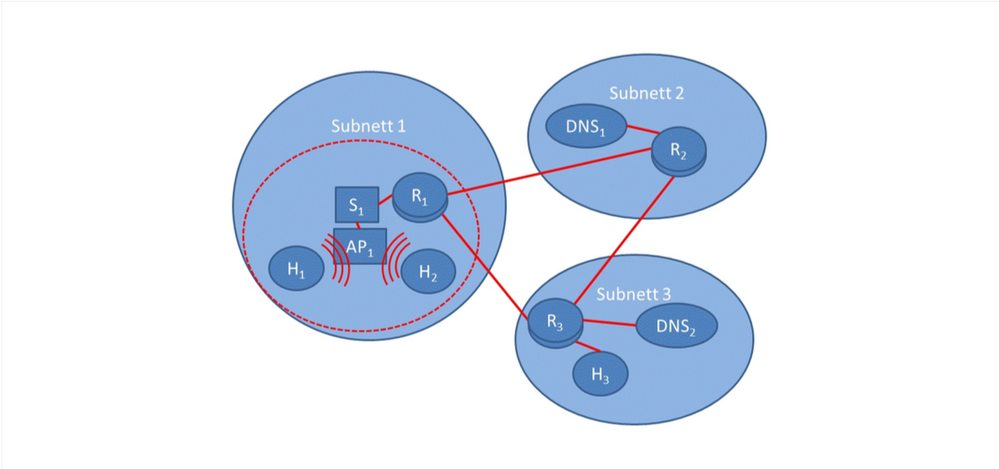
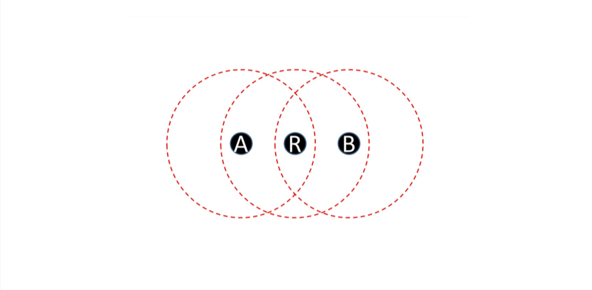
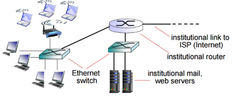
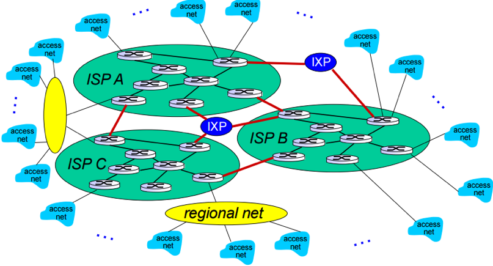
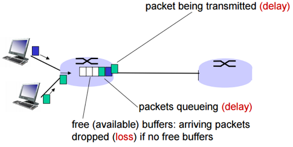
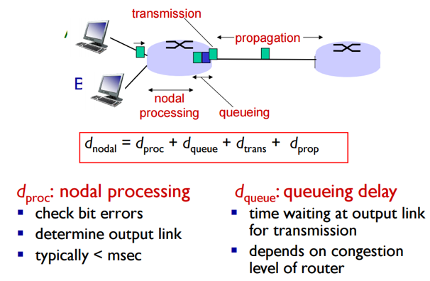
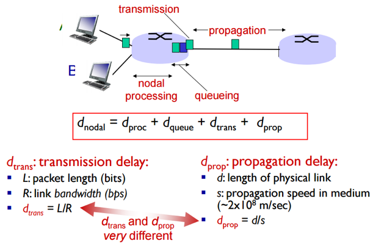
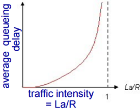
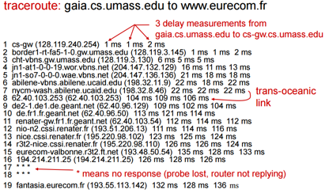

## Eksamen vår 2016

### Oppgåve 1



Betrakt nettverket i figuren. R<sub>1</sub>, R<sub>2</sub> og R<sub>3</sub> er tre rutere plassert i hvert sitt
subnett. S<sub>1</sub> er en ethernettsvitsj og AP1 er et trådløst 802.11-aksesspunkt. De
røde linjene representerer ledningsbaserte linker, og den stiplete linjenerundt
AP1 er området der AP1 kan kommunisere med trådløse 802.11-noder. H<sub>1</sub>, H<sub>2</sub> og H<sub>3</sub>
er vertsmaskiner. DNS<sub>1</sub> og DNS<sub>2</sub> er DNS-servere. Nettverket har også DHCP- og ARP
servere der det er nødvendig, men disse er ikke tegnet inn.

-   **R<sub>1</sub>, R<sub>2</sub>, R<sub>3</sub>:** Rutere i hvert sitt subnett (S<sub>1</sub>, S<sub>2</sub>, S<sub>3</sub>).
-   **AP1:** Trådløst 802.11-aksesspunkt. Kan kommunisere innenfor den stiplete
    linjen med andre 802.11-noder.
-   **H<sub>1,H</sub><sub>2</sub>, H<sub>3</sub>:** Vertsmaskiner.
-   **DNS<sub>1</sub> og DNS<sub>2</sub>:** er DNS servere. Nettverket har også DHCP- og ARP-servere der
    det er nødvendig.

#### 1 - Velg ett alternativ:

Når H<sub>1</sub> kommer utenfra og inn i dekningsområdet for AP1, trenger den en
IP-adresse, en IP-adresse til utgående ruter, og en IP-adresse til DNS-tjener.
Hvilken protokoll bruker H<sub>1</sub> til å få tak i IP-adresse til DNS-tjener?

-   [ ] DHCP -
-   [X] DNS query -
-   [ ] ARP -
-   [ ] DNS Discovery Protocol (DDP) -


<a id="org9a822ba"></a>

#### 2 - Velg ett alternativ:

H<sub>1</sub> får tildelt IP-adressen 192.168.2.2, og får informasjon om å bruke ruteren R<sub>1</sub>
med IP-adresse 192.168.2.1 og DNS-serveren DNS<sub>1</sub>.

H<sub>1</sub> må også få tak i MAC-adressen til ruteren R<sub>1</sub>. Hvorfor trenger H<sub>1</sub> denne
MAC-adressen?

-   [ ] Fordi H<sub>1</sub> er en Apple-maskin
-   [ ] Fordi datagrammer som sendes ut i Internett må leveres via R<sub>1</sub>, men de kan
    ikke adresseres med R<sub>1s</sub> IP-adresse.
-   [X] For at webserveren H<sub>3</sub> skal kunne rute svarene sine effektivt
-   [ ] På grunn av Medium aksess (MAC)-protokollen i 802.11.


<a id="orgd133c21"></a>

#### 3 - Velg ett alternativ:

Når en webklient i H<sub>1</sub> skal hente en *ressurs* fra websereveren i H<sub>2</sub>, vil den
vanligvis kjenne bare et symbolsk navn på ressursen, men den trenger H<sub>2</sub>'s
IP-adress, 146.192.201.19, gjennom&#x2026; (Velg den beskrivelsen som er mest
riktig):

-   [X] .. å utføre en DNS-forespørsel mot DNS<sub>1</sub> ved å bruke TCP
-   [ ] .. å utføre en DNS-forespørsel mot DNS<sub>1</sub> ved å bruke UDP
-   [ ] .. å utføre en DNS-forespørsel mot DNS<sub>2</sub> ved å bruke TCP
-   [ ] .. å utføre en DNS-forespørsel mot DNS<sub>2</sub> ved å bruke UDP


<a id="org4e716df"></a>

#### 4 - Velg ett alternativ

H<sub>1</sub> har blitt tildelt en NAT-adresse. Hvilket av disse alternativene beskriver
NAT-adresser best?

-   [X] H<sub>1</sub> har fått en IP-adresse som er ghenbrukbar og ikke globalt entydig.
    Ruteren R<sub>1</sub> vil oversette adresser og portnumre på pakker som går inn og ut.
-   [ ] H<sub>1</sub> har fått en MAC-adresse som er gjenbrukbar og ikke globalt entydig.
    Dette kan føre til problemer med ruting, men slike problemer forekommer svært
    sjelden.
-   [ ] H<sub>1</sub> har fått en MAC-adresse som er gjenbrukbar og ikke globalt entydig.
    Ruteren R<sub>1</sub> vil oversette adresser og portnumre på pakker som går inn og ut.
-   [ ] H<sub>1</sub> har fått en IP-adresse som er gjenbrukbar og ikke globalt entydig.
    Dette kan føre til problemer med ruting, men slike problemer forekommer svært
    sjelden.


<a id="org59d8e05"></a>

#### 5 - Velg ett alternativ

En promiskuøs pakkesniffer (f.eks. wireshark) i H<sub>2</sub> fanger opp en 802.11-ramme.
Denne rammen viser seg å inneholde *blant annet* følgende felt:

<table border="2" cellspacing="0" cellpadding="6" rules="groups" frame="hsides">


<colgroup>
<col  class="org-left" />

<col  class="org-left" />

<col  class="org-left" />

<col  class="org-left" />
</colgroup>
<tbody>
<tr>
<td class="org-left">Avsender Mac</td>
<td class="org-left">MottakerMAC</td>
<td class="org-left">MACadresse 3</td>
<td class="org-left">Data/Payload</td>
</tr>


<tr>
<td class="org-left">08:86:3b:4c:0e:70</td>
<td class="org-left">00:24:d6:ac:48:04</td>
<td class="org-left">06:32:3f:7e:9e.00</td>
<td class="org-left">src:146.192.201.19, Dst: 192.168.2.2 &#x2026;</td>
</tr>
</tbody>
</table>

1.  Hvilken enhet i nettverket har MAC-adresse 08:86:3b:4c:0e:70?

    Velg *ett* alternativ:

    -   [ ] H<sub>3</sub>
    -   [ ] AP<sub>1</sub>
    -   [ ] R<sub>1</sub>
    -   [ ] H<sub>1</sub>
    -   [ ] S<sub>1</sub>
    -   [ ] H<sub>2</sub>
    -   [ ] R<sub>3</sub>
    -   [ ] DNS<sub>2</sub>
    -   [ ] R<sub>2</sub>

2.  Hvilken enhet i nettverket har MAC-adresse 06:32:3f:7e:9e.00?

    Velg *ett* alternativ:

    -   [ ] S<sub>1</sub>
    -   [ ] H<sub>3</sub>
    -   [ ] DNS<sub>1</sub>
    -   [ ] H<sub>2</sub>
    -   [ ] R<sub>3</sub>
    -   [ ] AP<sub>1</sub>
    -   [ ] R<sub>1</sub>
    -   [ ] R<sub>2</sub>
    -   [ ] H<sub>1</sub>


<a id="orge7a3b5d"></a>

### Oppgåve 2 - Rutere og IP-adresser

Har rutere IP-adresser? I såfall, hvor mange?

1.  Velg *ett* alternativ

    -   [ ] De har alltid minst tre IP-adresser
    -   [ ] De har enten IP-adresser eller MAC-adresser
    -   [ ] Nei, de har bare MAC-adresser
    -   [X] De har én IP-adresse pr grensesnitt


<a id="org93140aa"></a>

### Oppgåve 3 - Virtuell line eller datagram.

I denne oppgaven skal vi drøfe fordeler og ulemper med virtuell-linje
nettverkstjeneste, sammenlignet med en forbindelsesløs nettverkstjeneste basert
på datagram.

-   **1.:** Anta at to vertsmaskiner skal kommunisere over et nettverk der nodene og
    linkene er ustabile og kan feile på utforutsigbare tidspunkt. Hvilken type
    nettverkstjeneste bør en bruke i denne situasjonen?
    -   [ ] Virtuell linje
    -   [X] Datagram
-   **2.:** Anta at to vertsmaskiner som skal kommunisere trenger en fast
    tilgjengelig båndbredde på stien mellom dem. Hvilken type
    nettverkstjeneste bør en bruke i denne situasjonen?
    -   [X] Virtuell linje
    -   [ ] Datagram
-   **3.:** Anta at vi har et nettverk som er så fysisk robust at linker og rutere
    aldri feiler, og at alle ruter mellom par av vertsmaskiner er stabile
    (det vil si, de beste rutene forandrer seg aldri). Hvilken type
    nettverkstjeneste bør en bruke i denne situasjonen?
    -   [ ] Datagram
    -   [X] Virtuell linje


<a id="orga1e8f60"></a>

### Oppgåve 4 - TCP

En datamaskin X sender to TCP-segmenter etter hverandre til en annen datamaskin
Y. Det første segmentet har sekvensnummer 172; det andre har sekvensnummer 240.
Tidligere segmenter er allerede ACKet.

-   Hvor mye data er det i det første segmentet?
    -   168 bytes.
-   Anta at det første segmentet kommer trygt frem, og at Y sender et ACK til X.
    Men dette ACK-segmentet forsvinner. Etter at Y har sendt dette ACKet kommer
    også det andre segmentet som X sendte trygt frem til Y. Det andre segmentet
    inneholder 60 databytes. Hva er ACK-nummeret i det neste segmentet Y sender X?
    -   300.0


<a id="orgc7ea7c5"></a>

### Oppgåve 5 - CIDR-aggregering i IP

En ruter har fått informasjon om følgende IP-adresser: 127.8.96.0/21,
127.8.104.0/21, 127.8.112.0/21 og 127.8.120.0/21. Rutingalgoritmen OSPF beregner
at IP-datagrammer til alle disse fire IP-adressene skal sendes på samme utlinje.
Ruteren vil forsøke å aggregere disse adressene slik at videresendingstabellen
blir kompakt. Hva blir resultatet av denne aggregeringen?

-   [ ] Alle adressene blir samlet i to aggregerte adresser, 127.8.96.0/20 og
    127.8.112.0/20
-   [X] Alle adressene blir samlet i en aggregert adresse, 127.8.96.0/19
-   [ ] Alle adressene blir samlet i en aggregert adresse, 127.8.96.0/21
-   [ ] Det er ikke mulig å aggregere disse adressene


<a id="org0f0a19a"></a>

### Oppgåve 6 - ALOHA

Betrakt et trådløst nettverk med nominell dataoverføringsrate på 4 Mbps. Anta nå
at nettverket har N brukerstasjoner som har mye data å sende, der N er et stort
tall, og at nettverket bruker båsdelt ("slotted") ALOHA som multippel
aksess-protokoll. Hva er den høyeste effektive gjennomsnittsdataraten vi kan
håpe på å oppnå?

-   [ ] Omtrent 2 Mbps
-   [ ] Omtrent 4 Mbps
-   [ ] Omtrent 746 kbps
-   [ ] Omtrent 1.47 Mbps

Hva er betingelsen for at vi skal oppnå den optimale dataraten i situasjonen som
er beskrevet ovenfor?

-   [ ] Hver stasjon sender data tilfeldig i hver tidsluke med sannsynlighet 1/N.
-   [ ] Stasjonene lytter på kanalen og sender hvis den er ledig.
-   [X] Stasjonene lytter på kanalen og sender med sannsynlighet 1/N hvis den er
    ledig.
-   [ ] Stasjonene får tildelt hver sin faste tidsluke og sender bare da.


<a id="org8722896"></a>

### Oppgåve 7 - Om fildistribusjon

Vert A ønsker å sende en stor fil til Vert B. Stien fra Vert A til Vert B
passerer gjennom tre *korte* linjer med kapasitet henholdsvis R<sub>1</sub> = 500 kbps,
R<sub>2</sub> = 2 Mbps, og R<sub>3</sub> = 1.1 Mbps. Hvor stor overføringsrate kan A sende med? Vi
antar at det ikke er annen trafikk i nettverket.

-   [ ] 184 kbps
-   [ ] 3.6 Mbps
-   [X] 500 kbps
-   [ ] 1.2 Mbps

Anta at filen er på 6 Megabyte. Hvor lang tid vil det ta å overføre filen til
Vert B?

-   [ ] Omtrent 13.3 sekunder.
-   [X] Omtrent 96 sekunder.
-   [ ] Omtrent 12 sekunder.
-   [ ] Omtrent 261 sekunder.

En fil på 1 Megabyte skal distribueres over et datanett til 1000 datamaskiner
(klienter) ved hjelp av en **klient-tjener**-arkitektur. Anta at filen ligger på
en tjener som kan sende samtidig til mange maskiner på en gang og kan sende med
forskjellige rater til forskjellige mottakere, så lenge den samlede
opplastingsraten ikke overstiger tjenerens opplastingsrate på 10 Mbps. Hver av
klientene har en nedlastingskapasitet på 1 Mbps. Bortsett fra tjenerens
opplastingsrate og klienten nedlastingsrate har linkene i nettet så stor
kapasitet at de i denne sammenhengen kan oppfattes som ubegrenset.

Hvor lang tid tar det minst å distribuere filen til alle klientene i denne
situasjonen?

-   [X] Omtrent 800 sekunder
-   [ ] Omtrent 0,1 sekund
-   [ ] Omtrent to sekunder
-   [ ] Omtrent 8 sekunder

En fil på 1 Megabyte skal distribueres over et datanett til 1000 datamaskiner
ved hjelp av en **P2P**-arkitektur. Anta som før at filen i utgangspunktet ligger
på en tjener som kan sende samtidig til mange maskiner på en gang og kan sende
med forskjellige rater til forskjellige datamaskiner, så lenge den samlete
opplastingsraten ikke overstiger tjenerens opplastingsrate på 10 Mbps. Hver av
klientene har en nedlastingsrate på 1 Mbps, og en opplastingsrate på 0,5 Mbps.
Bortsett fra tjenerens opplastingsrate og klientenes opp- og nedlastingsrate har
linkene i nettet så stor kapasitet at de i denne sammenhengen kan oppfattes som
ubegrenset.

Hvor lang tid tar det minst å distribuere filen til alle klientene i denne
situasjonen?

-   [ ] Omtrent 0,1 sekund.
-   [ ] Omtrent 8 sekunder.
-   [X] Omtrent 800 sekunder.
-   [ ] Omtrent to sekunder.


<a id="org6830a81"></a>

### Oppgåve 8 - Brannmur

Et pakkefilter for intern nettverket 129.177.102/8 er gitt ved følgende
aksesskontroll-liste:

<table border="2" cellspacing="0" cellpadding="6" rules="groups" frame="hsides">


<colgroup>
<col  class="org-left" />

<col  class="org-left" />

<col  class="org-left" />

<col  class="org-left" />

<col  class="org-right" />

<col  class="org-right" />

<col  class="org-left" />
</colgroup>
<thead>
<tr>
<th scope="col" class="org-left">Aksjon</th>
<th scope="col" class="org-left">Avsender</th>
<th scope="col" class="org-left">Mottaker</th>
<th scope="col" class="org-left">Protokoll</th>
<th scope="col" class="org-right">Avsender port</th>
<th scope="col" class="org-right">Mottaker port</th>
<th scope="col" class="org-left">flag bit</th>
</tr>
</thead>

<tbody>
<tr>
<td class="org-left">Tillat</td>
<td class="org-left">129.177.102/8</td>
<td class="org-left">alle</td>
<td class="org-left">UDP</td>
<td class="org-right">>1023</td>
<td class="org-right">53</td>
<td class="org-left">-</td>
</tr>


<tr>
<td class="org-left">Tillat</td>
<td class="org-left">alle</td>
<td class="org-left">129.177.102/8</td>
<td class="org-left">UDP</td>
<td class="org-right">53</td>
<td class="org-right">>1023</td>
<td class="org-left">-</td>
</tr>


<tr>
<td class="org-left">Tillat</td>
<td class="org-left">129.177.102/8</td>
<td class="org-left">alle</td>
<td class="org-left">TCP</td>
<td class="org-right">>1023</td>
<td class="org-right">80</td>
<td class="org-left">alt</td>
</tr>


<tr>
<td class="org-left">Tillat</td>
<td class="org-left">alle</td>
<td class="org-left">129.177.102/8</td>
<td class="org-left">TCP</td>
<td class="org-right">80</td>
<td class="org-right">>1023</td>
<td class="org-left">ACK</td>
</tr>


<tr>
<td class="org-left">Avslå</td>
<td class="org-left">146.172.102.21</td>
<td class="org-left">129.177.102/8</td>
<td class="org-left">TCP</td>
<td class="org-right">80</td>
<td class="org-right">>1023</td>
<td class="org-left">alt</td>
</tr>


<tr>
<td class="org-left">Avslå</td>
<td class="org-left">alle</td>
<td class="org-left">alle</td>
<td class="org-left">alle</td>
<td class="org-right">alle</td>
<td class="org-right">alle</td>
<td class="org-left">alle</td>
</tr>
</tbody>
</table>

Denne aksesskontroll-listen gjør at pakkefilteret oppfører seg slik:

-   [ ] Tillater all DNS trafikk in og ut, og alle http-pakker begge veier unntatt
    fra en webserver på 146.172.102.21. Tillater ikke noe annet.
-   [X] Tillater all DNS trafikk in og ut, alle pakker fra klienter på innsiden
    til webservere på utsiden, og alle svar fra webservere utenfor til klienter
    innenfor (unntatt 146.172.102.21). Tillater ikke noe annet.
-   [ ] Tillater DNS-forespørsler innenfra DNS-servere, og svar tilbake fra disse
    serverne. Tillater også alle pakker fra klienter på innsiden til webservere,
    og alle svar fra webservere til klienter innenfor. Tillater ikke noe annet.
-   [ ] Tillater all DNS trafikk inn og ut, alle pakker fra klienter på innsiden
    til webservere på utsiden, og alle svar fra webservere utenfor til klienter
    innenfor (unntatt 146.172.102.21). Tillater ikke noe annet.
-   [ ] Tillater DNS-forespørsler innenfra til DNS-servere, og svar tilbake fra
    disse serverne. Tillater også alle http-pakker. Tillater ikke noe annet.
-   [ ] Tillater DNS-forespørsler innenfra til DNS-servere, og svar tilbake fra
    disse serverne. Tillater også alle svar fra webservere til klienter innenfor
    (unntatt 146.172.102.21). Tillater ikke noe annet.
-   [ ] Tillater all DNS trafikk inn og ut, alle pakker fra klienter på innsiden
    til webservere, og alle svar fra webservere til klienter innenfor. Tillater
    ikke noe annet.
-   [ ] Tillater DNS-forespørsler innenfra til DNS-servere, og svar tilbake fra
    disse serverne. Tillater også alle http-pakker begge veier unntatt fra en
    webserver på 146.172.102.21. Tillater ikke noe annet.


<a id="org234aa85"></a>

### Oppgåve 9 - Forseinking

Nedenfor er det vist at resultatet av en kjøring av programmet tracert fra min
datamaskin ved UiB til regjeringens webtjener:

    O:\tracert regjeringen.no
    Tracing route to regjeringen.no [146.192.201.19]
    over a maximum of 30 hops:
     1 <1 ms <1 ms <1 ms ps-gw.ii.uib.no [129.177.122.1]
     2 <1 ms <1 ms <1 ms uib-bt-gw.uib.no [129.177.1.1]
     3 1ms   <1 ms <1 ms bergen-gw2.uninett.no [158.37.1.189]
     4 7ms   6ms   6 ms ifi2-gw.uninett.no [128.39.255.12]
     5 6ms   5ms   5 ms oslo-gw1.uninett.no [128.39.254.46]
     6 6ms   6ms   6 ms oslo-nix01.comace.net [193.156.90.27]
     7 9ms   9ms   9 ms 62.148.62.221
     8 8ms   8ms   8 ms 62.148.62.221
     9 8ms   8ms   8 ms 146.192.201.19

    Trace complete.

Hva er (mest sannsynlig) hovedårsaken til ende-til-endeforsinkelsen mellom min
maskin og regjeringen.no?

-   [ ] En tokenbøtte begrenser inputhastigheten.
-   [ ] Køforsinkelse i en eller flere noder.
-   [X] Nodeprosesseringsforsinkelse i en eller flere noder.
-   [ ] Transmisjonsforsinkelse i en eller flere noder.
-   [ ] Begrensninger i transportprotokollen.
-   [ ] Propagasjonsforsinkelse på en eller flere linker.

En applikasjon sender data i full fart fra min maskin til regjeringen.no over
ruten vist ovenfor. Anta at alle linker langs ruten er ledningsbaserte og har
kapasitet på 1 Gbps hver, at ruterne har uendelig prosesseringshastighet, og at
det er lite trafikk i nettet. Segmentstørrelsen er 1460 bytes + 60 bytes med
TCP-, IP- og linklagsheader. TCP-mottakervinduet recw er fast begrenset til
65535 bytes. Hva er største datarate som da er teoretisk mulig på denne
forbindelsen, gitt at de parameterne som er observert gjennom tracert er
representative?

-   [ ] Omtrent 8 Mbps
-   [ ] Omtrent 65 Mbps
-   [ ] Omtrent 345 Mbps
-   [ ] 1 Gbps
-   [ ] Omtrent 43 Mbps


<a id="org4e7d5ab"></a>

### Oppgåve 10 - Sant/usant

Ett symbolsk maskinnavn kan være tilordnet to forskjellige IPv4-adresser.

-   [X] Usant
-   [ ] Sant

Én IPv4-adresse kan være tilordnet to forskjellige symbolske navn (DNS-navn)

-   [ ] Usant
-   [X] Sant

En prosess på vert A er tilordnet port nummer p, og en prosess på vert B er
tilordnet portnummer q. Det er mulig å opprette to samtidige og forskjellige
TCP-forbindelser mellom disse to portene.

-   [X] Usant
-   [ ] Sant

En nettleser sender en forespørsel om en webside som inneholder noe tekst og tre
bilder. Dette gjøres ved at klienten sender en forespørsel-melding (GET), og får
fire responsmeldinger.

-   [X] Usant
-   [ ] Sant

Date:-headeren i http-respons-meldingen forteller når objektet siste ble
modifisert.

-   [X] Usant
-   [ ] Sant

HTTPs responsmelding har aldri en tom "message body".

-   [ ] Sant
-   [ ] Usant


<a id="org0dd2b23"></a>

### Oppgåve 11 - Trådlaus kommunikasjon


A, B og R er tre noder som kan kommunisere ved å kringkaste trådløse signaler.
Anta at alle signaler sprer seg i alle retninger, at hver node kan sende én bit
pr.tidsenhet til nærmeste nabo - det vil si, A kan kringkaste til R, B til R, og
R kan kringkaste til både A og B, men A og B kan ikke sende til hverandre fordi
avstanden er for stor. Derimot kan A og B sende til hverandre ved å sende til R
og ved at R sender til A og B. En node er begrenset slik at den bare kan motta
fra én sender av gangen.

Vi vil videre anta at A har ubegrenset med data å sende til B, og at B samtidig
har ubegrenset med data å sende til A. Hvor raskt kan A og B sende data til
hverandre ved hjelp av R?
**Hint:** Tenk på *nettverkskoding*.

-   [ ] 1/3 bits pr sekund hver fra A og B
-   [ ] 1/4 bits pr sekund hver fra A og B
-   [ ] 1/2 bits pr sekund hver fra A og B
-   [ ] 1 bits pr sekund hver fra A og B


<a id="orgf115109"></a>

### Oppgåve 12 - Stopp og vent i Java

La oss anta at vi ønsker å lage en *enkel* applikasjon bygget på UDP som lar en
klient laste ned en tekstfil fra en filtjener, og skriver filens innhold ut på
skjermen. "*Enkel*" betyr i denne sammnhengen at den vil værer robust hvis bare
én klient bruker tjeneren av gangen, og klienten ikke kræsjer i løpet av
overføringen av en fil.

1.  Klienten vil først sende en forespørsel som inneholder et filnavn
2.  Tjeneren sender en sekvens av pakker til klienten. Hver pakke inneholder en
    linje av tekstfilen. Etter siste linje sendes en linje med bare et punktum
    ".", der vi *for enkelthets skyld* antar at slike linjer ikke forekommer i
    tekstfilen. For å garantere at linjer blir levert korrekt selv om pakker
    forsvinner i overføringen, brukes en stopp- og vent protokoll.

Her er en implementasjon i Java av en filtjener som kommuniserer over denne
protokollen:

```java
import java.io.*; import java.net.*;
public class SWTjener {
   static void main(String args[]) throws Exception {
      DatagramSocket serverSocket = new DatagramSocket(9876);
      String eofString = ".\r\n";
      byte[] receiveData = new byte[1024];
      byte[] sendData = new byte[1024];
   while(true) {
      // Her burde det være en (3-veis) oppkobling, men vi hopper over
      // det for enkelhets skyld.
      int sekvensnummer = 0;
      // Les filnavn:
      DatagramPacket receivePacket = new DatagramPacket(receiveData, receiveData.length);
      serverSocket.receive(receivePacket);
      String filnavn = new String(receivePacket.getData()); InetAddress IPAddress = receivePacket.getAddress();
      Fil fil = new Fil(); fil.aapne(filnavn);
      int port = receivePacket.getPort();
         while (!fil.eof()) {
      // Lag og send pakke til klient
      sendData = (""+sekvensnummer+fil.leslinje()).getBytes();
      DatagramPacket sendPacket = new DatagramPacket(sendData, sendData.length, IPAddress, port);
      serverSocket.send(sendPacket);

      // Vent på ACK
      do {
         receivePacket = new DatagramPacket(receiveData, receiveData.length);
         serverSocket.receive(receivePacket);
      } while (Integer.parseInt(new String(receivePacket.getData())) != sekvensnummer);

         // Forbered neste sekvensnummer
         sekvensnummer = 1 - sekvensnummer;
         }
         sendData = eofString.getBytes();
         // Her burde det kanskje være en nedkobling,
         // men vi hopper over det for enkelhets skyld.

   } // while(true)

   } // main()
}
```

Skriv en klient i Java som kommuniserer med denne tjeneren:

```java
import java.io.*;
import java.net.*;
public class SWclient {
   static void main (String args[]) throws Exception {
      private int seq = 1;

      DatagramSocket clientSocket = new DatagramSocket(9876);
   byte[] receiveData = new byte[1024];
   byte[] sendData = new byte[1024];
   clientSocket.receive(receivePacket);
   DatagramPacket receivePacket = new DatagramPacket(receiveData, receiveData.length);

   sendData = inFromUser.readLine();
   DatagramPacket sendPacket = new DatagramPacket (sendData, sendData.length, IPAdress, port);

   while(true) {
      String mottatt = receiveData.readLine();

   // ACK-melding til server
      sendData = (seq + receiveData.getBytes()).toString();
      sendData.sendPacket();

   if (mottatt == ".")
      break;
   }

      clientSocket.close();

   }
}
```

<a id="org43e68f1"></a>

### Oppgåve 13 - Go-back-N

-   Forklar **kort** hvordan du kan utvide protokollen i forrige oppgave slik at den
    fungerer som en Go-back-N-protokoll.
-   Hva er fordelen med en slik protokoll fremfor stopp-og-vent-protokollen?
-   Forklar også kort, uten å gå i detalj på Java-koden, hvilken endringer du må
    gjøre på tjener- og klientsidene.

**Svar:**

> For å gjøre tjener og klient til en Go-back-N protokoll, må man gjøre slik at
> hvis ACK-en for tidligere sendte pakke ikke korresponderer til forventet verdi,
> prøv å send den forrige pakken igjen. Fordelen her er at vi får en viss
> sikkerhet mot pakketap, ettersom at vi har implementert ettersending av u-ackete
> pakker.
>
> Hvis man skal endre koden, ville jeg først implementert tellere (utover dem som
> allerede er implementert) for å holde telling på seq-nummeret, sendte pakker og
> mottatte pakker), også implementere en mekanisme (if-setning) for å ettersende
> forrige datagram.


<a id="orgcc5ac56"></a>

### Oppgåve 14 - &#x2026;men er protokollen robust?

I protokollene vi har sett på i de to foregående oppgavene, har vi hoppet over
problemstillingen med oppkobling og nedkobling av forbindelse mellom klient og
tjener.

-   Er denne forenklete protokollen, blant annet uten oppkobling, robust i den
    forstand at den vil garantere at riktig filinnhold vil bli levert til
    klienten, også dersom vi har en mer realistisk situasjon der klientprosesser
    kræsjer, eller dersom mer enn en klient prøver å bruke tjeneren samtidig?
    Begrunn svaret ditt.
-   Skissér også kort hvordan du eventuelt kan forbedre protokollen.

**Svar:**

> **Merk:** Server og tjener brukes om hverandre i denne oppgaven.
>
> I begge tilfeller er dette udp-protokoller uten en persistent connection. Eneste
> forsikringen mot ting som pakketap i Stop and wait, er at denne protokollen
> sender en Ack når den har mottatt en pakke, for å gi beskjed til den andre enden
> om at det er trygt å sende en til. Go-back-N-protokollen implementerer i tilleg
> en mekanisme for å sende pakker som ikke har blitt ack-et. Men hvis en prosess
> kræsjer hos tjeneren vil ikke klienten være istand til å se om serveren er opp
> eller nede. Det opprettes ingen tilkobling, både tjener og klient sender pakkene
> til adressert port og "håper på det beste". Hvis klienten går ned underveis vil
> den ikke sende noen ack-er tilbake til serveren for de mottatte ackene, og
> serveren vil bare stå og gå.
>
> Hvis mer enn en klient bruker tjeneren samtidig, vil de måtte bruke samme port,
> og forutsatt at det bare kjører et instans av tjenerer, vil det bli kluss i
> sekvensnummerene. En fiks kan være å lage separate seq-tellere for hver nye
> "registrerte klientport" slik at tjeneren holder telling på hvilken klient som
> har mottatt hva.


<a id="org7a5f5ec"></a>

## Notat til kapitla


<a id="org1fe252e"></a>

### Relevante forkortelsar

-   **HFC:** Hybrid fiber coax
-   **UTP:** Unshielded twisted pair
-   **FDM:** Frequency-division multiplexing
-   **TDM:** Time-division multiplexing
-   **POP:** Point of presence
-   **RTT:** Round-trip time
-   **ARQ:** Automatic repeat reQuest protocol
-   **GBN:** Go-back -N protocol
-   **SR:** Selective repeat
-   **ATM:** Asynchronous transfer mode
-   **CAM:** Content addressable memories
-   **MTU:** Maximum transmission unit
-   **DHCP:** Dynamic host configuration protocol
-   **NAT:** Network address translation
-   **VPN:** Virtual private network
-   **AS:** Autonomous system
-   **RIP:** Routing information protocol
-   **OSPF:** Open shortest path first
-   **BGP:** Border gateway protocol
-   **ASN:** Autonomous system number
-   **RPF:** Reverse path forwarding
-   **IGMP:** Internet group management protocol
-   **CDMA:** Code division multiple access
-   **ARP:** Address resolution protocol
-   **RFC:** Request for comments
-   **IETF:** Internet Engineering Task Force


<a id="orga0944bc"></a>

### Kva er internett - "Skruer og muttere"-perspektiv

Internett er eit nettverk samansett av hundrevis av millionar
databehandlingseinheiter. For ikkje lenge sia var dette berre tradisjonelle
PCar, Linux maskiner og såkalla servera som lagrar og deler informasjon som for
eksempel websider og mailar. No i nyare tid så består nettet meir og meir av
TVar, bærbare datamaskiner, spel konsollar, mobiltelefonar, webkamera, bilar,
bilderammer, eletriske og sikkerheitssystem.

-   **Vert:** er eit endesystem, som køyrer nettverksapplikasjonar.
-   **Kommunikasjonslinkar:** består av trådlause- og kobla -linkar. (fiber, kobber, radio, satelitt). Overføringsraten blir kalla ''båndbredde''.
-   **Pakkeswitch:** Sender vidare pakkar, som er blokker av data, ved hjelp av rutera og switchar.
-   **Internett:** ''Nettverk av nettverk''] Består av mange samankopla ISPar.
-   **Protokollar:** Protokollane sin jobb er å behandle/regulere sending og mottaking av meldingar. For eksempel TCP, IP, HTTP(S), Skype, 802.11.
-   **Internett-standardar:** Består av fleire standardar.
    -   **RFC** - Request for comments
    -   **IETF** - Internet Engineering Task Force


<a id="orga17e0c5"></a>

#### Kva er internett - tjenesteperspektiv

-   Infrastuktur som gir tenester til applikasjonar
    -   Web
    -   VoIP
    -   e-post
    -   spel
    -   e-handel
    -   sosiale nettverk
    -   Med meir..
-   Gir grensesnitt for applikasjonsprogrammerarar
    -   Lar program sende og motta data gjennom internett.
    -   Tilbyr valgfrie kommunikasjonstenester.


<a id="orgf5bb23a"></a>

#### Kva er ein protokoll?

-   **Protokollar mellom personar:** Består av meldingar som
    -   "Kva er klokka"
    -   "Eg har et spørsmål"
    -   Eller generelle ting; som introduksjonar.
-   **Nettverksprotokollar:** Består av maskiner og ikkje mennesker.
    -   All kommunikasjon i internett er regulert av protokollar.

Alle protokollar sender ei spesifikk melding og utløyser ei spesifikk handling
eller respons.

> **Protokollar** definerar **format** og **rekkefølge** av
> **meldingar som sendast og mottakast** mellom nettverksidentitetar, og
> **handlingar som utførast** ved sending og mottaking.


<a id="orgcc2224d"></a>

## Notat frå boka


<a id="org6617d05"></a>

### Kapittel 1

-   Computer network seems dated since there are alot of different devices
    connected to the internet. Phones, watches, dishwashers and toasters.
-   Communication links and packet switches.
-   overføringshastighet målt i bits/sekund.
-   takes a packet and forwards it to one of its outgoing communication links.
    -   two types
        -   routers and link-layer switches
-   Commonly used in access networks
-   Commonly used in network core.
-   End systems access the Internet through **Internet Service Providers** (ISPs)
    -   Contains its own network of packet switches and communication links.
-   End systems, packet switches, and other pieces of the Internet run protocols
    that control the sending and receiving of information within the Internet.
    -   The **Transmission Control Protocol** (TCP) and the **Internet Protocol** (IP) are
        two of the most important protocols in the internet.
        -   **IP** Specifies the format of the packets that are sent and received among
            routers and end systems. The Internet's principal protocols are
            collectively known as **TCP/IP**.
-   En systems attached to the internet provide a **socket interface** that specifies
    how a program running on one end system asks the Internet infrastructure to
    deliver data to a specific destination program running on another system.

> A **protocol** defines the format and the order of messages exchanged between two or
> more communicating entities, as well as the actions taken on the transmission
> an/or receipt of a message or other event.


<a id="org59add2d"></a>

## Notat frå word fila til Christian


<a id="org1a59ffb"></a>

### Whats the internet?

-   **Internet:** Millions of connected computing devices.
    -   Hosts = end systems
    -   Running network apps
-   Communication links
    -   Fiber, copper, radio, satelite.
    -   **Transmission rate:** Bandwidth which is the bit-rate of available or
        consumed information capacity expressed in metric multiples of bits per
        second.
-   **Packet switches:** forward packets
    -   Routers and switches

Internet is a network of networks. That is interconnected ISPs. ISP,
Interconnected service provider, is an organization that provides services for
services for accessing, using or participating in the Internet. Protocols are
created to control sending and receiving of messages such as TCP, IP, HTTP,
Skype, 802.11 (WiFi). Internet standards are specification of a technology or
methodology applicable to the Internet. They are created and published by the
IETF. The Internet is an infrastructure that provides services to applications
such as Web, VoIP, email, games etc. It provides programming interface to apps,
hooks that allow sending and receiving app programs to connect to Internet and
provides service options, analogous to postal service.

Protocols define *format, order of msgs sent and received* among network entities,
and *actions taken* on msg transmission receipt. A normal human protocol is a
conversation, while a computer network protocol is first TCP connection from pc
to server, TCP response from server, retrieve msg and transmit msg to pc.


<a id="org306be13"></a>

### Network edge - end systems, access networks and links

-   Network edge:
    -   **Hosts:** Client and servers
    -   Servers often in data centers
-   **Access networks, physical media:** Is a part of a telecommunications network
    which connects subscribers to their immediate service provider. Physical
    media are physical materials that are used to transmit information in data
    communications.
    -   Wired, wireless communication links.
-   **Network core:** Is the central part of a telecommunications network, that
    route's the network.
    -   Interconnected routers
    -   Network of networks

We connect systems to edge routers through residential access nets,
institutional access networks such as company or schools, and through mobile
access networks. Keep in mind the bandwidth of the access network and if it's
shared or dedicated. If it's shared you share the throughput available, but if
it's dedicated you get what the server provides.

-   **Access net:** Digital subscriber line (DSL) use existing telephone line to
    central office DSLAM which is data over DSL phone line that goes
    to Internet. It has under 2.5Mbps upstream transmission rate.
    DSL is a technology for bringing high- bandwidth information to
    homes and businesses over ordinary copper telephone lines.
    *Frequency division* multiplexing is different channels
    transmitted in different frequency bands.

Hybrid Fiber Coax (HFC) is asymmetric with up to 30Mbps downstream transmission
rate and a 2Mbps upstream transmission rate.

Ethernet is a family of computer networking technologies for local area networks
(LANs) and metropolitian area network (MANs). Typically used in companies and
universities. See picture below.

Shared wireless access network connects end system to router via base station
called access point. We have wireless LANs within buildings and wide-area
wireless access provided by telco (cellular) operator that gives between 1 and
10Mbps in an area, either 3G, 4G or LTE.

**Hosts sending packets of data:** host sending function

-   Takes application message
-   Breaks into smaller chunks, known as packets, of length *L* bits
-   Transmits packets into access network at *transmission rate R*
    -   Link transmission rate, aka link *capacity, aka link bandwidth*.

<table border="2" cellspacing="0" cellpadding="6" rules="groups" frame="hsides">


<colgroup>
<col  class="org-left" />

<col  class="org-left" />

<col  class="org-left" />

<col  class="org-left" />

<col  class="org-left" />
</colgroup>
<tbody>
<tr>
<td class="org-left">packet transmission delay</td>
<td class="org-left">=</td>
<td class="org-left">time needed to transmit *L*-bit packet into link</td>
<td class="org-left">=</td>
<td class="org-left">\((L (bits))/(R (bits/sec))\)</td>
</tr>
</tbody>
</table>

**Physical media**:

-   Bit: propagates between transmitter/receiver pairs
-   Physical link: what lies between transmitter and receiver
-   Signal carried in electromagnetic spectrum
-   Guided media: signals propagate in solid media: Copper, fiber and coax
-   Unguided media: signals propagate freely, eg. Radio

*Twisted pair* (TP) is two insulated copper wires, either category 5 with 100Mbps,
1Gbps Ethernet or category 6 with 10Gbps. *Coaxial cable* is two concentric copper
conductors that are bidirectional and broadband with multiple channels on cable
and HFC. *Fiver optic cable* is glass fiber carrying light pulses, each pulse a
bit. Its high-seppd operation, that's high-speed point-to-point transmission
with example 10's-100's Gbps transmission rate. It has a low error rate where
repeaters spaced far apart and immune to electromagnetic noise.

-   **Unguided physical media:** Has no physical wire, its bidirectional,
    propagation environment effects are reflection, obstructed by objects and
    interference. Radio link types.
    -   Terrestrial microwave
        -   Up to 45Mbps channels
    -   Lan (e.g. WiFi)
        -   11Mbps, 54Mbps
    -   Wide-area (e.g. cellular)
        -   3G cellular: ~few Mbps
    -   Satelite
        -   Kbps to 45Mbps channel(r multiple smaller channels)
        -   270 msec end-end delay
        -   Geosynchronous cersus low altitude


<a id="orgd81574f"></a>

### Network core - packet switching, circuit switchin and network structure

It's a mesh of interconnected routers.

-   **Packet-switching:** hosts break application-layer messages into packets. That

forwards packets from one router to the nextm across links on path from source
to destination. Each packet transmitted at full link capacity.

-   **Store-and-forward:** Takes L/R seconds to transmit (push out) L-bit packet
    into link at R bps.
    -   Store and forward: entire packet must arrive at router
        before it can be transmitted on next link.
    -   \(End-end delay = 2L/R\)
    -   Example;
        -   L = 7,5Mbps
        -   R = 1.5Mbps
        -   then the delay is \(2L/R = 2*7,5/1,5 = 5\)
-   **Queuing delay and loss:** If arrival rate (in bits) to link exceeds
    transmission rate of link for a period of time:
    -   Packets will queue, wait to be transmitted on link
    -   Packets can be lost if memory (buffer) fills up
-   **Alternative core: Circuit switching:** end-end resources allocated to,
    reserved for "call" between source and destination. In diagram, each link
    has four circuits. Call gets 3<sup>rd</sup> circuit in top link and 1<sup>st</sup> circuit in
    right link.
    -   **Dedicated resources:** no sharing where circuit-like (guaranteed)
        performance. Circuit segment idle if not used by call (no sharing).
        Commonly used in traditional networks.

Packet switching allows more users to use the network. **Example**: 1Mbps with
100kb/s for each user that is active 10% of the time. Packet switching with 35
users has the probability that 10 active at the same time is less than 0.0004.
Packet switching is great for bursty data, resource sharing, it's simpler than
circuit and requires no call setup. It has excessive congestion possible: packet
delay and loss, that protocols needed for reliable data transfer, congestion
control.

-   **Internet structure:** end systems connect to Internet via access ISPs. Access
    ISPs in turn must be interconnected so that any two hosts can send packets
    to each other. Resulting network of networks is very complex. Given
    millions of access ISPs, how do we connect them? Connect each access ISP to
    a global transit ISP. Costumer and provider ISPs have economic agreement.
    Still there can be several ISPs. Then the ISPs are connected through
    Internet exchange points (IXP). Regional network may arise to connect
    access nets to ISPs. Content provider networks (Google, Microsoft) may run
    their own network, to bring services, content close to end users. The
    picture showed the end point with the content provider network over
    everything.




<a id="orga33846d"></a>

### Delay, loss, throughput in networks

How does loss and delay occur? Packets *queue* in router buffers. Packet arrival
rate to link (temporarily) exceeds output link capacity. Packets queue and wait
for turn.

Queueing delay:

-   **R**: Link bandwidth (bps)
-   L: Packet length (bits)
-   A: Average packet arrival time rate

See picture(s) below:



-   La/R = 0, avg. queueing delay small
-   La/R &rarr; 1: avg. queueing delay large
-   La/R > 1: avg. queueing delay infinite!

See picture below:

To find "real" Internet delay and loss we can use Traceroute (tracert) program
that provides delay measurement from source to router along end-end Internet
path towards destination. For all i:

-   Sends three packets that will reach router i on path towards destination.
-   Router i will return packets to sender
-   Sender times interval between transmission and reply.

See pictures below:



-   **Packet Loss:** queue (aka buffer) preceding link in buffer has finite
    capacity. Packet arriving to full queue dropped (aka lost).
    Lost packet may be retransmitted by previous node, by source
    end system, or not at all.
