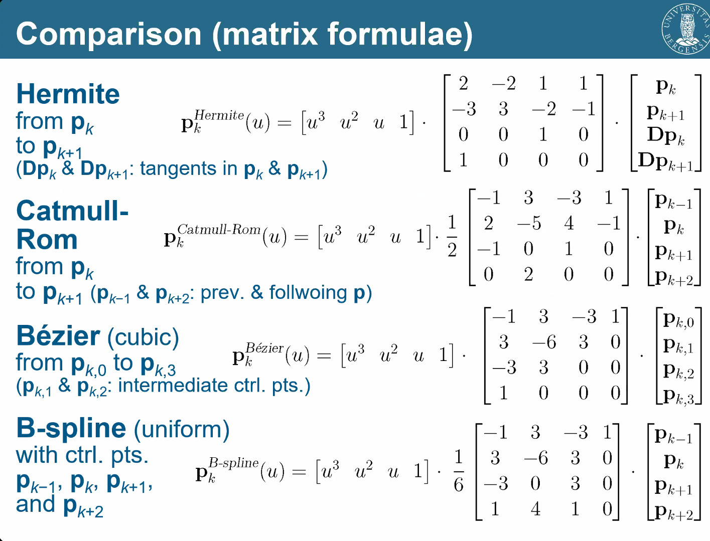

_A bunch of random notes from INF251 sorted by lectures. **Computer Graphics Pipeline Overview** and **Splines** should be partially structured and readable, the rest are less so._

# Computer Graphics Pipeline Overview

The graphics card in a computer is responsible for drawing pictures to the screen. The first graphics cards were limited in terms of functionality for the user but over the year manufactorers have been gradually more inclusive in terms of exposing more and more of the underlying graphics pipeline. Graphics programming is implemented from the manufacturers via API's in a graphics card. Many computer graphics APIs exist and is implemented on different hardware but a few common ones are:

- **GKS**: Graphical Kernel System: Standardized graphical framework.
  - Later developed into PHIGS -> PHIGS+
  - GL later became the standard
- **OpenGL**: Hardware independant version of GL.
  - Not including input functions (only graphics card related functions)
  - **WebGL**: OpenGL version similar to OpenGL ES 3.0 built into most browsers.
- **GLU**: OpenGL Utility: OpenGL + basic projection and transformation functionality
- **Vulkan**: Open source (hardware independant) modern implementation based on OpenGL but lower-level.
- **DirectX**: Microsoft developed GL utility. Includes graphics, audio and input management.
  - **Direct3D**: Graphics API part of DirectX.
  - **DirectX12**: DirectX version minimicking Vulkan's low level functionality.
- **Metal**: Apple developed low-level graphics api, similar to Vulcan or DirectX12 with focus on mobile GPUs.

## Window

Some graphics API come with build in window creation functionality, but for those that does not it is often common to use a window creation software like:

- **GLX**: OpenGL X Window System
- **AGL**: Apple GL
- **WGL**: Windows-to-OpenGL
- **GLUT**: OpenGL Utility Tookit
  - Link between OpenGL and device-specific window creation.
- **GLFW**: Popular cross-platform window creation software.

## Viewing pipeline

Most graphics API renders geometry using _geometric primitives_ which are _rasterized_ to represent pixels on the screen. Triangles are the most common primitive but various graphics APIs implement quads higher polyhedra aswell.

- A typical viewing pipeline:
  - Objects represented as vertices.
  - Vertices triangulated into triangles (or another primitive)
  - Triangles are transformed and rasterized into pixels.
  - Pixels are drawn onto screen buffer.
  - When everything is finished drawn the screen buffer is sent to the screen.

OpenGL rendering pipeline from [learnopengl.com/Getting-started/Hello-Triangle, Joey de Vries](https://learnopengl.com/Getting-started/Hello-Triangle): 

### Transformation Pipeline

- Most graphics hardware require standard right-handed Cartesian-coordinates.
  - Other formats needs to be converted before use.

In order to map geometry and images to the screen, a graphics API needs a transformation pipeline from a scene representation to the screen representation. For hardware independant APIs it is common practice to store the screen representation as **Screen Space**, which is the coordinate space of the screen represented in pixels.

- **Normalized Device Coordinates (NDC)** is a popular way to represent the scene where the spaces bounds are normalized (from -1 to 1 in all axis). **NDC** is commonly used as a middle-space in hardware independant graphics API to make it easier to later transform into a resolution dependant screen space.
- **Modeling coordinates**: Reference frame for modeling shapes
  - **_Local coordinates_**, **_master coordinates_**
  - Duplicate objects need only their coordinates specified once
- **World coordinates**:
  - Scene reference frame
  - Local coordinates can be duplicated into duplicate objects in a scene
- Local coordinates can be skipped (object placed directly into scene)
- A typical **Transformation pipeline**: Transforming an object from local, to world to screen spaced
  coordinates and mapping to screen.
  - World coordinates are transformed into viewing coordinates according to specific view. (camera)
  - Viewing coordinates are projected onto a 2D coordinate space before being sent to screen, normalized coordinates.
  - _Normalized coordinates / normalized device coordinates_, independant of output device.
  - _Normalized coordinates_ are transformed into device / screen coordinates which are then transferred onto a screen or device.
    - Screenspace coordinate system are often left-handed because increasing z would increase distance from monitor. (as opposed to a right-handed system where +z coordinate would be deeper into screen)

# Geometry representation

- Aspects that needs to be replicated in order to synthesize:

  - Form/shape (2D or 3D geometry)
  - Appearance (color, transparancy, etc.)

- Dimensionality (2D, 3D, 4D)
- Shapes:
  - Outline
  - Sometime deeper
- Computer Graphics simplify as much as possible
- Abstract data visualizations

  - No physical form

- Modeling:
  - Oriented realism
  - No limit on fidelity
- Representation:
  - Limited by the hardware
  - Simplification

Generalized model representation:

- Surfaces: The boundary of what the object is composed of
  - Surface patches: Smaller parts of a surface that can be handled individually
    - Surface primitives: Smallest representations that can be handled by the rendering (OpenGL: Triangles / quads)

## OpenGL

### OpenGL model representation

- Mesh

  - Polygons
    - Triangles
      - (Vertices)

- Different coordinate systems have different uses
- Switching between coordinate systems can give better or more efficient results
- Left handed vs right handed coordinate systems (z = -z)
- Screen coordinates:
  - Coordinates in resolution
  - After normalized coordinates
- Normalized coordinates:
  - After projection
  - [-1, 1] (normalized)
- View coordinates:
  - Coordinates from the viewpoint
  - Optimization: Can be used to skip rendering of objects that cannot be seen

### OpenGL primitives

- Points:
  - GL_POINTS
- Lines:
  - GL_LINES (line segments, a to b)
  - GL_LINE_STRIP (Continous line segments, a to b to c to d)
  - GL_LINE_LOOP (Continous closed line segments, a to b to c to d to a)
- Polygons/triangles:
  - GL_TRIANGLE (triangles between 3 points)
  - GL_POLYGON (filled multi-point polygon, gets further split into triangles by OpenGL itself)
  - GL_TRIANGLE_STRIP (Continous triangles)
    - _Q: How does GL_TRIANGLE_STRIP know which triangles to flip or not?_
      - For every odd face, frontface = backface
      - For every even face, frontface = frontface
  - GL_TRIANGLE_FAN (Contuous triangles connected to a center point)
- Polygons/quads

  - GL_QUAD (hardware splits up into triangles)
  - GL_QUAD_STRIP (hardware splits up into triangles)

- Backface culling:
  - Removes surfaces which arent fronfaces:
    - if `n * v > 0`, (n = normal, v = view)

## Implicit geometry examples

- Explicit: $y(x) = 2 - x^2$
- Implicit: $\mathbf{x} \cdot \mathbf{n} = 4$
- Parametric: $x(t) = \mathbf{p} + t \cdot \mathbf{d}$
- Rendering terrain can be done by only saving height values
  - Horizontal and vertical positions are created by deducing on a grid
- Shapes can be represented with paths

  - Splines, Beziers

- 2D curve example:
  - $y = k \cdot x + d$ -> linear slope with k steepness and d startheight
    - Line through (0, d)^T
- Sphere example:

  - $(x - c)^2 = r^2$
  - 2D: $(x,y - c_x,c_y)^2 = r^2$
  - 3D: $(x,y,z - c_x,c_y,c_z)^2 = r^2$

- B-reps - Boundary representations
- No need to explicitly state edges, they will be implicitly be defined by triangles.
- Everything can be represented by triangles

### Plane

- Parametric: x(u, v) = **p** + u _ **d_u** + v _ **d_v**

### Sphere

- Parametric: $x(a, b) = (c_x + r \cdot \cos(a) \cdot \sin(b), c_y + r \cdot \sin(a) \cdot \sin(b), ...)$
- Implicit: $(x - c)^2 = r^2$

### Circle

- Implicit: (x - c)^2 = r^2, **x** _ **n** = **c** _ **n**

### Ellipsoid

- Implicit: (x / r_x)^2 + (y / r_y)^2 + (z / r_z)^2

### Conics

- Implicit: A _ x^2 + B _ y^2 + C _ x _ y + D _ x + E _ y + F = 0

## Polynomials

- y = sum(k = 0, n) of a_k \* x^k
- **Parametric** = axis non-dependant
- **Non-parametric** = axis dependant

### Superquadrics

- Customizable level of detail
- Shape parameters:
  - a, b, c, ...
  - gamma
    - Form deformation
- Superquadrics tensor glyphs
  - Different form based on different materials
  - Isotropic diffusion
    - Paper towel
  - anisotropic diffusion
    - newspaper

## Blobby / soft objects

- Density function:
  - Everything in scene has specified density
  - Density d at point x:
    - d = sum_i() of f(**x** - **p_i**)
  - Density -> Tesselation -> Renderable scene
  - Gaussian approximations:
    - f(r) = 2(r^3/R^3) - 3(r^2/R^2) + 1
    - f(r) = a(r^6/R^6) + b(r^4/R^4) + c(r^2/R^2) + 1

### Constructive Solid Geometry (CSG)

- Booleans
  - Object defining attributes of other object
- A u B, A n B, A - B
- CSG can be saved as tree
- Transformation:
  - Apply transformations to whole tree
- Combination:
  - Combinations of trees

### Free Form Surfaces

- Individual points
  - no limits on shapes
  - Large memory requirements
  - Not scalable
- Mathematical functions
  - Definition exact
  - Scalable
  - Minimal memory requirements

# Scene representation

## Particle systems

- Large sets of points
- Behavior of particles
- Properties:
  - Geometric representation, Color, Texture, Animation
- Motion:
  - Position, Velocity, Lifetime
- Global variables
  - Transformations
- Ribbon particles:
  - Particles can be ordered / indexed.
  - Find particles close to other particles with scene graph

## Scene graphs

- Describes logical and spatial relations of objects
- Culling can cull entire branches that won't be used
  - Cull branches that are invisible to the camera when rendering

## Color

- RGB
  - Cyan = (0, 1, 1)
  - Magenta = (1, 0, 1)
  - White = (1, 1, 1)
- Alternative:
  - Index color table
    - Color lookup table
- Fill styles
  - Solid, Hollow, Dotted
  - Obsolene in modern OpenGL
- Characters
  - Serif
    - Better readability
    - Times, ...
  - Sans serif
    - Better legible characters
    - Arial, ...

# Volume / Area Representations

## Voxels

- Volume elements
- Binary (either there or not)
- Good for pixel represented data
  - Pixelated
- Very wastefull in terms of resources
  - Uniformly scaled values

## Octtree

- Works well with voxels
  - Lowest level holds exactly 1 voxel
- Transformations are often difficult
  - Except for some key transformations (rotate multiplum of 90 degrees, divide by 2)
- Often high-memory costs
  - Fixed size

## K-D Trees

- Uses freely chosen splitting of tree instead of fixed splitting
- Works well with arbitrary data
  - 4D+
- Generally outperforms octtrees
  - Construction is more expensive

## BSP (Binary Space Partitioning)

- Sequence of cuts that split scene into two

# Depth and Visibility

Visible Surface Detection

- Identifyig visible parts of a scene
- Type of algorithm depends on:
  - complexity of scene
  - type of objects
  - avaiable equipment
  - static or animated displays
- Object space methods
  - objects compare to each other
- Image space methods
  - Point by point at each pixel location
- Often sorting and coherence employed

## Back Face Detection

- Cull faces that has a positive dot product with the view and normal vector.
  - V_view \* N < 0
- In viewing coordinates, the view direction is (0, 0, -1) (for a right hand system).
- Note: For convex polyhedra you only need to do backface culling in order to check for depth testing.
  - In non-convex polyhedra you also have to test for fragment depth.

## Depth testing

### z-fighting

- Polygon offset as artificial offset to force object in front of other.
- Increasing buffer size

## A-Buffer Method (Depth Buffer Extended)

- Accumulation buffer
- Enables semi-transparent patches, enables antialiasing
- Stores a normal depth/info pair or a list in every pixel (instead of just one info)
- Dynamic memory list can be slower
- Static memory list much faster, maximum number of values.
- Hybrid:
  - Linked list of chunks of small arrays (typically 16 bytes)

## Scan Line

- Store edge list for all edges
- Store polygon list of all polygons
- Active edge list:
  - Store all edges crossing current scanline (x-sorted)
  - Depth test only edge pairs who intersect
- Ex:
  - Edges: A(1, 2, 3), B(4, 5, 6, 7), C(8, 9):
  - Scanline at certain x: 2, 4, 3, 5, 8, 9
    - A and B are overlapping in between 2 and 5

## Depth Sorting

- Sort by lowest depth first and draw over other objects the closer to camera you get
- Difficult in multiple dimensions.
  - Will normally have to be determined on a axis by axis basis.
  - Axises aligned with surface normals
- Infinite loops can be caused by cyclic overlaps

## BSP Tree method

1.  Organize scene in BSP tree
2.  Render in correct order
    - Recursively render the node furthest away from viewpoint (render furthest first)

```
RenderBSP(BSPtree *T)
    if (T is a leaf node)
        RenderObject(T)
    else {
        BSPtree *near, *far;
        if (eye on left side of T->plane)
             {
                 near = T->left; far = T->right;
             } else {
                 near = T->right; far = T->left;
             }
        RenderObject(far)
        RenderObject(near)
    }
```

- BSP tree used for transparancy sorting

## Area Subdivision Method

- Subdivide parts of scene until only 1 polygon exists in a subdivision / only 1 pixel

## Octree Methods

- Front-to-back:
  - pixel(x, y) written once
  - completely obscured nodes are not traversed

## Ray Casting Method

- Line-of-sight of each pixel is intersected with all surfaces
- Take pixel of closest intersected surface.

# Splines (Chapter 13)

- A **spline** is a piecewise cubic polynomial function whose first and second derivatives are continous across the
  varous curve sections
  - Piecewise bezier curve function
- A **spline surface** is a surface described with two sets of spline curves
- When spline pass through control points, spline is **interpolate**.
- When spline pass by control points, influenced by each point, spline is **approximate**.
- The convex hull of a spline is an outer convex shape around the control points of the spline, forming a polygon in 2D
  space or a polyhedron in 3D space.
- The **Control graph** is a polyline made from connecting the control points with edges, in order, that shows the general shape
  of the spline.
  - _Control polygon_, _characteristic polygon_
- Originally physical object, flexible pieces of wood or metal used in engineering.
- Attached at certain points using weights or similar fixations

## Continuity

- For any spline function that can be defined as
  `x = x(u), y = y(u), z = z(u), u_1 <= u <= u_2`,
  a function of **zero-order parametric continuity** or _C^0_ continuity means that
  `x`, `y` and `z` are the same in `u`. (`x`, `y` and `z` are equal from `u` positive and negative directions)
  - _C^1_ continuity means that `x'(u)`, `y'(u)` and `z'(u)` are equal from `u` positive and
    negative directions.
  - _C^2_ continuity means that `x''(u)`, `y''(u)` and `z''(u)` are equal from `u` positive and negative directions.
  - _Etc..._
- **Geometric continuity**, as opposed to _parametric continuity_, only requires that
  derivatives are proportional and not necessarily equal.
  - _Proportionality_ here means that one value can be equal to another when multiplied by a
    scalar.
    - `a = b * t`
    - Equal directions but different magnitudes in the context of vectors.
- In other words:
  - Continuity:
    - C0 continuity = end points coincide
    - C1 continuity = tangents equal
    - C2 continuity = 2nd order derivatives equal
  - Geometric contunuity:
    - G0 = C0
    - G1 continuity = tangent vectors are collinears
    - G2 continuity = tangent's magnitude are also similar

## Spline specifications

A function

$1: x(u) = a_x \cdot u^3 + b_x \cdot u^2 + c_x \cdot u + d_x, 0 \leq u \leq 1$

which defines x in the interval [0, 1] of a spline using u as the parametric value and a, b, c and d as the four coefficients.

Equation 1 is equal to the matrix product:

$2: x(u) = \left(\begin{array}{lll}u^3 & u^2 & u & 1\end{array}\right) \cdot \left(\begin{array}{l}a_x \\ b_x \\ c_x \\ d_x\end{array}\right) = U \cdot C$

where U is the parametric linear values (u), and C is the coefficients that tells the boundaries
of the spline. The equation can be further rewritten as

```
C = M_spline * M_geom
3: x(u) = U * M_spline * M_geom
```

where M_geom is a 4 element column matrix containing the geometric contraint values (or boundary conditions) of the spline, and M_spline is a 4 by 4 matrix that transforms the geometric constraint values to the polynomial coefficients (U).

The equation can also be rewritten as

$x(u) = \sum_{k=0}^3 G_k \cdot BF_k(x)$

where g*k is the geometric contraint parameters and BF_k is the \_blending functions* or _basis functons_. This is the normal representation of the generalized spline **B-Spline**.

A spline surface can be described by a combination of spline functions, which could be represented as the multivariable function

```
P(u, v) = sum(k_u, k_v) of P_(k_u, k_v) * BF_(k_u)(u) * BF_(k_v)(v)
```

### Catmull-Rom Splines and Cardinal Splines

- As hermite splines, but...
  - First-order parametric derivatives implicitly defined in joint points
    - ## Catmull-rom: Average of half of sector from previous to next control point as derivative
    - Cardinal: Like catmull-rom, but scaled with a tension parameter (1-t)
      - t = 0: Catmull-Rom
      - t < 0: Looser curves
      - t > 0: Tighter curves
      - Scale of weight

### Bezier Curves and Surfaces

- Spline approximation for points p_i, i=0,...,n

### De Casteljau Algorithm

- A bezier spline can be visualized with a series of linear interpolations
- Degree of curve implicitly defined by number of control points:
  - 4 controls points = 3 degree,
  - 3 control points = 2 degree

### Bezier curve design techniques

- Control polygon defines bounding polygon for surface
- Piecewise approximation curve
  - C1 continuity can be attained by setting control tangents before and after next b-spline collinear.
  - (C2 by using same lengths aswell)

### Spline conversion

- Any spline can be defined as P(u) = U _ M _ G
  - U = [u^3, u^2, ...]
  - M = Matrix
  - G = Geometric input
- Converting between splines is therefore a matter of finding G, the geometric inputs,
  for the different spline by solving for P_1(u) = P_2(u)

### Bezier Surfaces

- Cartesian product of two bezier curve bundles

## B-Spline Curves and Surfaces

- Spline approximation for points p_i, i=0, ..., n
- Degree parameter d
- _Non-uniform_ B-Spline
  - Difference between knot vector can differ
- _Uniform_ B-Spline
  - Difference between knot vector is the same.
- d describes how many conrol points unfluence every point on the curve

  - If d = n + 1 it is a bezier curve

- NonUniform Rational B-Splines = NURBS
  - Generalized B-Splines with non-uniform knots



# Raytracing

- Light
  - Physical aspect:
    - Electomagnetic spectre, Velocity
  - Computer graphics:
    - Simplified (RGB)
- Light is local space (not influenced by reflected lights) = phong
- **GI**: Global illumination
  - Direct lightning
  - Indirect lightning
    - light scattered even from shadowed parts of scene

## Rasterization vs Ray-tracing

- _Rasterization_:
  - Fast, realtime
  - Basic images
  - Per primitive -> rasterize -> calculate light per fragment
- _Ray-tracing_:
  - Simulation
  - Slow
  - Calculate only visible values
  - Ray per screen pixel -> traverse "into" scene -> per hit point, see if light source is in direct view (pass new ray)
- Reflections
  - Send out rays from reflected surface
- Transparancy
  - New ray travels through object
- Perfect light
  - Always smooth surfaces, direct lightning
- $Ray = eyepoint + t \cdot (pixel - eyepoint)$
- Note: Ray-tracing only primary ray is called _ray-casting_.

## Reflections

- For every reflection, cast new ray
- Transparancy
  - Follows same procedure but cast ray through object.
- $I = I_d + I_r + I_t$, light = diffuse + reflected light + translucent light
- Intersection with geometry:

1.  Use bounding spheres to eliminate easy cases before normal intersection
2.  Locate front face: $u \cdot n < 0$
3.  Intersection between plane and ray (triangle-ray)
4.  Check if inside or outside plane
    - Cast ray from point on surface, if ray-edge intersections are odd we are inside polygon.

- 3D Bresenham
  - 3D Fragmentation algorithm

## Other ray uses

- Ray-tracing for anti-aliasin
  - Gaussian like distribution
- Ray distribution for all ray-casting effects:
  - Reflections, smooth:
    - Ray-distributions on angles
    - BRDF
  - Sample smaller and smaller distributions per recursion level
    - Monte-carlo approach
  - Soft shadows
  - Depth blurring (Depth of Field)
- OptiX (NVidia ray tracing engine)
  - CUDA-based ray tracing engine

# Radiosity

- Diffuse coloring is global (same for every view angle)
  - Radiosity is independant on view direction
- GI (Light bleeding)
- Describes physical process of light distribution in diffuse environment
  - Every object is a light source (reflects lights)
- Origin of technique: Physics simulation of temperature spreading
- Radiosity B is the "radiant flux per unit area" that is leaving the surface
  - Diffuse amount
- Incoming light:
  - Subdivision into smaller patches on hemisphere
  - $B_i = E_i + P_i \cdot \sum_{j=1}^n B_j * F_{ij}$
  - $F_{ij}$ = Form factor
    - Contribution of $B_j$ on patch j.

## Finding form factor

- Sum of form factors should sum to 1 (part of whole hemisphere).
  - $\sum_{j=1}^n F_{ij} = 1$
- $A_i \cdot F_{ij} = A_i \cdot F_{ji}$ <- Uniform light direction
- $F_{ii} = 0$ <- No self radiance

$$
\phi_i = angle\ between\ incoming\ surface\ plane\ normal\ and\ vector\ between\ surface\ patches\\
\phi_j = angle\ between\ outgoing\ surface\ plane\ normal\ and\ vector\ between\ surface\ patches\\
F_{ij} = \dfrac{\cos(\phi_i) \cdot \cos(\phi_j) \cdot A_j}{\pi \cdot r^2}
$$

### Form factor calculation

- Most expensive step
- Hemicube approximation approach
- Gaussian / gauss-seidel iteration
- Progressive refinement
  - Start with high energy-exposing patches (ex. light sources)
- Sorted on brightest light
  - Already expelled surfaces are excluded from next pass (implementation dependant)

# Intersecting Media

- Light interracts between and below surfaces
  - Sub-surface scattering
- Why is the sky blue?
  - Rayleigh Scattering
- Volume rendering
  - No explicitly defined surface
  - Scalar fields
  - Applications:
    - Atmosphere effects
    - Translucent solids
    - Scientific visualizations
- Light interracts (potentially) on every point of surface
  - Volume rendering integral
- Energy increase:
  - Emission
  - In-scattering
- Energy decrease:
  - Absorption
  - Out-scattering
- Back-to-front compositing:
  - $C'_i = C_i + (1 - A_i) * C'_{i-1}$
  - Alpha blending / painters algorithm
- Front-to-back compositing:
  - $C'_i = C'_{i+1} + (1 - A'_{i+1}) * C_i$
  - Able to short circuit early when $1 < alpha$

## Object order vs. Image order

- Slicing along planes from viewport (Object order)
  - For each slice:
    - Calculate contribution to image
  - Benefits:
    - Memory efficient: Slices is more cache friendly
  - Problems:
    - More difficult to implement early termination
- Raycasting (Image order)
  - Benefits:
    - Easier implementable
    - Early termination trivial

## Volume rendering pipeline

- Reconstruction
  - Rays are sampled on continous function, but points are sampled.
    - Needs to convert to function
  - Trilinear interpolation
- GPUs does trilinear interpolation automatically
- For high quality, more complex filtere are needed
  - Marschner-Lobb signal used to test filter reconstruction
- Trilinear reconstruction is not C1-continuos (derivatives don't line up)

### Classification

- What parts are transparent / Opaque?
- **Transfer function**
  - Simplest implementation: Color table with opacity over data values
    - Gradient specifying range/steps
- Classification can occur before / after reconstruction: pre- and post-intertpolative
  - Post often gives best results
- **Pre-integration**:
  - Stores pre-computer integral
  - Difficulties:
    - Multifunction transfer function
    - Adaptive sampling

## Shading

- Any lightning model (ex. phong)
- Normal
  - Gradient estimation
    - Magnitude decide strength of definition, small magnitude means small differences between samples

### Alpha compositing

- Two main approaches:
  - Procedural ray/box intersection
  - Rasterize bounding box
- Early termination (front-to-back compositing)
- Empty space skipping
  - Less work on transparent volumes
  - Using oct-tree to predetermine transparancy
    - Rasterize opacity on images

### Scattering

- Phase function
  - Henyey-Greenstein Phase function

### Shadows

- Volume shadow-map
- Half-angle slicing
  - Light attenuation
- More scattering:
  - Take slices with light scattering approximations (approximate half-angle slices)

### Volume refraction

- Difficult in current interactive media approaches
  - Refraction gradient
  - Convolution filters
- Limitations (to half-angle slicing)
  - One light
  - Must be on camera half-hemisphere

### Photon mapping

- Photons are shot into scene from light sources
  - Photons scattered are followed
  - Absorbed photons are saved

# Sampling and Reconstruction

- Continuos:
  - Light signals that enters eyes
  - Geometric shapes
- Discrete

  - Raster image (sampled photons)
  - Information from eye
  - Brain

- Real world is mostly continuos but represented in computers as discretely sampled data.
- Example sampling: "Checking" signal every 2 secnods

  - Interval is 2
  - Sampling rate is 2
  - Frequency = rate / interval = 1

- Noise reduction is often performed by Fourier Transforming the image and then multiply it with a noise reduction function instead of convolution.

## Sum of Sines - Fourier Transform

- $x(f) = \int_{-\infty}^\infty x(f) \cdot e^{-i 2 \pi \mathrm{ft}} \mathrm{d}t$, i = imaginary part
- DTTF = Discrete version
- Rapid changes in signals would result in large amounts of frequencies (many sines)
- Periodic signal -> discrete spectrum
- non-periodic signal -> continuos spectrum

```
Time domain      |    Frequency domain
Multiplication  <=>   Convolution
Convolution     <=>   Multiplication
```

- Convolution (think blurs / kernels)
- Linear interpolation is a convolution with a linear (triangle) filter
  - Convolution of two box functions results in a triangle function
- Dirac impulse = $f(x) = \left\{\begin{array}{ll}\infin & if\ x = 0 \\ 0 & otherwise\end{array}\right\}$
  - Comb function

## Nyquist-Shannon Theorem

- A sampled function can be reconstructed if:
  - It was band-limited before sampling:
    $x(f) = 0\ for\ all\ f = B$
    - "perfect looping cutoff"
  - And it was sampled above the Nyquist rate: $f_s > 2 \cdot B$
- Perfect reconstruction (with sinc)
  - $sinc = \dfrac{\sin(\pi \cdot x)}{x}$

## Practical issues - Perfect reconstruction

- Signals are often not band-limited
  - Aliasing - Unperfect reconstruction
- Wrong Nyquiest frequency
- Aliasing examples
  - Fragmentation missing geometry (low res)
  - Skipping animation frames
  - Color spectre clamping

### Anti aliasing

- Prefiltering
  - Remove high-frequencies to simplify down to band-limited filter
  - Issue: sinc function is infinite in extent meaning no "perfect" prefiltering
- MSAA vs. SSAA
  - Randomly distribute weights to counteract human eye pattern recognition (MSAA)

# Math stuff

## Appendix 1

- **Polar coordinates**: $x = r \cdot \cos(alpha), y = r \cdot sin(alpha)$
  - Inverse transformation from Cartesian to polar coordinates: $r = \sqrt {x^2 + y^2}, alpha = \arctan \left(\dfrac{y}{x}\right)$

## Vectors

- Scalar product
  - Angle between vectors
    - $\dfrac{\mathbf{a} \cdot \mathbf{b}}{|\mathbf{a}| \cdot |\mathbf{b}| = \cos(\angle ab)}$
  - Projection:
    - $\mathbf{a} \cdot \mathbf{b} = |\mathbf{a}| \cdot \cos (\angle ab)$ = a projected on b (distance)
- Vector product
  - Normal
    - $\mathbf{a} \times \mathbf{b} = |\mathbf{a}| \cdot |\mathbf{b}| \cdot \sin(\angle ab) * n_w$

## 2D Geometric Transformations

- Translation:
  - Translating a point p to position p' with translation vector t

$$
p = (x, y) \\
p' = (x', y') \\
t = (t_x, t_y) \\
x' = x + t_x, y' = y + t_y
$$

- Rotation:

$$
x = r \cdot \cos(angle), y = r \cdot \sin(angle) \\
x' = r \cdot \cos(angle + angle'), y' = r \cdot \sin(angle + angle') \\
x' = x \cdot \cos(angle) - y \cdot \sin(angle) \\
y' = y \cdot \sin(angle) + y \cdot \cos(angle) \\
R =    \left(\begin{matrix}
        \cos(angle) &-\sin(angle) \\
       \sin(angle) & \cos(angle) \\
       \end{matrix}\right)
$$

- Scaling:

$$
x' = x * s_x \\
y' = y * s_y \\
S =   \left(\begin{matrix}
      s_x & 0 \\
      0   & s_y
      \end{matrix}\right)
$$

### Homogeneous Coordinates

- Extend dimensionality by 1
  - $(x, y) \to (x_h, y_h, h)$
- h is 1 with points, h is 0 with vectors (vector's cannot be translated)

### Composite Transformations

- Matrices are associative
  - Can be grouped: $(M_1 \cdot M_2) \cdot M_3 = M_1 \cdot (M_2 \cdot M_3)$
- Matrices are non-commutative
  - $M_1 \cdot M_2 \neq M_2 \cdot M_1$
- Order of transformation is often the revers of the multiplication order
  - $T \cdot R \cdot S \cdot p \implies T(R(S(p)))$
    - point is scaled, then rotated and then translated.
